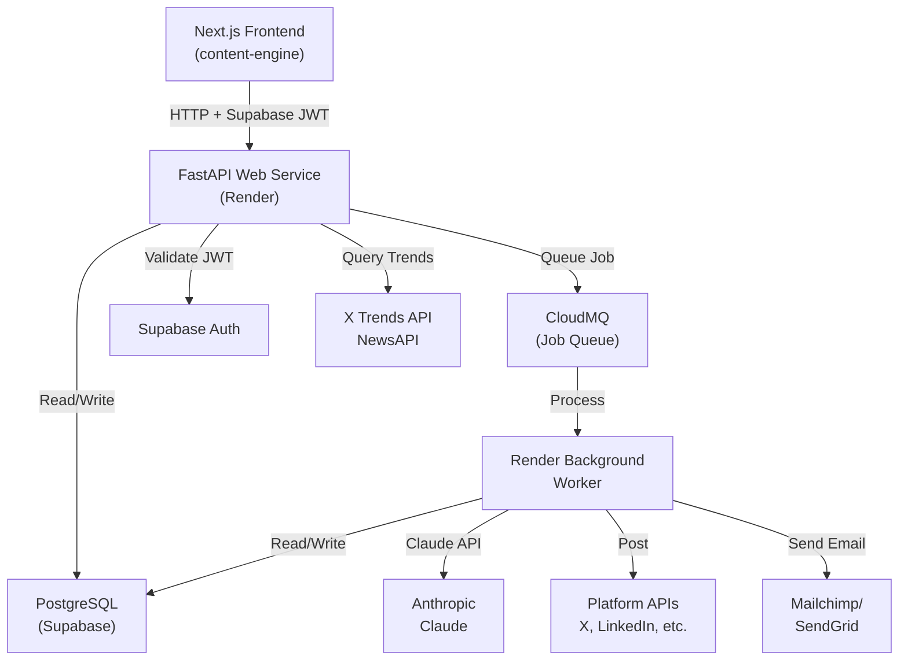

# Design: Content Engine Backend API

**Date:** 2026-04-24  
**Status:** Phase 2 — Design Document  
**Feature:** backend-core-api

---

## Overview

The Content Engine Backend is a FastAPI microservice that:
1. Exposes REST API endpoints for brand kit CRUD, content generation, distribution, metrics, and feedback loop
2. Validates requests using Supabase JWT tokens and enforces workspace isolation
3. Integrates with Claude API for content generation with platform-specific prompting
4. Posts content to 5 platforms (X, LinkedIn, Instagram, Reddit, email)
5. Ingests performance metrics and generates insights via feedback loop
6. Queues long-running jobs (generation, distribution, metrics analysis) to CloudMQ
7. Processes jobs via a Render Background Worker for async execution

The backend is stateless (scales horizontally) and decoupled from the Next.js frontend via REST API.

---

## Architecture



---

## Components and Interfaces

### 1. FastAPI Web Service (Render)

**Responsibility:** Handle HTTP requests, validate auth, route to services, queue jobs, return responses.

**Endpoints (see API Design section below)**

**Key Middleware:**
- Auth validation (Supabase JWT)
- Workspace extraction (from JWT payload)
- Error handling (JSON error responses)
- CORS (allow frontend origin only)
- Rate limiting (slowapi)

```python
@app.middleware("http")
async def validate_workspace(request: Request, call_next):
    # Extract JWT, validate via Supabase, extract workspace_id
    # Add workspace_id to request.state
    return await call_next(request)
```

### 2. Render Background Worker

**Responsibility:** Process CloudMQ jobs (long-running operations).

**Jobs Handled:**
- `content_generation` — Call Claude API, store results
- `platform_distribution` — Post to X, LinkedIn, Instagram, Reddit, Email
- `metrics_analysis` — Aggregate metrics, extract patterns, generate insights
- `newsjacking_topic_fetch` — Query X Trends + NewsAPI, filter, rank

**Job Processing Pattern:**
```python
@worker.task(name='content_generation')
def generate_content(job_id, workspace_id, topic, brand_kit_id):
    # 1. Load brand kit
    # 2. Construct prompts per platform
    # 3. Call Claude API
    # 4. Store generated_content + generated_posts
    # 5. Update job status to "completed"
    # On error: retry logic, eventually fail
```

### 3. Services (Business Logic)

```python
class BrandKitService:
    def create_kit(workspace_id, name) → BrandKit
    def get_active_kit(workspace_id) → BrandKit
    def update_section(kit_id, section, data) → BrandKit
    def approve(kit_id, reason) → BrandKit (version++)
    def activate(kit_id) → BrandKit (is_active=true)
    def get_versions(kit_id) → List[BrandKitVersion]
    def revert(kit_id, target_version) → BrandKit (new version)

class ContentGenerationService:
    def queue_generation(workspace_id, topic, source_type, brand_kit_id) → Job
    def generate_platform_content(topic, brand_kit, platform) → str
    def construct_prompt(topic, brand_kit, platform) → str
    def call_claude(prompt) → str

class DistributionService:
    def queue_distribution(workspace_id, content_id, platforms) → Job
    def post_to_x(post) → Dict[success, post_id, error]
    def post_to_linkedin(post) → Dict[success, post_id, error]
    def post_to_instagram(post) → Dict[success, post_id, error]
    def post_to_reddit(post) → Dict[success, post_id, error]
    def send_email(post) → Dict[success, campaign_id, error]

class MetricsService:
    def ingest_metrics(workspace_id, post_id, metrics) → PostMetrics
    def get_post_metrics(post_id) → List[PostMetrics]
    def queue_analysis(brand_kit_id) → Job

class FeedbackLoopService:
    def analyze_metrics(brand_kit_id) → List[FeedbackInsight]
    def extract_patterns(metrics_data, brand_kit) → Dict[correlations]
    def generate_insights(correlations) → List[FeedbackInsight]
    def apply_insight(insight_id) → BrandKit (version++)

class NewsjackingService:
    def fetch_trending_topics(workspace_id, content_pillars) → List[NewsjackingTopic]
    def score_relevance(topic, pillars) → float (0–1)
    def score_momentum(topic) → float (0–1)
    def filter_and_rank(topics, pillars) → List[NewsjackingTopic]
```

---

## Database Architecture

### Technology Choice

**PostgreSQL (via Supabase)** — Same as frontend spec. Supabase provides:
- Hosted PostgreSQL with automatic backups
- Row-Level Security (RLS) for workspace isolation
- Real-time subscriptions (for live updates)
- Auth integration (JWT-based)

---

### Schema

Same 13 tables from frontend spec (created in this backend project):

```sql
workspaces, brand_kits, brand_visual_identity, brand_content_identity,
brand_platform_overrides, brand_performance_benchmarks, brand_kit_versions,
generated_content, generated_posts, post_metrics, feedback_insights,
newsjacking_topics
```

**Plus 2 additional tables for job tracking:**

```sql
-- Job queue status tracking
CREATE TABLE IF NOT EXISTS jobs (
  id UUID PRIMARY KEY DEFAULT gen_random_uuid(),
  workspace_id UUID NOT NULL REFERENCES workspaces(id),
  job_type VARCHAR(100) NOT NULL, -- content_generation, platform_distribution, metrics_analysis
  status VARCHAR(50) DEFAULT 'pending', -- pending, processing, completed, failed
  payload JSONB NOT NULL, -- Input to job
  result JSONB, -- Output from job
  error_message TEXT,
  retry_count INT DEFAULT 0,
  cloudmq_job_id VARCHAR(255), -- CloudMQ's job ID
  created_at TIMESTAMP DEFAULT NOW(),
  started_at TIMESTAMP,
  completed_at TIMESTAMP
);

-- Job execution history (for debugging)
CREATE TABLE IF NOT EXISTS job_logs (
  id UUID PRIMARY KEY DEFAULT gen_random_uuid(),
  job_id UUID NOT NULL REFERENCES jobs(id) ON DELETE CASCADE,
  log_level VARCHAR(20), -- INFO, WARNING, ERROR
  message TEXT,
  timestamp TIMESTAMP DEFAULT NOW()
);
```

### Indexes

```sql
CREATE INDEX idx_jobs_workspace_status ON jobs(workspace_id, status);
CREATE INDEX idx_jobs_created ON jobs(created_at DESC);
CREATE INDEX idx_job_logs_job ON job_logs(job_id);
```

### Query Patterns

- **Load active brand kit:** `SELECT * FROM brand_kits WHERE workspace_id = ? AND is_active = true`
- **Fetch pending jobs:** `SELECT * FROM jobs WHERE workspace_id = ? AND status = 'pending'`
- **Get post metrics:** `SELECT * FROM post_metrics WHERE generated_post_id = ? ORDER BY recorded_at DESC`
- **Fetch pending insights:** `SELECT * FROM feedback_insights WHERE brand_kit_id = ? AND applied = false ORDER BY confidence DESC`

---

## API Design

### Base URL
`https://content-engine-api.onrender.com` (production)  
`http://localhost:8000` (local development)

### Authentication
All endpoints require: `Authorization: Bearer {supabase_jwt_token}`

### Brand Kit Endpoints

```
POST /workspaces/{workspace_id}/brand-kits
  Request:  { name: string }
  Response: { id, workspace_id, name, version: 1, is_active: false, created_at }

GET /workspaces/{workspace_id}/brand-kits
  Response: [ { id, name, version, is_active, approved_at, created_at }, ... ]

GET /workspaces/{workspace_id}/brand-kits/{brand_kit_id}
  Response: { id, workspace_id, name, version, visual_identity, content_identity, platform_overrides, performance_benchmarks, is_active, created_at, updated_at }

PATCH /workspaces/{workspace_id}/brand-kits/{brand_kit_id}
  Request:  { visual_identity?, content_identity?, platform_overrides?, performance_benchmarks? }
  Response: { id, ..., updated_at }

POST /workspaces/{workspace_id}/brand-kits/{brand_kit_id}/approve
  Request:  { reason?: string }
  Response: { id, ..., version: (incremented), approved_at }

POST /workspaces/{workspace_id}/brand-kits/{brand_kit_id}/activate
  Response: { id, ..., is_active: true }

GET /workspaces/{workspace_id}/brand-kits/{brand_kit_id}/versions
  Response: [ { version, approved_at, reason, created_by, changes, created_at }, ... ]

POST /workspaces/{workspace_id}/brand-kits/{brand_kit_id}/revert
  Request:  { target_version: int }
  Response: { id, ..., version: (new), approved_at: null }
```

### Content Generation Endpoints

```
POST /workspaces/{workspace_id}/generate-content
  Request:  { topic: string, source_type: 'standard'|'newsjacking'|'article', source_url?, brand_kit_id? }
  Response: { job_id, status: 'pending', created_at }
  (202 Accepted)

GET /workspaces/{workspace_id}/jobs/{job_id}
  Response: { id, job_type, status, payload, result, error_message, started_at, completed_at }
```

### Distribution Endpoints

```
POST /workspaces/{workspace_id}/platform-distribution
  Request:  { content_id: UUID, platforms?: ['linkedin', 'x', ...] }
  Response: { job_id, status: 'pending', created_at }
  (202 Accepted)

GET /workspaces/{workspace_id}/generated-content/{content_id}/status
  Response: { content_id, platform_results: { "x": { success, post_id, posted_at }, ... } }
```

### Metrics Endpoints

```
POST /workspaces/{workspace_id}/generated-posts/{post_id}/metrics
  Request:  { impressions: int, saves: int, likes: int, comments: int, shares: int, clicks?: int, conversions?: int }
  Response: { id, generated_post_id, impressions, saves, ..., recorded_at }

GET /workspaces/{workspace_id}/generated-posts/{post_id}/metrics
  Response: [ { impressions, saves, likes, comments, shares, clicks, conversions, recorded_at }, ... ]
```

### Insights & Feedback Loop Endpoints

```
GET /workspaces/{workspace_id}/brand-kits/{brand_kit_id}/insights
  Response: [ { id, platform, insight_type, insight_text, impact_metric, confidence, recommendation, applied }, ... ]

POST /workspaces/{workspace_id}/insights/{insight_id}/approve
  Request:  { apply: true|false }
  Response: { id, applied }
```

### Newsjacking Endpoints

```
GET /workspaces/{workspace_id}/newsjacking/topics
  Query: { limit: 10 }
  Response: [ { id, topic_title, trend_source, relevance_score, momentum_score, context, suggested_at, expires_at }, ... ]

POST /workspaces/{workspace_id}/newsjacking/topics/{topic_id}/select
  Response: { id, selected: true, selected_at }

POST /workspaces/{workspace_id}/newsjacking/generate
  Request:  { topic_id: UUID, brand_kit_id?: UUID }
  Response: { job_id, status: 'pending', created_at }
  (202 Accepted)
```

---

## Testing Strategy

### Test Pyramid

**Unit Tests (60%):**
- Service logic (brand kit validation, content generation prompts, metrics correlation)
- Database query construction (SQL building, workspace filtering)
- Utility functions (relevance scoring, confidence calculation)

**Integration Tests (30%):**
- API endpoints (request/response, status codes, error handling)
- Database operations (CRUD, relationships, constraints)
- Job queueing (job creation, CloudMQ integration)
- Auth middleware (JWT validation, workspace isolation)

**E2E Tests (10%):**
- Full workflows (brand kit creation → content generation → metrics → insights)
- Platform API integration (mock X, LinkedIn, Instagram APIs)

### Test Database

Use local PostgreSQL (or SQLite in-memory for speed) with fixtures that reset between tests.

```python
@pytest.fixture
def test_db():
    # Create test database
    # Run migrations
    # Yield connection
    # Drop database
    pass

@pytest.fixture
def test_workspace(test_db):
    # Create test workspace + user
    yield workspace_id
    pass
```

### Security Tests

- Workspace isolation (user A cannot see workspace B)
- Auth validation (missing/invalid token → 401)
- CORS enforcement (only frontend origin allowed)
- Rate limiting (exceeding limits returns 429)

---

## Security Architecture

### Threat Model

| Threat | Vector | Likelihood | Impact | Mitigation |
|--------|--------|------------|--------|------------|
| **Cross-workspace data leak** | API missing workspace_id filter | Medium | High | Mandatory workspace_id in every query (DB + API) |
| **JWT token theft** | Token in logs/error messages | Low | High | Never log tokens; use Sentry for error tracking (sanitized) |
| **Platform API credential theft** | Secrets in code/logs | Medium | High | Environment variables only; Render secret management |
| **XSS in generated content** | User injects HTML in topic | Medium | Medium | HTML escape all user input; validate before Claude API |
| **Rate limiting bypass** | Attacker floods /metrics endpoint | Medium | Low | Rate limiting middleware + Supabase RLS |
| **CloudMQ job injection** | Attacker modifies job payload | Low | Medium | Validate job payloads before processing; sign payloads |

### Auth & Authz

**Authentication:** Supabase JWT (issued by frontend on login)
- Token includes: `user_id`, `workspace_id`, `email`, `aud` (audience), `exp` (expiry)
- Backend validates signature using Supabase public key (no API call)

**Authorization:** Workspace-based
- Every query filters by `workspace_id` from JWT
- Request to different workspace returns 403

### Secrets Management

**Secrets stored in Render environment variables:**
- `DATABASE_URL` (PostgreSQL connection string)
- `SUPABASE_JWT_SECRET` (for token validation)
- `ANTHROPIC_API_KEY` (Claude API)
- `X_API_BEARER_TOKEN`, `LINKEDIN_API_TOKEN`, etc. (platform APIs)
- `MAILCHIMP_API_KEY`, `SENDGRID_API_KEY` (email)
- `CLOUDMQ_CONNECTION_STRING` (job queue)

**Never:**
- Hardcode secrets in code
- Log secrets in error messages
- Commit `.env` files

---

## Scalability & Performance

### Load Expectations
- 10–100 RPS during peak hours
- Content generation: 2–5 second latency (async job)
- Distribution: 5–30 second latency per platform (async job)
- Metrics ingestion: <100ms (sync)

### Horizontal Scaling
- **API layer:** Stateless FastAPI instances (scale up/down independently)
- **Background worker:** Separate Render service (scales independently)
- **Database:** Supabase handles read replicas automatically

### Caching Strategy
- **Active brand kit:** Cache in-memory with 5-minute TTL (hit on every generation)
- **Trending topics:** Cache X Trends + NewsAPI results for 15 minutes
- **JWT validation:** No caching (validation is fast)

### Performance Targets
- GET endpoints: <100ms
- POST endpoints: <500ms (for sync operations)
- Async jobs: queue within 1 second, process within 5–30 seconds
- Database queries: <50ms (with indexes)

---

## Deployment & Infrastructure

### Render Services

1. **Web Service (content-engine-api)**
   - Runtime: Python 3.11
   - Build command: `pip install -r requirements.txt`
   - Start command: `uvicorn app.main:app --host 0.0.0.0 --port $PORT`
   - Environment: Production
   - Scaling: Auto (0–3 instances)
   - Health check: `GET /health`

2. **Background Worker (content-engine-worker)**
   - Runtime: Python 3.11
   - Build command: `pip install -r requirements.txt`
   - Start command: `python -m app.worker`
   - Environment: Production
   - Scaling: 1 instance (or more for high load)
   - No HTTP needed

### Database (Supabase)
- Hosted PostgreSQL (managed by Supabase)
- Automatic backups (daily)
- SSL/TLS encryption (auto-renews)
- Connection pooling via Supabase connection pooler

### Job Queue (CloudMQ)
- Serverless job queue (managed)
- No infrastructure to provision
- Auto-scales to 0 when idle

### CI/CD (GitHub Actions)
- Run tests on every push to main
- Deploy to Render on merge to main
- Run migrations before API startup

---

## Error Handling

### HTTP Error Responses

```json
{
  "error": "error_code",
  "message": "Human-readable message",
  "details": { "field": "context" }
}
```

**Status codes:**
- `200 OK` — Success
- `201 Created` — Resource created
- `202 Accepted` — Job queued (async)
- `204 No Content` — Success, no body
- `400 Bad Request` — Validation error
- `401 Unauthorized` — Missing/invalid auth
- `403 Forbidden` — Workspace access denied
- `404 Not Found` — Resource doesn't exist
- `409 Conflict` — State conflict (e.g., can't modify approved kit)
- `429 Too Many Requests` — Rate limit exceeded
- `500 Internal Server Error` — Unhandled error

### Job Failure Handling

- Retry up to 3 times with exponential backoff (1s, 2s, 4s)
- On final failure: mark job as failed, log error, notify via Sentry
- Client can poll `/jobs/{job_id}` to see failure reason

### Platform API Failure Handling

- If X post fails: log failure, continue with LinkedIn (don't block)
- Return partial success: `{ "x": "failed", "linkedin": "posted", ... }`
- Don't retry platform failures automatically (client decision)

---

## ADRs

### ADR-1: FastAPI over Django REST

**Status:** Accepted  
**Context:** Need lightweight, async-first framework for microservice  
**Decision:** FastAPI (async, type-safe, minimal overhead)  
**Consequences:** Smaller ecosystem than Django, but better performance for our use case

### ADR-2: CloudMQ over Bull + Redis

**Status:** Accepted  
**Context:** Need job queue without managing infrastructure  
**Decision:** CloudMQ (serverless, no Redis needed, scales to 0)  
**Consequences:** Less control than self-hosted queue, but simpler operations

### ADR-3: Supabase PostgreSQL

**Status:** Accepted  
**Context:** Need database + auth integration  
**Decision:** Supabase (managed PostgreSQL + JWT auth)  
**Consequences:** Vendor lock-in (Supabase), but no infrastructure to manage

---

**Design document created at `.spec/design.md`. Please review and reply 'approved' to continue to the task plan.**
