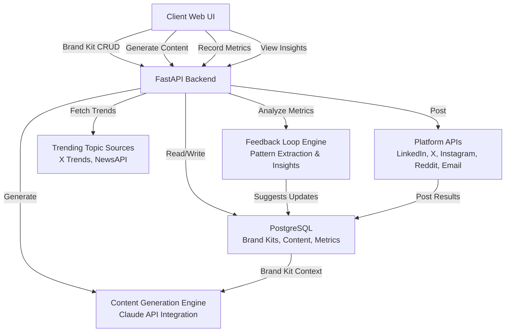
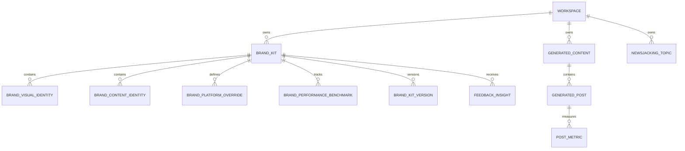

# Design: Brand Kit & Newsjacking System

**Date:** 2026-04-24  
**Status:** Phase 2 — Design Document  
**Feature:** brand-kit-newsjacking

---

## Overview

The Brand Kit & Newsjacking System is a multi-component platform that enables clients to:
1. **Define their brand once** (visual identity, content voice, platform rules, performance benchmarks)
2. **Generate on-brand content automatically** (standard topics or trending topics via newsjacking)
3. **Post across all platforms** (LinkedIn, X, Instagram, Reddit, Email) with platform-specific optimization
4. **Track performance** (metrics ingestion) and **auto-optimize brand kit** (feedback loop)

The system treats brand kit as the foundational source of truth — every piece of generated content references the active brand kit version. Performance metrics feed back into brand kit refinements, creating a continuously learning content strategy engine.

---

## Architecture



---

## Components and Interfaces

### 1. Brand Kit Service (Backend)
**Responsibility:** CRUD operations on brand kits, versioning, and active kit selection.

```typescript
interface BrandKit {
  id: UUID;
  workspace_id: UUID;
  name: string;
  version: number;
  visual_identity: VisualIdentity;
  content_identity: ContentIdentity;
  platform_overrides: Record<Platform, PlatformOverride>;
  performance_benchmarks: Record<Platform, PerformanceBenchmark>;
  created_at: Timestamp;
  updated_at: Timestamp;
  approved_at?: Timestamp;
  is_active: boolean;
}

interface VisualIdentity {
  color_palette: { primary: string; secondary: string; accent: string; neutral: string };
  typography: { heading_font: string; body_font: string; size_scale: string };
  logo_url: string;
  imagery_style: string;
  spacing_system: object; // grid rules, padding, breakpoints
}

interface ContentIdentity {
  positioning_statement: string;
  tone_descriptors: string[];
  content_pillars: string[];
  audience_icp: object;
  key_messages: string[];
  banned_words: string[];
  writing_rules: object;
}

interface PlatformOverride {
  platform: Platform;
  voice_variation: string;
  content_rules: object;
  format_preferences: object;
  posting_window: string;
  frequency_targets: object;
}

interface PerformanceBenchmark {
  platform: Platform;
  historical_best_format: string;
  historical_best_topics: string[];
  current_follower_count: number;
  target_metrics: object;
  last_updated: Timestamp;
}
```

### 2. Content Generation Service (Backend)
**Responsibility:** Generate platform-specific content using active brand kit + topic context.

```typescript
interface ContentGenerationRequest {
  workspace_id: UUID;
  brand_kit_id: UUID;
  topic: string;
  source_type: 'standard' | 'newsjacking' | 'article';
  source_url?: string;
}

interface GeneratedContent {
  id: UUID;
  workspace_id: UUID;
  brand_kit_id: UUID;
  topic: string;
  source_type: string;
  source_url?: string;
  platform_variants: Record<Platform, GeneratedPost>;
  created_at: Timestamp;
}

interface GeneratedPost {
  platform: Platform;
  content: string; // The generated content for this platform
  edited_version?: string; // If client edited
  status: 'draft' | 'scheduled' | 'posted' | 'archived';
  posted_at?: Timestamp;
  posted_by_user_id?: UUID;
}
```

**Generation Flow (per platform):**
1. Load active brand kit (visual identity, content identity, platform-specific rules)
2. For topic + brand kit context, call Claude API with platform-specific prompt
3. Claude generates platform-optimized content using brand voice + rules
4. Return generated content for client review

### 3. Newsjacking Service (Backend)
**Responsibility:** Source trending topics, filter for relevance, and expose for client selection.

```typescript
interface NewsjackingTopic {
  id: UUID;
  workspace_id: UUID;
  topic_title: string;
  trend_source: 'x_trends' | 'newsapi' | 'rss' | 'manual';
  relevance_score: number; // 0–1
  momentum_score: number; // 0–1
  context: string; // Brief description
  suggested_at: Timestamp;
  expires_at: Timestamp;
  selected: boolean;
  selected_at?: Timestamp;
}
```

**Topic Sourcing & Filtering:**
1. Query X Trends API, NewsAPI, and client-configured RSS feeds
2. For each topic, extract keywords and match against client's content_pillars (from brand kit)
3. Calculate relevance_score (keyword match strength) + momentum_score (trend velocity)
4. Rank by relevance + momentum
5. Return top 5–10, expire old topics after configurable TTL (default: 48 hours)

### 4. Distribution Service (Backend)
**Responsibility:** Post generated content to each platform API and track results.

```typescript
interface PostResult {
  platform: Platform;
  success: boolean;
  post_id?: string; // Platform-specific post ID
  error?: string;
  posted_at: Timestamp;
}

interface DistributionRequest {
  generated_content_id: UUID;
  platforms: Platform[];
  versions: 'generated' | 'edited'; // Which version to post
}
```

**Distribution Flow:**
1. Validate content against platform-specific rules (warnings only, not blocks)
2. For each platform, call platform API with content
3. On success: store post_id, update post.status → 'posted', record posted_at
4. On failure: log error, allow retry
5. Return results summary per platform

### 5. Metrics Service (Backend)
**Responsibility:** Ingest performance metrics and link to generated content.

```typescript
interface PostMetrics {
  id: UUID;
  generated_post_id: UUID;
  impressions: number;
  saves: number;
  likes: number;
  comments: number;
  shares: number;
  clicks?: number;
  conversions?: number;
  recorded_at: Timestamp;
  recorded_by_user_id: UUID;
}
```

**Metrics Ingestion Flow:**
1. Client enters raw metrics (numbers only)
2. Validate numeric inputs
3. Store metrics linked to generated_post
4. Invoke feedback loop engine (Requirement 10)

### 6. Feedback Loop Engine (Backend)
**Responsibility:** Analyze performance patterns and suggest brand kit updates.

```typescript
interface FeedbackInsight {
  id: UUID;
  brand_kit_id: UUID;
  platform: Platform;
  insight_type: 'tone_effectiveness' | 'topic_performance' | 'format_performance';
  insight_text: string;
  impact_metric: number; // e.g., +15 (15% improvement)
  confidence: number; // 0–1
  recommendation: string; // Which brand kit field to update and how
  applied: boolean;
  created_at: Timestamp;
}
```

**Analysis Flow:**
1. Aggregate metrics for recent posts (last 30 days)
2. For each post, extract: tone used, format used, topic pillar, platform
3. Correlate with performance metrics (impressions, saves, engagement rate)
4. Identify patterns: "posts with vulnerable tone on LinkedIn get +20% saves"
5. Generate insights with confidence scores
6. Suggest specific brand kit updates (e.g., "increase tone_descriptors.vulnerable weight on LinkedIn")
7. Present to client for approval/rejection

---

## Database Architecture

### Technology Choice

**ADR-1: PostgreSQL for Relational Brand Kit & Content Data**

**Status:** Accepted  
**Context:** Brand kit requires versioning, relationships (1 kit → many platform overrides → many benchmarks), audit trails (who changed what when), and strong consistency.  
**Options Considered:**
- Option A: PostgreSQL (relational, ACID, versioning via schema, audit trails via triggers)
- Option B: MongoDB (flexible schema, versioning via document history, eventual consistency)
- Option C: DynamoDB (managed, scalable, but versioning requires application logic)

**Decision:** PostgreSQL. Versioning, audit trails, and multi-table consistency are core to the spec.  
**Consequences:** Requires schema migrations. Scaling beyond 10k active clients may require read replicas.

---

### Schema Definition

```sql
-- Workspaces (multi-tenancy boundary)
CREATE TABLE workspaces (
  id UUID PRIMARY KEY DEFAULT gen_random_uuid(),
  name VARCHAR(255) NOT NULL,
  created_at TIMESTAMP NOT NULL DEFAULT NOW(),
  created_by_user_id UUID NOT NULL REFERENCES users(id)
);

-- Brand Kits
CREATE TABLE brand_kits (
  id UUID PRIMARY KEY DEFAULT gen_random_uuid(),
  workspace_id UUID NOT NULL REFERENCES workspaces(id) ON DELETE CASCADE,
  name VARCHAR(255) NOT NULL,
  version INT NOT NULL DEFAULT 1,
  created_at TIMESTAMP NOT NULL DEFAULT NOW(),
  updated_at TIMESTAMP NOT NULL DEFAULT NOW(),
  approved_at TIMESTAMP,
  is_active BOOLEAN DEFAULT FALSE,
  UNIQUE(workspace_id, version)
);

-- Visual Identity
CREATE TABLE brand_visual_identity (
  id UUID PRIMARY KEY DEFAULT gen_random_uuid(),
  brand_kit_id UUID NOT NULL REFERENCES brand_kits(id) ON DELETE CASCADE,
  color_palette JSONB NOT NULL,
  typography JSONB NOT NULL,
  logo_url TEXT,
  imagery_style VARCHAR(255),
  spacing_system JSONB,
  created_at TIMESTAMP NOT NULL DEFAULT NOW()
);

-- Content Identity
CREATE TABLE brand_content_identity (
  id UUID PRIMARY KEY DEFAULT gen_random_uuid(),
  brand_kit_id UUID NOT NULL REFERENCES brand_kits(id) ON DELETE CASCADE,
  positioning_statement TEXT NOT NULL,
  tone_descriptors TEXT[] NOT NULL,
  content_pillars TEXT[] NOT NULL,
  audience_icp JSONB NOT NULL,
  key_messages TEXT[] NOT NULL,
  banned_words TEXT[],
  writing_rules JSONB,
  created_at TIMESTAMP NOT NULL DEFAULT NOW()
);

-- Platform-Specific Overrides
CREATE TABLE brand_platform_overrides (
  id UUID PRIMARY KEY DEFAULT gen_random_uuid(),
  brand_kit_id UUID NOT NULL REFERENCES brand_kits(id) ON DELETE CASCADE,
  platform VARCHAR(50) NOT NULL,
  voice_variation VARCHAR(255),
  content_rules JSONB NOT NULL,
  format_preferences JSONB,
  posting_window VARCHAR(255),
  frequency_targets JSONB,
  created_at TIMESTAMP NOT NULL DEFAULT NOW(),
  UNIQUE(brand_kit_id, platform)
);

-- Performance Benchmarks
CREATE TABLE brand_performance_benchmarks (
  id UUID PRIMARY KEY DEFAULT gen_random_uuid(),
  brand_kit_id UUID NOT NULL REFERENCES brand_kits(id) ON DELETE CASCADE,
  platform VARCHAR(50) NOT NULL,
  historical_best_format VARCHAR(255),
  historical_best_topics TEXT[],
  current_follower_count INT,
  target_metrics JSONB,
  last_updated TIMESTAMP DEFAULT NOW(),
  UNIQUE(brand_kit_id, platform)
);

-- Brand Kit Version History (audit trail)
CREATE TABLE brand_kit_versions (
  id UUID PRIMARY KEY DEFAULT gen_random_uuid(),
  brand_kit_id UUID NOT NULL REFERENCES brand_kits(id) ON DELETE CASCADE,
  version INT NOT NULL,
  changes JSONB NOT NULL, -- Diff of what changed
  reason VARCHAR(255), -- "Performance feedback", "Client update", etc.
  created_by UUID NOT NULL REFERENCES users(id),
  created_at TIMESTAMP NOT NULL DEFAULT NOW()
);

-- Generated Content
CREATE TABLE generated_content (
  id UUID PRIMARY KEY DEFAULT gen_random_uuid(),
  workspace_id UUID NOT NULL REFERENCES workspaces(id) ON DELETE CASCADE,
  brand_kit_id UUID NOT NULL REFERENCES brand_kits(id),
  topic TEXT NOT NULL,
  source_type VARCHAR(50) NOT NULL, -- 'standard', 'newsjacking', 'article'
  source_url TEXT,
  created_at TIMESTAMP NOT NULL DEFAULT NOW()
);

-- Platform-Specific Generated Posts
CREATE TABLE generated_posts (
  id UUID PRIMARY KEY DEFAULT gen_random_uuid(),
  generated_content_id UUID NOT NULL REFERENCES generated_content(id) ON DELETE CASCADE,
  platform VARCHAR(50) NOT NULL,
  content TEXT NOT NULL,
  edited_version TEXT,
  status VARCHAR(50) DEFAULT 'draft', -- 'draft', 'scheduled', 'posted', 'archived'
  posted_at TIMESTAMP,
  posted_by_user_id UUID REFERENCES users(id),
  post_id VARCHAR(255), -- Platform-specific post ID
  created_at TIMESTAMP NOT NULL DEFAULT NOW(),
  UNIQUE(generated_content_id, platform)
);

-- Post Metrics (client-entered raw metrics)
CREATE TABLE post_metrics (
  id UUID PRIMARY KEY DEFAULT gen_random_uuid(),
  generated_post_id UUID NOT NULL REFERENCES generated_posts(id) ON DELETE CASCADE,
  impressions INT,
  saves INT,
  likes INT,
  comments INT,
  shares INT,
  clicks INT,
  conversions INT,
  recorded_at TIMESTAMP NOT NULL DEFAULT NOW(),
  recorded_by_user_id UUID NOT NULL REFERENCES users(id)
);

-- Feedback Loop Insights (engine-generated)
CREATE TABLE feedback_insights (
  id UUID PRIMARY KEY DEFAULT gen_random_uuid(),
  brand_kit_id UUID NOT NULL REFERENCES brand_kits(id) ON DELETE CASCADE,
  platform VARCHAR(50),
  insight_type VARCHAR(100), -- 'tone_effectiveness', 'topic_performance', 'format_performance'
  insight_text TEXT NOT NULL,
  impact_metric DECIMAL(5, 2), -- e.g., +15 (15% improvement)
  confidence DECIMAL(3, 2), -- 0–1
  recommendation TEXT,
  applied BOOLEAN DEFAULT FALSE,
  created_at TIMESTAMP NOT NULL DEFAULT NOW()
);

-- Newsjacking Topics
CREATE TABLE newsjacking_topics (
  id UUID PRIMARY KEY DEFAULT gen_random_uuid(),
  workspace_id UUID NOT NULL REFERENCES workspaces(id) ON DELETE CASCADE,
  topic_title VARCHAR(255) NOT NULL,
  trend_source VARCHAR(100), -- 'x_trends', 'newsapi', 'rss', 'manual'
  relevance_score DECIMAL(3, 2), -- 0–1
  momentum_score DECIMAL(3, 2), -- 0–1
  context TEXT,
  suggested_at TIMESTAMP NOT NULL DEFAULT NOW(),
  expires_at TIMESTAMP,
  selected BOOLEAN DEFAULT FALSE,
  selected_at TIMESTAMP
);

-- Indexes for performance
CREATE INDEX idx_brand_kits_workspace_active ON brand_kits(workspace_id, is_active);
CREATE INDEX idx_generated_content_workspace ON generated_content(workspace_id);
CREATE INDEX idx_generated_posts_status ON generated_posts(status);
CREATE INDEX idx_post_metrics_post_id ON post_metrics(generated_post_id);
CREATE INDEX idx_feedback_insights_kit ON feedback_insights(brand_kit_id);
CREATE INDEX idx_newsjacking_topics_workspace ON newsjacking_topics(workspace_id, expires_at);
```

### Entity Relationship Diagram



### Migration Strategy

**Zero-downtime migrations** using PostgreSQL's concurrent operations:
1. Add new columns with defaults (backward-compatible)
2. Deploy code that reads new columns
3. Migrate existing data (backfill) in batches
4. Deploy code that writes new columns
5. Remove old columns in follow-up migration

Example: Brand kit versioning introduced in Phase 1.
```sql
-- Migration 001: Create brand kit versioning schema
-- 1. Create new tables (non-blocking)
-- 2. Backfill existing brand kits: version = 1, approved_at = updated_at
-- 3. Drop old brand kit single-version constraints
```

### Indexing & Query Patterns

**Primary Query Patterns:**
1. **Load active brand kit per workspace** → `SELECT * FROM brand_kits WHERE workspace_id = ? AND is_active = TRUE`
   - Index: `(workspace_id, is_active)`

2. **Fetch all generated content per workspace** → `SELECT * FROM generated_content WHERE workspace_id = ? ORDER BY created_at DESC`
   - Index: `(workspace_id, created_at)`

3. **Fetch metrics for a post** → `SELECT * FROM post_metrics WHERE generated_post_id = ? ORDER BY recorded_at DESC`
   - Index: `(generated_post_id, recorded_at)`

4. **Fetch non-expired newsjacking topics** → `SELECT * FROM newsjacking_topics WHERE workspace_id = ? AND expires_at > NOW() ORDER BY relevance_score DESC`
   - Index: `(workspace_id, expires_at, relevance_score)`

5. **Fetch pending feedback insights** → `SELECT * FROM feedback_insights WHERE brand_kit_id = ? AND applied = FALSE ORDER BY confidence DESC`
   - Index: `(brand_kit_id, applied, confidence)`

---

## API Design

### Brand Kit Endpoints

```
POST /workspaces/{workspace_id}/brand-kits
  Request:  { name: string }
  Response: { id, workspace_id, name, version: 1, is_active: false, created_at }
  
GET /workspaces/{workspace_id}/brand-kits
  Response: [ { id, name, version, is_active, approved_at, created_at }, ... ]
  
GET /workspaces/{workspace_id}/brand-kits/{brand_kit_id}
  Response: { id, workspace_id, name, version, visual_identity, content_identity, platform_overrides, performance_benchmarks, is_active, created_at }
  
PATCH /workspaces/{workspace_id}/brand-kits/{brand_kit_id}
  Request:  { visual_identity?, content_identity?, platform_overrides?, performance_benchmarks? }
  Response: { id, ..., updated_at }
  
POST /workspaces/{workspace_id}/brand-kits/{brand_kit_id}/activate
  Response: { id, ..., is_active: true }
  
POST /workspaces/{workspace_id}/brand-kits/{brand_kit_id}/approve
  Request:  { reason?: string }
  Response: { id, ..., version: (incremented), approved_at }
  
GET /workspaces/{workspace_id}/brand-kits/{brand_kit_id}/versions
  Response: [ { version, approved_at, reason, created_by, created_at }, ... ]
  
POST /workspaces/{workspace_id}/brand-kits/{brand_kit_id}/revert
  Request:  { target_version: int }
  Response: { id, ..., version: (new version with old data), approved_at: null }
```

### Content Generation Endpoints

```
POST /workspaces/{workspace_id}/generate-content
  Request:  { topic: string, source_type: 'standard'|'newsjacking'|'article', source_url?, brand_kit_id? }
  Response: { id, workspace_id, brand_kit_id, topic, platform_variants: { linkedin: "...", x: "...", ... }, created_at }
  
PATCH /generated-posts/{post_id}
  Request:  { edited_version?: string, status?: string }
  Response: { id, platform, content, edited_version, status, ... }
  
POST /generated-posts/{post_id}/post
  Request:  { platforms?: ['linkedin', 'x', ...] }
  Response: { success: true, results: { linkedin: { success, post_id, posted_at }, x: {...}, ... } }
```

### Newsjacking Endpoints

```
GET /workspaces/{workspace_id}/newsjacking/topics
  Query: { limit: 10, sort_by: 'relevance'|'momentum' }
  Response: [ { id, topic_title, trend_source, relevance_score, momentum_score, context, suggested_at, expires_at }, ... ]
  
POST /workspaces/{workspace_id}/newsjacking/topics/{topic_id}/select
  Response: { id, ..., selected: true, selected_at }
  
POST /workspaces/{workspace_id}/newsjacking/topics/manual
  Request:  { topic_title: string, context?: string }
  Response: { id, workspace_id, topic_title, trend_source: 'manual', ... }
```

### Metrics Endpoints

```
POST /generated-posts/{post_id}/metrics
  Request:  { platform: string, impressions: int, saves: int, likes: int, comments: int, shares: int, clicks?, conversions? }
  Response: { id, generated_post_id, impressions, saves, ..., recorded_at }
  
GET /generated-posts/{post_id}/metrics
  Response: [ { impressions, saves, likes, comments, shares, clicks, conversions, recorded_at }, ... ]
  
GET /brand-kits/{brand_kit_id}/insights
  Response: [ { id, platform, insight_type, insight_text, impact_metric, confidence, recommendation, applied }, ... ]
  
POST /brand-kits/{brand_kit_id}/insights/{insight_id}/approve
  Request:  { apply: true|false }
  Response: { id, ..., applied: true|false }
```

---

## Error Handling Strategy

**Standard API error responses:**

```json
{
  "error": "error_code",
  "message": "Human-readable description",
  "details": { "field": "context" }
}
```

**Error codes & HTTP status:**
- `400_bad_request` (400) — Validation failure (e.g., invalid hex color, missing required field)
- `401_unauthorized` (401) — Missing/invalid auth token
- `403_forbidden` (403) — User lacks permission (e.g., accessing another workspace)
- `404_not_found` (404) — Resource doesn't exist (e.g., brand kit not found)
- `409_conflict` (409) — Conflict (e.g., brand kit version already approved)
- `422_unprocessable` (422) — Semantically invalid (e.g., topic already posted by client)
- `500_internal_error` (500) — Server error

**Platform API errors (when posting fails):**
```json
{
  "error": "platform_post_failed",
  "message": "Failed to post to LinkedIn",
  "platform": "linkedin",
  "platform_error": "LinkedIn API error details",
  "retry_safe": true
}
```

**Retry logic:** POST failures are retry-safe; client can retry after fixing (e.g., content too long).

---

## Testing Strategy

### Test Pyramid

**Unit Tests (60%):** Generation logic, brand kit validation, metrics analysis
**Integration Tests (30%):** API endpoints, database operations, feedback loop
**E2E Tests (10%):** Full workflows (create brand kit → generate content → post → record metrics → insights)

### Unit Tests

- **Brand Kit Validation:** color codes, typography, tone descriptors, content pillars
- **Content Generation Logic:** platform-specific prompt construction, rule application
- **Metrics Analysis:** pattern extraction (tone vs. saves correlation), confidence scoring
- **API Input Validation:** required fields, type checking, enum values

### Integration Tests

- **Brand Kit CRUD + Versioning:** create, modify, approve, list versions, revert
- **Content Generation:** generate for all platforms, validate platform-specific rules applied
- **Distribution:** post to each platform API, handle failures per platform
- **Metrics Ingestion:** record metrics, invoke feedback loop, verify insights generated
- **Feedback Loop:** metric aggregation, pattern extraction, insight generation, brand kit update suggestions

### E2E Tests (Playwright)

1. **Brand Kit Creation Flow:** Create brand kit → fill visual identity → fill content identity → approve → set active
2. **Standard Content Flow:** Generate content for custom topic → edit LinkedIn variant → post to all platforms → record metrics
3. **Newsjacking Flow:** Browse trending topics → select topic → generate → post → record metrics → view insights
4. **Feedback Loop:** Record metrics for multiple posts → view insights → approve suggestion → verify brand kit updated

### Security Tests

- **Multi-workspace isolation:** User from workspace A cannot access workspace B data
- **API auth:** Unauthenticated requests return 401; invalid tokens return 401
- **Input injection:** XSS/SQL injection in brand kit fields, topic text, metrics
- **Rate limiting:** POST endpoints rate-limited per user (prevent spam)

---

## Security Architecture

### Threat Model

| Threat | Vector | Likelihood | Impact | Mitigation |
|--------|--------|------------|--------|------------|
| **Data breach — brand kit + content leaks** | Unauthorized DB access or API exposure | Medium | High | Workspace isolation at DB level; encrypted at-rest for sensitive fields |
| **Cross-workspace data leak** | API missing workspace_id filter | Medium | High | Mandatory workspace_id validation on every query |
| **XSS in generated content** | User injects malicious HTML in topic/rules | Medium | High | Sanitize all user input; escape output in UI |
| **Platform API credential theft** | Secrets leaked in logs or code | Medium | High | Secrets in environment variables (never in code or logs); rotate regularly |
| **Unauthorized content posting** | Attacker posts to client's platform accounts | Medium | High | Require explicit user action (click "Post"); log all posts with user_id |
| **Metrics data manipulation** | Client manually edits metrics to game insights | Low | Low | No technical mitigation (business process controls instead) |
| **Token reuse attack** | Session token used after logout | Low | Medium | Token expiry + revocation on logout |

### Auth & Authz

**Authentication:** JWT tokens (issued on login, 24-hour expiry, refresh tokens for extended sessions)

**Authorization:** Workspace-based RBAC
- `owner` — full access to workspace, can manage members
- `editor` — can create/modify brand kits, generate content, post, record metrics
- `viewer` — read-only access to brand kits, content, insights

**Enforcement:** Every API endpoint checks workspace_id + user role before returning data.

### Secrets Management

**Secrets needed:**
- OpenAI/Claude API key (for content generation)
- X API credentials (posting + trending topics)
- LinkedIn API credentials (posting)
- Instagram Business API credentials (posting)
- Reddit API credentials (posting)
- Mailchimp/SendGrid API keys (email delivery)
- NewsAPI key (trending topics)

**Storage:** All secrets in environment variables (never in code, config, or logs). Secrets manager recommended for production (AWS Secrets Manager, HashiCorp Vault).

**Rotation:** API keys rotated every 90 days; on rotation, update environment variables and restart app.

### Input Validation & Sanitization

**Validation points:**
- Brand kit fields: color codes (hex format), font names (whitelist), content pillars (non-empty strings)
- Topics: non-empty, max 1000 chars
- Metrics: non-negative integers
- URLs: valid HTTP/HTTPS URLs

**Sanitization:**
- User-entered text (topics, brand kit fields): strip HTML tags, escape special characters
- Generated content: validate no injection vectors before posting to platforms

### Compliance Requirements

**Data privacy:** GDPR compliance — users can request data deletion (brand kit + all content), export personal data

**Data retention:** Generated content retained for 2 years; metrics retained for 5 years (for feedback loop learning)

---

## UI/UX Design

### User Flows

#### Flow 1: Brand Kit Creation
1. Client navigates to "Brand Kits" → clicks "New Brand Kit"
2. Enters brand kit name → clicks "Create"
3. Form displays tabs: Visual, Content, Platforms, Benchmarks
4. Client fills Visual Identity (colors, typography, logo, imagery, spacing) → clicks "Save"
5. Tabs update; client proceeds to Content Identity (positioning, tone, pillars, audience, messages, banned words, rules) → clicks "Save"
6. Client proceeds to Platforms → selects each platform (LinkedIn, X, Instagram, Reddit, Email) and customizes voice + rules per platform
7. Client proceeds to Benchmarks → enters historical best formats/topics, current metrics, target metrics
8. Client clicks "Review & Approve" → form summary shows all sections
9. Client clicks "Approve & Save" → brand kit version 1 created, approved_at set, marked active

#### Flow 2: Generate & Post Content (Standard Topic)
1. Client clicks "Generate Content" in main nav
2. Form shows: topic text, article URL (optional), topic description (optional)
3. Client enters topic → clicks "Generate"
4. System loads active brand kit, generates content for all platforms
5. Shows all platform variants side-by-side (tabs or cards): LinkedIn, X, Instagram, Reddit, Email
6. Each variant shows generated content in editable text field
7. Client can edit any variant (edited version saved separately)
8. Client clicks "Review" → modal shows all variants formatted as they'd appear on platform
9. Client clicks "Post All" or selects specific platforms → system posts via APIs
10. Shows results: ✓ LinkedIn posted, ✓ X posted, ✓ Instagram posted, etc. with post links
11. Client can view posts on platforms or return to dashboard

#### Flow 3: Newsjacking (Trending Topic)
1. Client clicks "Newsjacking" in main nav
2. Shows trending topics list (title, source, relevance score, momentum, context)
3. Client clicks on topic → preview shows topic details
4. Client clicks "Generate Content for This Topic" → system generates cross-platform content
5. Same as Flow 2 from step 5 onward (edit, review, post)

#### Flow 4: Record Metrics & View Insights
1. 24 hours after posting, dashboard shows "Record Metrics" button next to each post
2. Client clicks "Record Metrics" → modal shows form: impressions, saves, likes, comments, shares, clicks, conversions
3. Client enters numbers from platform analytics → clicks "Save"
4. System records metrics and invokes feedback loop
5. After metrics are recorded, "View Insights" becomes available
6. Client clicks "View Insights" → shows generated insights: "Vulnerable tone +20% saves on LinkedIn", etc.
7. Each insight shows: insight text, impact metric, confidence score, recommendation
8. Client can "Approve" (apply to brand kit, increment version) or "Dismiss"
9. If approved: brand kit updates, version increments, new version marked as active

### Screen/Component Inventory

| Screen | Components | Purpose |
|--------|-----------|---------|
| Brand Kits List | Card grid (name, version, active status), "New Kit" button | Overview all brand kits per workspace |
| Brand Kit Editor | Tabbed form (Visual, Content, Platforms, Benchmarks), Save/Approve buttons | Full brand kit CRUD |
| Content Generator | Topic input, article URL input, Generate button, platform variant cards | Generate content |
| Platform Variant Editor | Editable text field (full width), character count, platform preview below | Edit generated variant before posting |
| Post Review Modal | All platforms shown formatted (LinkedIn-style post, tweet, carousel mockup, etc.) | Preview before posting |
| Post Results | Success/failure per platform, post links, share buttons | Confirm posting succeeded |
| Metrics Recorder | Form with numeric inputs (impressions, saves, etc.), Save button | Record performance data |
| Insights Viewer | Cards per insight (text, impact, confidence, recommendation), Approve/Dismiss buttons | Review feedback loop suggestions |

### Wireframes (ASCII)

**Brand Kit Editor — Visual Identity Tab**
```
┌─────────────────────────────────────────────────────────────────┐
│ Brand Kit: My Brand              [Visual] [Content] [Platforms]  │
├─────────────────────────────────────────────────────────────────┤
│ Visual Identity                                                  │
│                                                                   │
│ Color Palette                                                    │
│ Primary Color:     [#000000]  [Preview]                          │
│ Secondary Color:   [#FFFFFF]  [Preview]                          │
│ Accent Color:      [#FF0000]   [Preview]                          │
│ Neutral Color:     [#CCCCCC]  [Preview]                          │
│                                                                   │
│ Typography                                                        │
│ Heading Font:      [Google Fonts Dropdown] Weight: [Bold]        │
│ Body Font:         [Google Fonts Dropdown] Weight: [Regular]     │
│ Size Scale:        [Dropdown: Compact/Standard/Large]            │
│                                                                   │
│ Logo                                                              │
│ Logo Lockup URL:   [https://...] [Preview]                      │
│ Wordmark URL:      [https://...] [Preview]                      │
│ Icon URL:          [https://...] [Preview]                      │
│                                                                   │
│ Imagery Style:     [Select: minimalist/vibrant/documentary]     │
│                                                                   │
│                                          [← Back] [Save] [Next →] │
└─────────────────────────────────────────────────────────────────┘
```

**Content Generator**
```
┌─────────────────────────────────────────────────────────────────┐
│ Generate Content                                                  │
├─────────────────────────────────────────────────────────────────┤
│ Topic:      [Enter topic or paste article...]                   │
│ Article URL: [Optional: https://...]                            │
│                                                                   │
│                                               [Generate Content]   │
│                                                                   │
│ Platform Variants                                                │
│ ┌─ LinkedIn ──────────────────────────────────────────────────┐ │
│ │ [Generated content — editable]                              │ │
│ │                                                              │ │
│ │                                               [Preview Post] │ │
│ └──────────────────────────────────────────────────────────────┘ │
│                                                                   │
│ ┌─ X ────────────────────────────────────────────────────────┐ │
│ │ [Generated thread content — editable]                      │ │
│ │                                                              │ │
│ │                                               [Preview Post] │ │
│ └──────────────────────────────────────────────────────────────┘ │
│                                                                   │
│ ┌─ Instagram ────────────────────────────────────────────────┐ │
│ │ [7-slide carousel description — editable]                  │ │
│ │                                                              │ │
│ │                                               [Preview Post] │ │
│ └──────────────────────────────────────────────────────────────┘ │
│                                                                   │
│                                         [Post All] [Save Draft]  │
└─────────────────────────────────────────────────────────────────┘
```

### Design Tokens

```
Colors:
  Primary: #000000 (black)
  Secondary: #FFFFFF (white)
  Accent: #0084FF (blue)
  Success: #31A24C (green)
  Warning: #FFA500 (orange)
  Error: #E74C3C (red)
  Background: #F5F5F5 (light gray)
  Surface: #FFFFFF (white)

Typography:
  Heading 1: 32px, bold, line-height 1.2
  Heading 2: 24px, bold, line-height 1.3
  Body: 16px, regular, line-height 1.5
  Small: 14px, regular, line-height 1.4

Spacing:
  xs: 4px
  sm: 8px
  md: 16px
  lg: 24px
  xl: 32px

Border Radius: 8px
Shadows: 0 2px 8px rgba(0,0,0,0.1)
```

### Responsive Behavior

- **Desktop (1024px+):** Multi-column layouts, tabs for brand kit sections, side-by-side platform variants
- **Tablet (768–1023px):** Single-column with stacked cards, platform variants in accordion
- **Mobile (< 768px):** Full-width single column, collapsible brand kit sections, swipeable platform variants

### Accessibility

- **Keyboard navigation:** Tab through all form fields, Enter to submit, Escape to close modals
- **Screen readers:** All form labels associated with inputs (ARIA labels)
- **Color contrast:** WCAG AA compliance (contrast ratio ≥ 4.5:1)
- **Focus indicators:** Clear visual focus state on all interactive elements

### Interaction & Motion

- **Form submission:** Optimistic update (show success immediately), disable button during submit
- **Content generation:** Loading spinner + progress message ("Generating for LinkedIn...", "Generating for X...")
- **Platform variants:** Smooth tab transitions, highlight edited fields in yellow
- **Insights:** Fade-in animation on approval, success toast notification

### Empty & Error States

**Empty State — No Brand Kits:**
```
[Icon: Brand kit illustration]
No brand kits yet.
Create your first brand kit to start generating content.
[Create Brand Kit button]
```

**Error State — Generation Failed:**
```
Oops, content generation failed.
Reason: "Context length exceeded. Please try a shorter topic description."
[Retry] [Dismiss]
```

**Loading State — Generating Content:**
```
Generating content for all platforms...
[████████░░] 80%
Generating Instagram content...
```

---

## Scalability and Performance

### Expected Load

- **Active clients per deployment:** 0–10k
- **Requests per second:** 10–100 RPS during peak (morning hours)
- **Generated content per client per month:** 40–200 pieces (average: 80)
- **Metrics recorded per month:** 320–1,600 per client (average: 640)

### Bottlenecks

1. **Content generation (Claude API)** — sequential calls per platform, latency ~2–5s per call
   - Mitigation: Parallel generation via async queue (asyncio, Bull, etc.)

2. **Database writes during metrics ingestion** — spike during feedback loop (multiple insights inserted)
   - Mitigation: Batch insight writes, batch feedback loop processing

3. **Platform API posting** — rate limits on X, LinkedIn, Instagram
   - Mitigation: Respect platform rate limits, queue posting with exponential backoff

### Caching Strategy

- **Brand kit (read-heavy):** Cache active brand kit per workspace in Redis (5-minute TTL) — hit on every generation
- **Trending topics (time-sensitive):** Cache X Trends API response for 15 minutes (trends change slowly within a window)
- **User session (auth):** Cache in Redis with 24-hour TTL for JWT tokens

### Async Processing

- **Content generation:** Queue job (topic + brand kit) → Claude API call in background → store result
- **Platform posting:** Queue job (content + platform) → platform API call in background → store result + retry on failure
- **Feedback loop:** Queue job (metrics aggregation) → pattern extraction in background → generate insights

Use Bull queue (Node.js) or Celery (Python) for job scheduling.

### Horizontal Scalability

**Stateless API layer:** No session state in memory; all state in PostgreSQL + Redis → scale API servers horizontally.

**Database scaling:**
- Write replica for metrics ingestion (separate from read replica)
- Read replicas for analytics queries (brand kit history, insights)
- Partitioning on workspace_id for future (>100k workspaces)

---

## Dependencies and Risks

### Critical Dependencies

1. **Claude API** — content generation backbone
   - Risk: API rate limiting, latency spikes, model changes
   - Mitigation: Cache generated content, implement exponential backoff, monitor token usage

2. **Platform APIs** (LinkedIn, X, Instagram, Reddit)
   - Risk: API changes, authentication failures, rate limiting
   - Mitigation: Standardize API error handling, retry logic, maintain API client SDKs

3. **PostgreSQL** — brand kit + content storage
   - Risk: Data corruption, outage, migration failures
   - Mitigation: Daily backups, test recovery, version migrations carefully

### High-Impact Risks

1. **Feedback loop generates bad insights** — metric correlation is spurious
   - Mitigation: High confidence threshold (0.8+) before suggesting updates, client always approves manually

2. **Generated content violates platform policies** — posts get removed, account banned
   - Mitigation: Soft validation (warnings, not blocks), client responsible for review before posting

3. **Multi-workspace data leak** — workspace isolation fails
   - Mitigation: Test isolation at integration level, code review all API endpoints for workspace_id checks

### Medium-Impact Risks

1. **Trending topics API unreliable** — X Trends or NewsAPI goes down
   - Mitigation: Graceful degradation (fall back to manual entry), alert ops, retry logic

2. **Email delivery fails silently** — metrics not recorded
   - Mitigation: Webhook confirmation from Mailchimp/SendGrid, retry failed sends

---

## ADRs (Architecture Decision Records)

### ADR-2: Claude API for Content Generation

**Status:** Accepted  
**Context:** Brand kit system requires multi-platform content generation. Options: Claude API, OpenAI GPT-4, self-hosted model, template-based system.  
**Decision:** Claude API (via Anthropic SDK) for flexibility, instruction-following, and platform-specific generation rules.  
**Consequences:** Rate-limited at platform level; costs ~$0.01–0.05 per generation (all platforms); latency ~2–5s per call.

### ADR-3: PostgreSQL for Relational State

**Context:** Brand kit versioning, content-to-metrics relationships, audit trails.  
**Decision:** PostgreSQL over NoSQL for ACID guarantees and versioning ease.  
**Consequences:** Scaling requires read replicas; migrations needed for schema changes.

### ADR-4: Workspace-Based Multi-Tenancy

**Status:** Accepted  
**Context:** Platform serves multiple clients, each with isolated brand kits + content.  
**Decision:** Workspace table with foreign key constraints; every query filters by workspace_id.  
**Consequences:** Simple isolation model but limits cross-workspace analytics; scaling beyond 10k workspaces requires partitioning.

### ADR-5: Feedback Loop Confidence Scoring

**Status:** Accepted  
**Context:** Insights from metrics correlations can be spurious (e.g., one viral post skews data).  
**Decision:** Insights require confidence score ≥0.7 before suggesting; client always approves manually.  
**Consequences:** Some insights may never reach threshold; client must actively review insights to drive continuous improvement.

---

**Design document created at `.spec/brand-kit-newsjacking/design.md`. Please review and reply 'approved' to continue to the task plan.**
