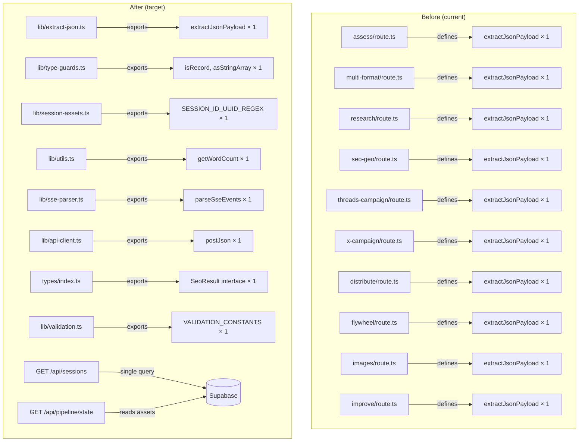

# Design: Code Review Remediation

## Overview

This is a **brownfield refactoring** spec. No new user-facing features are added.
All changes are internal: extracting duplicated logic into canonical utility files,
fixing validation asymmetries, and moving a P0 concern (pipeline state orchestration)
from the browser to the server.

The work is decomposed into 10 independent tasks that can be executed serially. Each
task is scoped to a single shared utility or fix category. Tasks do not depend on each
other except where noted (pipeline state depends on sessions endpoint).

---

## Architecture



---

## Components and Interfaces

### New Files

| File | Exports | Purpose |
|------|---------|---------|
| `lib/extract-json.ts` | `extractJsonPayload(raw: string): unknown` | Single canonical JSON extractor for LLM responses |
| `lib/type-guards.ts` | `isRecord`, `asStringArray` | Type-narrowing utilities used across all API routes |
| `lib/sse-parser.ts` | `parseSseEvents(body: string): StreamEvent[]` | Parses SSE response body into typed events |
| `lib/api-client.ts` | `postJson<T>(url: string, body: Record<string, unknown>): Promise<T>` | Browser POST helper with error handling |
| `lib/validation.ts` | `VALIDATION_CONSTANTS` | Shared validation limits (min lengths, buffer periods, allowed file types) |
| `app/api/sessions/route.ts` | `GET /api/sessions` | Returns user sessions + assets in one query |
| `app/api/pipeline/state/route.ts` | `GET /api/pipeline/state?sessionId=` | Returns pipeline step state for a session |

### Modified Files

| File | Change |
|------|--------|
| `lib/utils.ts` | Add `getWordCount` export |
| `lib/session-assets.ts` | Add `SESSION_ID_UUID_REGEX` export |
| `types/index.ts` | Add `SeoResult` interface |
| `app/api/seo/route.ts` | Remove `SeoResult` declaration, import from `@/types` |
| `app/api/data-driven/assess/route.ts` | Remove local `extractJsonPayload`, `asStringArray`; import from lib |
| `app/api/data-driven/multi-format/route.ts` | Remove locals; import from lib; remove local `isRecord`, `getWordCount` |
| `app/api/data-driven/research/route.ts` | Remove locals; import from lib |
| `app/api/data-driven/seo-geo/route.ts` | Remove locals; import from lib |
| `app/api/data-driven/threads-campaign/route.ts` | Remove locals; import from lib |
| `app/api/data-driven/x-campaign/route.ts` | Remove locals; import from lib |
| `app/api/distribute/route.ts` | Remove local `extractJsonPayload`; import from lib |
| `app/api/flywheel/route.ts` | Remove local `extractJsonPayload`; import from lib |
| `app/api/images/route.ts` | Remove local `extractJsonPayload`; import from lib |
| `app/api/improve/route.ts` | Remove local `extractJsonPayload`; import from lib; add backend validation |
| `app/api/data-driven/article/route.ts` | Remove local `getWordCount`; import from lib |
| `app/api/blog/route.ts` | Remove inline word count; import `getWordCount` from lib |
| `app/dashboard/data-driven/page.tsx` | Remove `postJson`; import from `lib/api-client.ts` |

---

## Data Models

No schema changes. This refactor touches only TypeScript source files and API routes.

### `VALIDATION_CONSTANTS` shape

```typescript
export const VALIDATION_CONSTANTS = {
  MIN_SOURCE_TEXT_LENGTH: 10,       // frontend: topic non-empty; backend was 1 → tighten to 10
  MIN_ARTICLE_IMPROVE_LENGTH: 101,   // matches existing MIN_ARTICLE_LENGTH in improve/route.ts
  SCHEDULING_BUFFER_HOURS: 1,        // minimum hours before a scheduled post
  ALLOWED_FILE_EXTENSIONS: ['txt', 'md', 'pdf'] as const,
  ALLOWED_MIME_TYPES: ['text/plain', 'text/markdown', 'application/pdf'] as const,
} as const
```

### `GET /api/sessions` Response Shape

```typescript
interface SessionsResponse {
  sessions: Array<{
    id: string
    created_at: string
    input_type: string
    input_data: unknown
    assets: ContentAsset[]
  }>
}
```

### `GET /api/pipeline/state` Response Shape

```typescript
interface PipelineStateResponse {
  sessionId: string
  steps: Record<string, {
    status: 'pending' | 'running' | 'done' | 'error'
    assetId?: string
    error?: string
  }>
}
```

---

## API Design

### `GET /api/sessions`

```
GET /api/sessions
Authorization: Supabase session cookie (requireAuth)
Query params: id? (string) — filter to single session

Response 200: SessionsResponse
Response 401: { error: { code: 'unauthorized', message: string } }
Response 500: { error: { code: 'internal', message: string } }
```

### `GET /api/pipeline/state`

```
GET /api/pipeline/state?sessionId={uuid}
Authorization: Supabase session cookie (requireAuth)

Response 200: PipelineStateResponse
Response 400: { error: { code: 'invalid_session_id', message: string } }
Response 401: { error: { code: 'unauthorized', message: string } }
Response 404: { error: { code: 'session_not_found', message: string } }
```

---

## Error Handling Strategy

All existing error handling patterns are preserved. New routes follow the same pattern as
existing routes: `requireAuth` at the top, `try/catch` around the Supabase query,
`NextResponse.json({ error: ... }, { status: NNN })` for errors.

Validation errors return HTTP 422 with `{ error: { code: 'validation_error', message: string } }`.

---

## Security Architecture

### Threat Model

| Threat | Vector | Mitigation |
|--------|--------|-----------|
| Validation bypass | Direct API call skipping frontend | Backend validation in `lib/validation.ts` enforced at every route entry point |
| Data exfiltration | Unauthenticated session reads | All new routes call `requireAuth` — existing pattern |
| Injection via file upload | Malicious MIME type | `VALIDATION_CONSTANTS.ALLOWED_MIME_TYPES` checked at backend before processing |

### Auth & Authz

All new API routes (`/api/sessions`, `/api/pipeline/state`) call `requireAuth(request)` from
`lib/auth.ts` — same pattern as all existing routes. No new auth mechanism introduced.

### Input Validation

`lib/validation.ts` exports constants shared by frontend (`lib/data-driven-form.ts`) and
backend routes. Both sides import `VALIDATION_CONSTANTS.MIN_SOURCE_TEXT_LENGTH` — no more
divergence.

---

## Testing Strategy

### Test Pyramid

- **Unit tests** — one test file per new utility (`lib/extract-json.test.ts`,
  `lib/type-guards.test.ts`, `lib/sse-parser.test.ts`, `lib/utils.test.ts`,
  `lib/validation.test.ts`). Jest + ts-jest as used by the existing test suite.
- **Integration tests** — existing route tests already cover the routes being modified;
  they will pass without change after the refactoring because the function behaviour
  is identical.
- **Regression** — `bun run type-check` and `bun test` must pass after each task.

### Unit Test Scope

| File | Tests |
|------|-------|
| `lib/extract-json.test.ts` | plain JSON, fenced JSON, bare object extraction, throws on garbage |
| `lib/type-guards.test.ts` | `isRecord` (object/array/null/primitive), `asStringArray` (array/null/mixed) |
| `lib/sse-parser.test.ts` | single event, multi-event, partial chunk |
| `lib/utils.test.ts` | empty string, single word, multi-word, whitespace-heavy |
| `lib/validation.test.ts` | each constant is a number/array and non-negative |

---

## Scalability and Performance

No performance impact. All changes are compile-time deduplication.
The `/api/sessions` endpoint replaces N browser Supabase calls with one server-side join,
which is a net performance improvement for the dashboard load.

---

## Dependencies and Risks

| Risk | Likelihood | Mitigation |
|------|------------|-----------|
| Import path errors after extraction | Medium | TypeScript compile check (`bun run type-check`) after each task |
| Behaviour change in `extractJsonPayload` | Low | Function body is copy-pasted verbatim — no logic changes |
| `session-assets.ts` circular import | Low | `SESSION_ID_UUID_REGEX` is a pure constant — no dependencies |
| Existing tests break after route modification | Low | Route tests mock the lib functions — only import path changes |

### ADR-1: `isRecord` canonical location

**Status:** Accepted  
**Context:** `isRecord` already exists in `lib/session-assets.ts` (exported). Multiple
route files declare local copies.  
**Options Considered:**
- Keep in `session-assets.ts`, re-export from `lib/type-guards.ts` — Pro: no breaking change; Con: split source
- Move to `type-guards.ts`, update `session-assets.ts` import — Pro: single file; Con: minor churn in session-assets
**Decision:** Create `lib/type-guards.ts` that imports `isRecord` from `session-assets.ts`
and re-exports it alongside `asStringArray`. Routes import from `lib/type-guards.ts`.  
**Consequences:** `session-assets.ts` remains the source of truth for `isRecord`; `type-guards.ts` is the consumer-facing barrel.

### ADR-2: `VALIDATION_CONSTANTS` coupling

**Status:** Accepted  
**Context:** Frontend form validation is in `lib/data-driven-form.ts`. Backend uses magic
numbers. We need shared constants without circular imports.  
**Options Considered:**
- Put constants in `types/index.ts` — already used by both; cleaner
- New `lib/validation.ts` — explicit separation  
**Decision:** New `lib/validation.ts` — avoids polluting types with non-type content.  
**Consequences:** Both `data-driven-form.ts` and route files import from `lib/validation.ts`.
