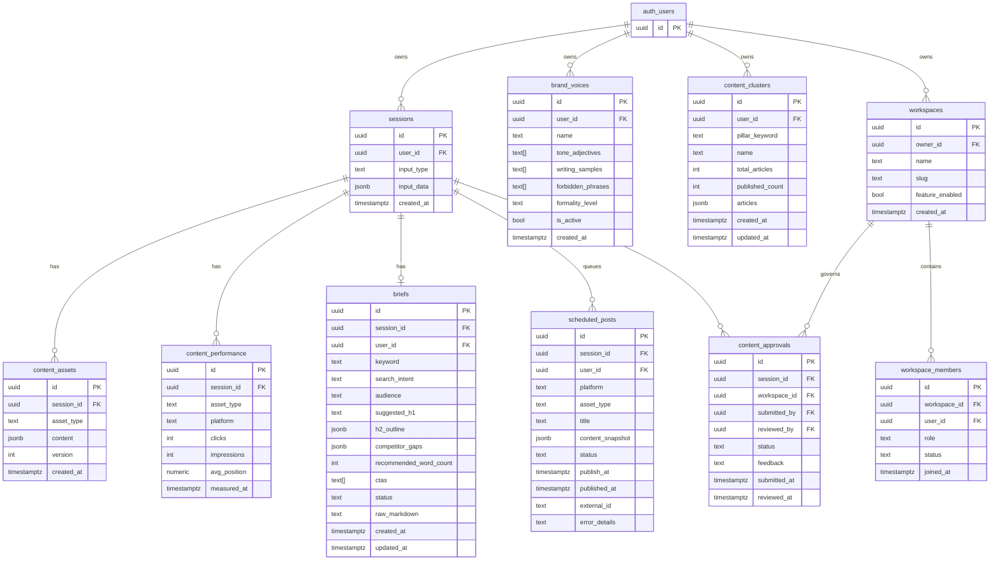

# Design — Competitive Gaps Roadmap
**Feature slug:** competitive-gaps-roadmap  
**Date:** 2026-04-28  
**Stack:** Next.js 14 App Router · TypeScript · Supabase · Anthropic Claude API · Tailwind CSS · Vercel

---

## 1. Architecture Overview

```mermaid
graph TD
  subgraph "Browser"
    UI[Next.js App Router Pages]
    CE[ContentEditor - Tiptap]
    CL[ContentLibrary - ROI Table]
    SC[ScheduleCalendar]
    BV[BrandVoiceSettings]
    BC[BriefCard]
    TAP[TopicalAuthorityPlanner]
    TW[TeamWorkspace - Approval Queue]
  end

  subgraph "Next.js API Routes (Vercel Edge / Node)"
    AI[api/ingest - URL ingestion]
    AR[api/roi - ROI aggregation]
    ASC[api/schedule/[id] - CRUD]
    ABV[api/brand-voice - CRUD + score]
    ABR[api/brief - generate + CRUD]
    ADT[api/detect - plagiarism gate]
    AED[api/edit - inline SSE edits]
    ACL[api/cluster - topical cluster]
    AWK[api/workspace - team CRUD]
    AAPR[api/approval - state machine]
    AIM[api/images - existing, extended]
  end

  subgraph "Background (Inngest)"
    INN1[content/schedule.publish - cron *]
    INN2[content/pipeline.start - existing]
    INN3[content/detect.run - post-gen hook]
  end

  subgraph "External Services"
    FAL[fal.ai - image gen + Whisper]
    YT[YouTube Data API v3]
    ORIG[Originality.ai API]
    GA4[Google Analytics 4]
    SC2[Search Console API]
    GS[Google Search API]
  end

  subgraph "Supabase"
    PG[(PostgreSQL)]
    AUTH[Auth]
    STORE[Storage - image assets]
    EF[Edge Functions - email notify]
  end

  UI --> AI & AR & ASC & ABV & ABR & ADT & AED & ACL & AWK & AAPR & AIM
  AI --> FAL & YT
  ADT --> ORIG
  INN1 -->|publish| ASC
  INN3 -->|post-gen| ADT
  AR --> GA4 & SC2
  ACL --> GS
  ABV --> ABR
  AIM --> FAL
  API --> PG
  AWK --> EF
  EF -->|email| Resend
```

---

## 2. Database Architecture

### 2.1 New Tables ERD



### 2.2 Table Specifications

**`brand_voices`**
```sql
CREATE TABLE public.brand_voices (
  id               uuid PRIMARY KEY DEFAULT gen_random_uuid(),
  user_id          uuid NOT NULL REFERENCES auth.users(id) ON DELETE CASCADE,
  name             text NOT NULL,
  tone_adjectives  text[] NOT NULL DEFAULT '{}',
  writing_samples  text[] NOT NULL DEFAULT '{}',
  forbidden_phrases text[] NOT NULL DEFAULT '{}',
  formality_level  text NOT NULL DEFAULT 'neutral'
                   CHECK (formality_level IN ('formal', 'casual', 'neutral')),
  is_active        boolean NOT NULL DEFAULT false,
  created_at       timestamptz NOT NULL DEFAULT now()
);
```

**`briefs`**
```sql
CREATE TABLE public.briefs (
  id                    uuid PRIMARY KEY DEFAULT gen_random_uuid(),
  session_id            uuid NOT NULL REFERENCES public.sessions(id) ON DELETE CASCADE,
  user_id               uuid NOT NULL REFERENCES auth.users(id) ON DELETE CASCADE,
  keyword               text NOT NULL,
  search_intent         text,
  audience              text,
  suggested_h1          text,
  h2_outline            jsonb NOT NULL DEFAULT '[]',
  competitor_gaps       jsonb NOT NULL DEFAULT '[]',
  recommended_word_count integer,
  ctas                  text[] NOT NULL DEFAULT '{}',
  status                text NOT NULL DEFAULT 'draft'
                        CHECK (status IN ('draft', 'approved')),
  raw_markdown          text,
  created_at            timestamptz NOT NULL DEFAULT now(),
  updated_at            timestamptz NOT NULL DEFAULT now()
);
```

**`content_clusters`**
```sql
CREATE TABLE public.content_clusters (
  id              uuid PRIMARY KEY DEFAULT gen_random_uuid(),
  user_id         uuid NOT NULL REFERENCES auth.users(id) ON DELETE CASCADE,
  pillar_keyword  text NOT NULL,
  name            text NOT NULL,
  total_articles  integer NOT NULL DEFAULT 0,
  published_count integer NOT NULL DEFAULT 0,
  articles        jsonb NOT NULL DEFAULT '[]',
  created_at      timestamptz NOT NULL DEFAULT now(),
  updated_at      timestamptz NOT NULL DEFAULT now()
);
```

**`workspaces`**
```sql
CREATE TABLE public.workspaces (
  id              uuid PRIMARY KEY DEFAULT gen_random_uuid(),
  owner_id        uuid NOT NULL REFERENCES auth.users(id) ON DELETE CASCADE,
  name            text NOT NULL,
  slug            text NOT NULL UNIQUE,
  feature_enabled boolean NOT NULL DEFAULT false,
  created_at      timestamptz NOT NULL DEFAULT now()
);
```

**`workspace_members`**
```sql
CREATE TABLE public.workspace_members (
  id           uuid PRIMARY KEY DEFAULT gen_random_uuid(),
  workspace_id uuid NOT NULL REFERENCES public.workspaces(id) ON DELETE CASCADE,
  user_id      uuid REFERENCES auth.users(id) ON DELETE SET NULL,
  email        text NOT NULL,
  role         text NOT NULL DEFAULT 'writer'
               CHECK (role IN ('writer', 'editor', 'admin')),
  status       text NOT NULL DEFAULT 'pending'
               CHECK (status IN ('pending', 'active', 'removed')),
  joined_at    timestamptz
);
```

**`content_approvals`**
```sql
CREATE TABLE public.content_approvals (
  id            uuid PRIMARY KEY DEFAULT gen_random_uuid(),
  session_id    uuid NOT NULL REFERENCES public.sessions(id) ON DELETE CASCADE,
  workspace_id  uuid NOT NULL REFERENCES public.workspaces(id) ON DELETE CASCADE,
  submitted_by  uuid NOT NULL REFERENCES auth.users(id),
  reviewed_by   uuid REFERENCES auth.users(id),
  status        text NOT NULL DEFAULT 'draft'
                CHECK (status IN ('draft','review','approved','published','changes_requested')),
  feedback      text,
  submitted_at  timestamptz,
  reviewed_at   timestamptz
);
```

**`scheduled_posts` extension** (adds `title` to existing table):
```sql
ALTER TABLE public.scheduled_posts ADD COLUMN IF NOT EXISTS title text;
```

---

## 3. API Design

### 3.1 New Routes

| Method | Route | Handler file | Description |
|--------|-------|--------------|-------------|
| POST | `/api/ingest` | `app/api/ingest/route.ts` | URL ingestion (YouTube, audio, web) |
| GET | `/api/roi` | `app/api/roi/route.ts` | Per-article ROI aggregation |
| PATCH | `/api/schedule/[id]` | `app/api/schedule/[id]/route.ts` | Update scheduled post |
| DELETE | `/api/schedule/[id]` | `app/api/schedule/[id]/route.ts` | Cancel scheduled post |
| GET | `/api/brand-voice` | `app/api/brand-voice/route.ts` | List brand voices |
| POST | `/api/brand-voice` | `app/api/brand-voice/route.ts` | Create brand voice |
| PUT | `/api/brand-voice/[id]` | `app/api/brand-voice/[id]/route.ts` | Update brand voice |
| DELETE | `/api/brand-voice/[id]` | `app/api/brand-voice/[id]/route.ts` | Delete brand voice |
| POST | `/api/brand-voice/score` | `app/api/brand-voice/score/route.ts` | Score article alignment |
| POST | `/api/brief` | `app/api/brief/route.ts` | Generate brief |
| GET | `/api/brief` | `app/api/brief/route.ts` | Fetch brief by sessionId |
| PATCH | `/api/brief/[id]` | `app/api/brief/[id]/route.ts` | Update brief |
| POST | `/api/detect` | `app/api/detect/route.ts` | Plagiarism + AI detection |
| POST | `/api/edit` | `app/api/edit/route.ts` | Inline SSE AI edit |
| POST | `/api/cluster` | `app/api/cluster/route.ts` | Create topical cluster |
| GET | `/api/cluster/[id]` | `app/api/cluster/[id]/route.ts` | Fetch cluster |
| PATCH | `/api/cluster/[id]/article/[articleId]` | `app/api/cluster/[id]/article/[articleId]/route.ts` | Update article status |
| POST | `/api/workspace` | `app/api/workspace/route.ts` | Create workspace |
| GET | `/api/workspace/[id]/members` | `app/api/workspace/[id]/members/route.ts` | List members |
| POST | `/api/workspace/[id]/invite` | `app/api/workspace/[id]/invite/route.ts` | Invite member |
| POST | `/api/approval` | `app/api/approval/route.ts` | Submit for review |
| PATCH | `/api/approval/[id]` | `app/api/approval/[id]/route.ts` | Approve / request changes |

### 3.2 Request/Response Contracts (key routes)

**POST /api/ingest**
```typescript
// Request
{ url: string; sessionId?: string }

// Response 200
{ data: { sessionId: string; wordCount: number; preview: string; assetId: string } }

// Response 422
{ error: { code: 'ingestion_error'; source: 'youtube'|'audio'|'web'; message: string } }
```

**GET /api/roi**
```typescript
// Response 200
{
  data: Array<{
    sessionId: string
    title: string
    publishedAt: string | null
    organicClicks: number | null
    impressions: number | null
    avgPosition: number | null
    trafficValue: number | null
    trend: number[]            // 14-day daily click array
    needsRefresh: boolean
  }>
  meta: { total: number; page: number; pageSize: number }
}
```

**POST /api/brand-voice/score**
```typescript
// Request
{ sessionId: string; articleText: string; brandVoiceId: string }

// Response 200
{ data: { score: number; violations: string[] } }
```

**POST /api/edit** (SSE stream)
```typescript
// Request
{ paragraph: string; action: 'rewrite'|'expand'|'shorten'|'change_tone'|'fix_seo'|'add_stat'; tone?: string; articleContext: { title: string; keyword: string; audience: string } }

// Stream: text/event-stream
// data: {"delta": "text chunk"}
// data: [DONE]
```

---

## 4. Security Architecture

### 4.1 RLS Policies (new tables)

**brand_voices** — users see/modify only their own:
```sql
CREATE POLICY brand_voices_own ON public.brand_voices
  USING (user_id = auth.uid()) WITH CHECK (user_id = auth.uid());
```

**briefs** — users see/modify only their own:
```sql
CREATE POLICY briefs_own ON public.briefs
  USING (user_id = auth.uid()) WITH CHECK (user_id = auth.uid());
```

**content_clusters** — users see/modify only their own:
```sql
CREATE POLICY clusters_own ON public.content_clusters
  USING (user_id = auth.uid()) WITH CHECK (user_id = auth.uid());
```

**workspaces** — admins/editors/writers see workspace data:
```sql
-- workspaces: only members can read
CREATE POLICY workspaces_member_select ON public.workspaces FOR SELECT
  USING (
    id IN (SELECT workspace_id FROM public.workspace_members
           WHERE user_id = auth.uid() AND status = 'active')
    OR owner_id = auth.uid()
  );

-- workspace_members: members can read all members in their workspace
CREATE POLICY wm_member_select ON public.workspace_members FOR SELECT
  USING (
    workspace_id IN (SELECT workspace_id FROM public.workspace_members
                     WHERE user_id = auth.uid() AND status = 'active')
  );

-- content_approvals: writer sees own, editor/admin see all workspace submissions
CREATE POLICY approvals_select ON public.content_approvals FOR SELECT
  USING (
    submitted_by = auth.uid()
    OR workspace_id IN (
      SELECT workspace_id FROM public.workspace_members
      WHERE user_id = auth.uid() AND role IN ('editor', 'admin') AND status = 'active'
    )
  );
```

### 4.2 API Key Management

| Service | Env Var | Storage |
|---------|---------|---------|
| Originality.ai | `ORIGINALITY_API_KEY` | Vercel env (server-only) |
| fal.ai Whisper | `FAL_API_KEY` | Vercel env (existing) |
| YouTube API | `GOOGLE_SEARCH_API_KEY` | Vercel env (existing) |
| Resend (email) | `RESEND_API_KEY` | Vercel env (server-only) |

All third-party API calls happen server-side only. Keys are never exposed to the browser. Rate limiting via existing `@upstash/ratelimit` middleware applies to all new routes.

### 4.3 Input Validation

All new routes use existing `sanitizeInput()` from `lib/sanitize.ts`. URLs are validated with regex before external calls. Workspace slugs are validated against `^[a-z0-9-]+$`.

---

## 5. UI/UX Design — Component Inventory

### 5.1 New Components

| Component | Location | Type | Description |
|-----------|----------|------|-------------|
| `ContentEditor` | `components/sections/ContentEditor.tsx` | Client | Tiptap editor with slash menu + right-click actions |
| `ContentLibrary` | `components/sections/ContentLibrary.tsx` | Client | ROI table with sparklines, pagination, refresh badge |
| `ROISparkline` | `components/ui/ROISparkline.tsx` | Client | Recharts 14-day miniaturized line chart |
| `BrandVoiceSettings` | `components/sections/BrandVoiceSettings.tsx` | Client | CRUD UI for brand voice profiles |
| `BrandScoreCard` | `components/ui/BrandScoreCard.tsx` | Client | Score 0-100 display with violations list |
| `ScheduleCalendar` | `components/sections/ScheduleCalendar.tsx` | Client | Weekly calendar grid with drag-drop |
| `CalendarSlot` | `components/ui/CalendarSlot.tsx` | Client | Individual time slot with article card |
| `BriefCard` | `components/sections/BriefCard.tsx` | Client | Editable brief form between research and generation |
| `DetectionBadge` | `components/ui/DetectionBadge.tsx` | Client | Green/amber/red originality + AI score badge |
| `TopicalAuthorityPlanner` | `components/sections/TopicalAuthorityPlanner.tsx` | Client | Pillar keyword input + cluster article grid |
| `ClusterArticleCard` | `components/ui/ClusterArticleCard.tsx` | Client | Individual cluster article with status + generate button |
| `WorkspaceDashboard` | `components/sections/WorkspaceDashboard.tsx` | Client | Workspace selector + approval queue |
| `ApprovalQueue` | `components/ui/ApprovalQueue.tsx` | Client | Editor review list with approve/reject actions |
| `URLIngestionInput` | `components/input/URLIngestionInput.tsx` | Client | URL tab added to existing input flow |

### 5.2 Existing Components Modified

| Component | Change |
|-----------|--------|
| `components/sections/ImagesPanel.tsx` | Add auto-generated featured image section below prompt list |
| `components/sections/AnalyticsDashboard.tsx` | Link to ContentLibrary; add ROI column |
| `components/input/ArticleUpload.tsx` | Add URL tab alongside file upload |
| `components/sections/ScheduleModal.tsx` | Wire to PATCH/DELETE api/schedule/[id] |
| `app/dashboard/page.tsx` | Add navigation links to new views |

### 5.3 New Dashboard Pages

| Route | File | Description |
|-------|------|-------------|
| `/dashboard/library` | `app/dashboard/library/page.tsx` | ContentLibrary ROI view |
| `/dashboard/schedule` | `app/dashboard/schedule/page.tsx` | ScheduleCalendar |
| `/dashboard/brand-voice` | `app/dashboard/brand-voice/page.tsx` | BrandVoiceSettings |
| `/dashboard/clusters` | `app/dashboard/clusters/page.tsx` | TopicalAuthorityPlanner |
| `/dashboard/workspace` | `app/dashboard/workspace/page.tsx` | WorkspaceDashboard |

---

## 6. Inngest Background Functions

### 6.1 New Functions

**`content/schedule.publish`** (cron: `"* * * * *"`)
```typescript
// Query scheduled_posts WHERE status = 'queued' AND publish_at <= now()
// For each: call api/publish/{platform}, update status
// On failure: set status = 'failed', store error_details
```

**`content/detect.run`** (triggered by `content/pipeline.start` completion)
```typescript
// After pipeline SSE completes: call api/detect with article text
// Store result in content_assets
// If originalityScore < 90: trigger rewrite, re-detect once
```

### 6.2 Modified Functions

**`content/pipeline.start`** — after article generation step, emit `content/detect.run` event and brief generation if `BRIEF_ENABLED` env flag is set.

---

## 7. Testing Strategy

### 7.1 Unit Tests (Jest)

- `lib/ingest.ts` — URL type detection, YouTube URL parsing
- `lib/brand-voice.ts` — prompt injection builder, score parser
- `lib/brief.ts` — brief markdown parser, brief injection formatter
- `lib/cluster.ts` — cluster article array normalization
- API route handler logic via `jest-fetch-mock`

### 7.2 Integration Tests (Jest + Supabase test instance)

- RLS policy verification: writer cannot read other workspace's approvals
- Scheduled post cron: verify Inngest mock fires `api/publish`
- Brand voice: active flag mutual exclusion (only 1 active per user)

### 7.3 E2E Tests (Playwright)

- URL ingestion flow: paste YouTube URL → transcript appears → article generates
- Schedule drag-drop: card moves to new slot → DB updated
- Brand voice: create profile → generate article → score displayed
- Approval workflow: writer submits → editor approves → status changes

### 7.4 Coverage Targets

- Unit: ≥80% line coverage on new `lib/` modules
- API routes: ≥1 happy path + ≥1 auth error + ≥1 validation error test per route

---

## 8. Implementation Prioritization

Implementation proceeds in priority order based on impact × effort × differentiation score from the gap analysis:

| Order | Rec | Feature | Effort | Differentiator |
|-------|-----|---------|--------|----------------|
| 1 | R6 | Contextual Image Generation | Low | High |
| 2 | R5 | URL Ingestion + Transcription | Low-Med | High |
| 3 | R7 | Per-Article ROI Dashboard | Low-Med | High |
| 4 | R4 | Scheduled Publishing Queue | Med | High |
| 5 | R3 | Brand Voice Profiles + Score | Med | High |
| 6 | R2 | Living Content Brief | Med | Med |
| 7 | R10 | Plagiarism + AI Detection Gate | Low | Med |
| 8 | R1 | Inline AI Editor | High | Very High |
| 9 | R8 | Topical Authority Planner | Med | High |
| 10 | R9 | Team Workspaces + Approval | High | High (B2B) |
