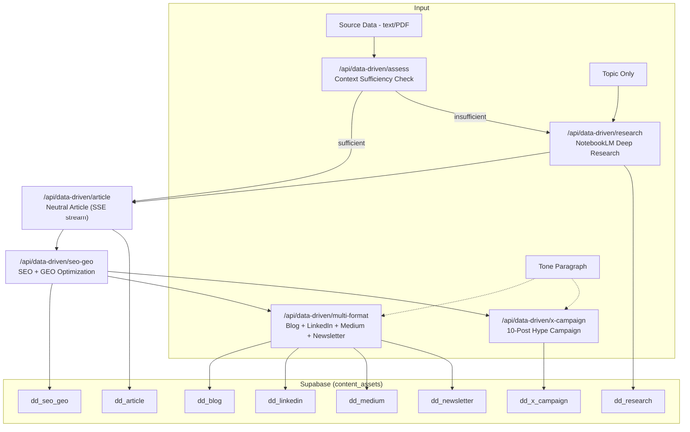
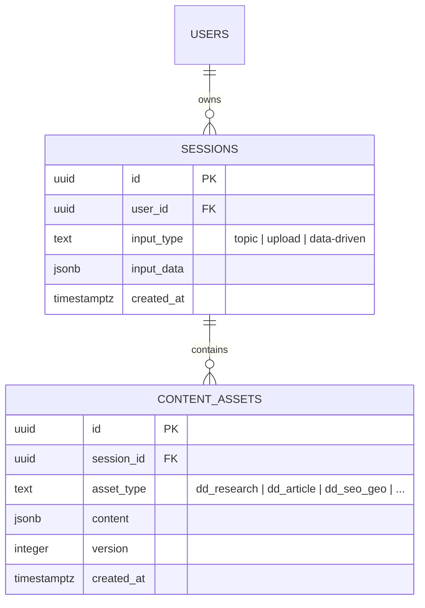

# Design: Data-Driven Content Generation Pipeline

## Overview

The data-driven pipeline is a parallel content generation flow that accepts raw source data (text/PDF) or a topic, paired with a free-form tone paragraph. It runs alongside the existing topic-based and upload-based pipelines without modifying them. Content flows through three iterations: neutral article generation, SEO+GEO optimization, and tone-applied multi-format output with a strategic X hype campaign.

The pipeline introduces two new architectural concepts:
1. **NotebookLM-powered deep research** — replaces the lightweight Google Search + single Claude call with a multi-capability research engine.
2. **GEO (Generative Engine Optimization)** — optimizes content for AI search engines (ChatGPT, Perplexity, Google AI Overviews) alongside traditional SEO.

---

## Architecture



### Pipeline Flow Variants

| Input Mode | Steps |
|---|---|
| Topic only | Research -> Article -> SEO+GEO -> Multi-format + X Campaign |
| Data (sufficient) | Article -> SEO+GEO -> Multi-format + X Campaign |
| Data (insufficient) | Assess -> Research -> Article (data + research) -> SEO+GEO -> Multi-format + X Campaign |

---

## Components and Interfaces

### New TypeScript Types (`types/index.ts`)

```typescript
// Extend SessionInputType
export type SessionInputType = "topic" | "upload" | "data-driven";

// New input data interface
export interface DataDrivenInputData {
  sourceText?: string;
  sourceFileName?: string;
  topic?: string;
  tone: string; // free-form paragraph, NOT TopicTone enum
}

// Extend union
export type SessionInputData = TopicInputData | UploadInputData | DataDrivenInputData;

// Deep research output
export interface DeepResearchResult {
  summary: string;
  keyFindings: string[];
  statistics: string[];
  expertInsights: string[];
  caseStudies: string[];
  controversies: string[];
  trends: string[];
  gaps: string[];
  sourceUrls: string[];
  capabilitiesUsed: string[];
}

// Context assessment output
export interface AssessmentResult {
  sufficient: boolean;
  missingAreas: string[];
  suggestedTopic: string;
}

// SEO+GEO combined result
export interface SeoGeoResult {
  seo: {
    title: string;
    metaDescription: string;
    slug: string;
    primaryKeyword: string;
    secondaryKeywords: string[];
    headingStructure: { h2: string[]; h3: string[] };
    faqSchema: Array<{ question: string; answer: string }>;
    seoScore: number;
  };
  geo: {
    citationOptimization: string[];
    entityMarking: Array<{ entity: string; description: string }>;
    conciseAnswers: Array<{ question: string; answer: string }>;
    structuredClaims: string[];
    sourceAttribution: string;
  };
}

// X campaign types
export interface XCampaignPost {
  postNumber: number;
  phase: "mystery" | "reveal_slow" | "reveal_full";
  content: string;
  purpose: string;
  scheduleSuggestion: string;
  hashtags: string[];
  hasLink: boolean;
}

export interface XCampaignOutput {
  campaignName: string;
  posts: XCampaignPost[];
  threadVariant: string[];
}

// Multi-format output
export interface MultiFormatOutput {
  blog: string;
  linkedin: string;
  medium: { article: string; subtitle: string };
  newsletter: {
    subjectLine: string;
    previewText: string;
    body: string;
    plainText: string;
  };
}
```

### New Prompt Modules (`lib/prompts/`)

| File | Input | Output | Tone Applied? |
|---|---|---|---|
| `deep-research.ts` | topic, notebookLmFindings | `DeepResearchResult` JSON | No |
| `data-driven-article.ts` | sourceText and/or researchData | Markdown article (2000-3500 words) | No |
| `seo-geo.ts` | article markdown | `SeoGeoResult` JSON | No |
| `multi-format.ts` | article, seoGeo, tone paragraph | `MultiFormatOutput` JSON | **Yes** |
| `x-campaign.ts` | article, seoGeo, tone paragraph | `XCampaignOutput` JSON | **Yes** |

### New API Routes (`app/api/data-driven/`)

All routes follow the existing pattern: `requireAuth()` -> sanitize input -> AI call -> save asset -> respond.

| Route | Method | Streaming | Asset Type(s) | Description |
|---|---|---|---|---|
| `/api/data-driven/assess` | POST | No | — | Lightweight context sufficiency check |
| `/api/data-driven/research` | POST | No | `dd_research` | NotebookLM deep research |
| `/api/data-driven/article` | POST | **SSE** | `dd_article` | Neutral article generation (accepts JSON or multipart/form-data for PDF) |
| `/api/data-driven/seo-geo` | POST | No | `dd_seo_geo` | Combined SEO + GEO optimization |
| `/api/data-driven/multi-format` | POST | No | `dd_blog`, `dd_linkedin`, `dd_medium`, `dd_newsletter` | Tone-applied multi-format output |
| `/api/data-driven/x-campaign` | POST | No | `dd_x_campaign` | 10-post hype campaign |

### New UI Components

| Component | Location | Description |
|---|---|---|
| `DataDrivenForm` | `components/input/DataDrivenForm.tsx` | Input form: toggle between data/topic mode, tone textarea, file upload |
| `DataDrivenStepper` | `components/sections/DataDrivenStepper.tsx` | Vertical stepper with collapsible cards, status indicators, regenerate buttons |

### New Pages

| Page | Route | Description |
|---|---|---|
| Pipeline stepper | `/dashboard/data-driven` | Main stepper page showing pipeline progress |
| Blog output | `/dashboard/data-driven/blog` | Rendered blog with copy button |
| LinkedIn output | `/dashboard/data-driven/linkedin` | LinkedIn article with copy button |
| Medium output | `/dashboard/data-driven/medium` | Medium article with copy button |
| Newsletter output | `/dashboard/data-driven/newsletter` | Email newsletter with copy buttons per section |
| X Campaign output | `/dashboard/data-driven/x-campaign` | 10-post timeline with phase-coded cards |

### Modified Files

| File | Changes |
|---|---|
| `types/index.ts` | Add `DataDrivenInputData`, `SeoGeoResult`, `XCampaignOutput`, etc. Extend `SessionInputType` and `SessionInputData` unions. |
| `components/dashboard/Sidebar.tsx` | Add "Data Pipeline" nav group with separator |
| `app/dashboard/page.tsx` | Add "Data-Driven" tab, render `DataDrivenForm`, show badges in history |
| `components/dashboard/SummaryPanel.tsx` | Add `dd_*` asset types to `ASSET_CATALOG` |

---

## Data Models

### Database Changes

Single migration: update `sessions.input_type` check constraint.

```sql
-- Migration: data_driven_flow.sql
ALTER TABLE public.sessions
  DROP CONSTRAINT sessions_input_type_check;

ALTER TABLE public.sessions
  ADD CONSTRAINT sessions_input_type_check
  CHECK (input_type IN ('topic', 'upload', 'data-driven'));
```

No schema changes to `content_assets` — all new asset types (`dd_research`, `dd_article`, `dd_seo_geo`, `dd_blog`, `dd_linkedin`, `dd_medium`, `dd_newsletter`, `dd_x_campaign`) are stored as JSONB in the existing `content` column.

### Entity Relationship (unchanged structure)



### Asset Content Shapes

| Asset Type | JSONB Shape |
|---|---|
| `dd_research` | `DeepResearchResult` |
| `dd_article` | `{ markdown: string, wordCount: number }` |
| `dd_seo_geo` | `SeoGeoResult` |
| `dd_blog` | `{ markdown: string, wordCount: number }` |
| `dd_linkedin` | `{ article: string }` |
| `dd_medium` | `{ article: string, subtitle: string }` |
| `dd_newsletter` | `{ subjectLine, previewText, body, plainText }` |
| `dd_x_campaign` | `XCampaignOutput` |

---

## API Design

### Request/Response Contracts

#### POST `/api/data-driven/assess`

```typescript
// Request
{ sourceText: string, sessionId?: string }

// Response 200
{ data: { sufficient: boolean, missingAreas: string[], suggestedTopic: string } }
```

#### POST `/api/data-driven/research`

```typescript
// Request
{ topic?: string, sourceText?: string, sessionId?: string }

// Response 201
{ data: { id, sessionId, assetType: "dd_research", content: DeepResearchResult, version, createdAt } }
```

#### POST `/api/data-driven/article`

Accepts `application/json` or `multipart/form-data` (for PDF upload).

```typescript
// JSON Request
{ sourceText?: string, researchData?: DeepResearchResult, sessionId?: string }

// multipart/form-data Request
file: PDF file
sessionId?: string

// Response: SSE stream
data: { text: "chunk" }          // streaming chunks
data: { done: true, wordCount, asset }  // final message
```

#### POST `/api/data-driven/seo-geo`

```typescript
// Request
{ article: string, sessionId: string }

// Response 200
{ data: { id, sessionId, assetType: "dd_seo_geo", content: SeoGeoResult, version, createdAt } }
```

#### POST `/api/data-driven/multi-format`

```typescript
// Request
{ article: string, seoGeo: SeoGeoResult, tone: string, sessionId: string }

// Response 201
{ data: { blog: asset, linkedin: asset, medium: asset, newsletter: asset } }
```

#### POST `/api/data-driven/x-campaign`

```typescript
// Request
{ article: string, seoGeo: SeoGeoResult, tone: string, sessionId: string }

// Response 201
{ data: { id, sessionId, assetType: "dd_x_campaign", content: XCampaignOutput, version, createdAt } }
```

### Error Response Format (consistent with existing)

```typescript
{ error: { code: string, message: string, details?: Array<{ field: string, message: string }> } }
```

---

## Error Handling Strategy

Follows existing patterns established in `app/api/blog/route.ts` and `app/api/research/route.ts`:

1. **Auth errors** — 401 with `{ code: "unauthorized" }`. Caught via `requireAuth()`.
2. **Validation errors** — 400 with `{ code: "validation_error", details: [...] }`. Validated before any AI call.
3. **JSON parse errors** — AI responses wrapped in try/catch with fallback markdown code block extraction (same pattern as research route).
4. **Storage errors** — 500 with `{ code: "storage_error" }`. Supabase insert failures.
5. **Streaming errors** — SSE `data: { error: "message" }` followed by `controller.close()` (same as blog route).
6. **PDF parse errors** — 400 with specific message for image-only PDFs or files exceeding 80K chars.
7. **NotebookLM errors** — 500 with `{ code: "research_error" }`. Fallback to Google Search + standard research if NotebookLM is unavailable.

---

## Testing Strategy

| Layer | Tool | Focus |
|---|---|---|
| Unit | Vitest | Prompt builders, PDF parser, type guards, utility functions |
| Integration | Vitest + MSW | API routes with mocked AI/Supabase responses |
| Component | React Testing Library | Form validation, stepper state transitions, output rendering |
| E2E | Manual verification | Full pipeline flow (topic-only, data-sufficient, data-insufficient, PDF) |

**Coverage target:** 80%+ on new code.

**Key test scenarios:**
- PDF text extraction (valid PDF, image-only PDF, oversized PDF)
- Context assessment (sufficient vs. insufficient)
- Article generation with source data only, research only, and both combined
- SEO+GEO output validates against `SeoGeoResult` schema
- Multi-format produces all 4 distinct outputs
- X campaign produces exactly 10 posts with correct phase distribution
- Stepper state persistence across page reloads
- Session history shows correct badges for data-driven sessions

---

## Security Architecture

### Threat Model

| Threat | Vector | Likelihood | Impact | Mitigation |
|---|---|---|---|---|
| Malicious PDF upload | Exploit in pdf-parse | Medium | High | Validate content-type, enforce size limit (10MB), run pdf-parse in try/catch, sanitize extracted text |
| Prompt injection via source text | User injects adversarial prompt in source data | Medium | Medium | Sanitize all user input before embedding in prompts (existing `sanitizeInput()`), AI output is always treated as untrusted data |
| XSS via generated content | AI outputs malicious HTML | Low | Medium | All markdown rendered via `react-markdown` (sanitizes by default), no `dangerouslySetInnerHTML` |
| IDOR on session assets | User accesses another user's session | Low | High | Supabase RLS policies (existing) ensure users only see their own sessions/assets |
| Rate abuse on AI endpoints | Automated requests burning API credits | Medium | Medium | Existing middleware rate limiter (10 req/60s per user per endpoint) |
| Oversized payload DoS | Large text/PDF submission | Medium | Low | Enforce 80K char limit on source text, 10MB on PDF upload |

### Security Controls

- All endpoints require JWT auth via `requireAuth()`
- All user text inputs sanitized via `sanitizeInput()` / `sanitizeUnknown()`
- PDF upload: validate MIME type, enforce size limit, extract text safely
- No secrets in client-side code — NotebookLM API key is server-side only
- Rate limiting applied via existing middleware

---

## Scalability and Performance

### Performance Targets

| Metric | Target |
|---|---|
| Context assessment (assess) | < 3s (lightweight AI call, ~500 tokens) |
| Deep research (research) | < 30s (NotebookLM multi-capability) |
| Article generation (article) | First token < 2s, full article < 45s (streaming) |
| SEO+GEO (seo-geo) | < 15s |
| Multi-format (multi-format) | < 20s |
| X Campaign (x-campaign) | < 15s |

### Optimization Strategies

1. **Parallel execution** — Multi-format and X Campaign fire in parallel after SEO+GEO completes (saves ~15s).
2. **Streaming** — Article generation uses SSE streaming (same as existing blog route) for perceived performance.
3. **Parallelized research** — When using Google Search fallback, 3 search queries run via `Promise.all()` (existing pattern).
4. **Lazy loading** — Output pages only fetch their specific asset type, not the full session.
5. **Asset caching** — Stepper restores from saved assets on page reload, no re-generation needed.

### ADR-1: NotebookLM as Primary Research Engine

**Status:** Accepted
**Context:** Requirements specify deep research with multiple capabilities (competitive intel, market synthesis, etc.). The existing Google Search + single Claude call produces shallow research.
**Options Considered:**
- Option A: Enhanced Google Search + multi-prompt Claude analysis — Pro: No new dependency. Con: Limited depth, no programmatic notebook management.
- Option B: NotebookLM API integration — Pro: Multi-capability research, structured artifacts, richer output. Con: New dependency, API availability risk.
**Decision:** Use NotebookLM as the primary research engine with Google Search + Claude as fallback when NotebookLM is unavailable.
**Consequences:** Must handle NotebookLM API errors gracefully. New env var `NOTEBOOKLM_API_KEY` required.

### ADR-2: Free-Form Tone vs. TopicTone Enum

**Status:** Accepted
**Context:** The existing pipeline uses `TopicTone` enum (`"authority" | "casual" | "storytelling"`). The data-driven pipeline requires a free-form tone paragraph for brand voice matching.
**Options Considered:**
- Option A: Extend `TopicTone` with custom option — Pro: Backwards compatible. Con: Two different tone systems, confusing.
- Option B: Separate `tone: string` field on `DataDrivenInputData` — Pro: Clean separation, no impact on existing pipeline. Con: Different UX pattern.
**Decision:** Option B. The data-driven pipeline uses `tone: string` (free-form paragraph). The existing pipeline keeps `TopicTone` enum unchanged.
**Consequences:** No breaking changes to existing pipeline. Tone is embedded directly into Iteration 3 prompts as a raw paragraph.

### ADR-3: PDF Parsing Library

**Status:** Accepted
**Context:** Need to extract text from user-uploaded PDFs.
**Options Considered:**
- Option A: `pdf-parse` — Pro: Lightweight (2.5MB), well-maintained, simple API. Con: Text-only (no OCR).
- Option B: `@nutrient/document-processing` — Pro: Full document processing. Con: Heavy, requires API key, overkill for text extraction.
**Decision:** Use `pdf-parse`. Image-only PDFs are rejected with a helpful error message directing users to paste text manually.
**Consequences:** Must add `pdf-parse` to dependencies. Must handle the case where extracted text is empty (image-only PDF).

---

## Dependencies and Risks

### New Dependencies

| Package | Purpose | License |
|---|---|---|
| `pdf-parse` | PDF text extraction | MIT |

### Environment Variables (new)

| Variable | Required | Purpose |
|---|---|---|
| `NOTEBOOKLM_API_KEY` | For deep research | NotebookLM API authentication |
| `GOOGLE_SEARCH_ENGINE_ID` | For research fallback | Already exists but not in env list |

### Risks

| Risk | Likelihood | Impact | Mitigation |
|---|---|---|---|
| NotebookLM API instability or rate limits | Medium | Medium | Fallback to Google Search + Claude analysis. Log failures for monitoring. |
| AI model produces invalid JSON for structured outputs | Medium | Low | JSON parse with fallback extraction (existing pattern). Schema validation before saving. |
| PDF parsing fails on complex documents | Low | Low | Clear error message. User can paste text manually as alternative. |
| Large source text (near 80K limit) causes slow AI responses | Low | Medium | Truncation with flag. Consider chunking for very large documents in future iteration. |

---

## File Summary

| Action | Count | Files |
|---|---|---|
| **Modify** | 4 | `types/index.ts`, `Sidebar.tsx`, `dashboard/page.tsx`, `SummaryPanel.tsx` |
| **New utility** | 1 | `lib/pdf-parse.ts` |
| **New prompts** | 5 | `lib/prompts/deep-research.ts`, `data-driven-article.ts`, `seo-geo.ts`, `multi-format.ts`, `x-campaign.ts` |
| **New API routes** | 6 | `app/api/data-driven/{assess,research,article,seo-geo,multi-format,x-campaign}/route.ts` |
| **New components** | 2 | `DataDrivenForm.tsx`, `DataDrivenStepper.tsx` |
| **New pages** | 6 | `app/dashboard/data-driven/{page,blog/page,linkedin/page,medium/page,newsletter/page,x-campaign/page}.tsx` |
| **New migration** | 1 | `supabase/migrations/<timestamp>_data_driven_flow.sql` |
| **Total** | ~25 | 4 modified + ~21 new |
