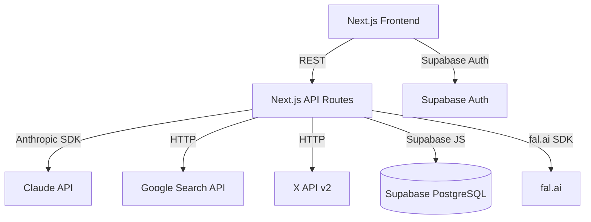

# Design — AI Content Engine

## Architecture Overview

## Data Models

### users (managed by Supabase Auth)
| Column | Type | Notes |
|---|---|---|
| id | uuid | PK, from auth.users |
| email | text | unique |
| created_at | timestamptz | |

### sessions
| Column | Type | Notes |
|---|---|---|
| id | uuid | PK |
| user_id | uuid | FK → auth.users |
| input_type | enum('topic','upload') | |
| input_data | jsonb | topic form or raw article text |
| created_at | timestamptz | |

### content_assets
| Column | Type | Notes |
|---|---|---|
| id | uuid | PK |
| session_id | uuid | FK → sessions |
| asset_type | text | 'research','seo','blog','x','linkedin',... |
| content | jsonb | Full generated output |
| version | int | For regeneration history |
| created_at | timestamptz | |

## API Design

All routes under `/api/`. Each accepts POST with JSON body and returns streamed or JSON response.

### POST /api/research
Input: `{ topic, audience, geography? }`
Output: `{ intent, demand, trend, keywords, faqs, competitors, gaps }`
- Calls Google Search API for top 10 results
- Calls Claude to analyse and extract intelligence

### POST /api/seo
Input: `{ topic, research, keywords }`
Output: `{ title, metaDescription, slug, primaryKeyword, secondaryKeywords, faqSchema, articleSchema, snippetAnswer, headingStructure, seoScore, keywordScore, rankingPotential }`

### POST /api/blog
Input: `{ topic, seo, research, tone }`
Output: streamed markdown (SSE)
- Streams via `ReadableStream` + `TransformStream`

### POST /api/improve
Input: `{ article: string }`
Output: `{ original, improved, changes[] }`

### POST /api/social
Input: `{ blog, seo, platforms: string[] }`
Output: `{ x, linkedin, instagram, medium, reddit, newsletter, pinterest }`

### POST /api/images
Input: `{ topic, blog, style }`
Output: `{ hero, sections[], infographic, social, pinterest }`

### POST /api/distribute
Input: `{ assets }`
Output: `{ sequence[], platformInstructions{} }`

### POST /api/traffic
Input: `{ topic, seo }`
Output: `{ demand, competition, clickPotential, seoStrength, label, estimatedRange }`

### POST /api/flywheel
Input: `{ topic, keywords }`
Output: `{ ideas[], clusters[] }`

## Architecture Decision Records (ADRs)

### ADR-01: Streaming for blog generation
**Decision:** Use SSE (Server-Sent Events) via Next.js `StreamingTextResponse`.
**Reason:** Blog generation takes 15–30s; streaming removes perceived latency.
**Consequence:** Client must handle partial markdown rendering.

### ADR-02: All AI via Claude API only
**Decision:** No OpenAI, no Gemini — single provider.
**Reason:** Simplifies key management, billing, and prompt iteration.
**Consequence:** Tied to Anthropic uptime; mitigated by Vercel edge retry.

### ADR-03: No direct social posting in MVP
**Decision:** Distribution engine produces copy-paste instructions, not API posts.
**Reason:** X API v2 posting requires OAuth 2.0 PKCE per user — scope creep for MVP.
**Consequence:** Phase 2 adds per-user OAuth token storage and posting.

### ADR-04: Supabase for both auth and DB
**Decision:** Use Supabase for auth + PostgreSQL.
**Reason:** Row-level security (RLS) ties auth identity directly to data access — zero boilerplate auth middleware.
**Consequence:** All queries must use the Supabase JS client with the user's session token.

### ADR-05: Prompt templates in `/lib/prompts/`
**Decision:** All Claude prompts are TypeScript functions in dedicated files.
**Reason:** Prompts are the core product logic — they must be testable, versioned, and iterable independently of API route logic.

## Error Handling

| Scenario | Handling |
|---|---|
| Claude API timeout (>30s) | Return partial content + "Generation incomplete" toast |
| Google Search API rate limit | Return cached results if available; else show "Research unavailable" |
| Supabase write failure | Show warning "Content not saved"; content still usable in UI |
| Invalid topic (empty/too short) | Client-side validation before any API call |
| Low demand topic | Research engine returns alternatives; user must confirm before proceeding |

## Security

- All API routes validate `Authorization` header via Supabase JWT middleware
- RLS policies: users can only read/write their own `sessions` and `content_assets`
- API keys (Anthropic, Google, Twitter, fal.ai) stored in Vercel env vars — never exposed to client
- `NEXT_PUBLIC_` prefix only for Supabase URL and anon key (safe by design)
- Input sanitised before insertion into prompts (strip prompt-injection characters)
- Rate limiting via Vercel Edge middleware (10 req/min per user per route)

## Performance

- Blog streaming: first token in <2s via Claude streaming API
- Research: parallelise Google Search + Claude analysis with `Promise.all`
- Social generation: all 8 platforms in one Claude call (single prompt, structured JSON output)
- Supabase queries: indexed on `session_id` and `user_id`
- No client-side AI calls — all generation server-side
