# Design: distribution-and-analytics

---

## Architecture Diagram

```mermaid
graph TD
  subgraph Browser["Browser (Next.js 16 / React 19)"]
    XPanel["XPanel / LinkedInPanel / etc."]
    CalendarPanel["CalendarPanel (extended)"]
    AnalyticsPage["Analytics Dashboard"]
    NewsletterPanel["NewsletterPanel"]
  end

  subgraph NextAPI["Next.js API Routes (app/api/)"]
    PublishX["POST /api/publish/x"]
    PublishLI["POST /api/publish/linkedin"]
    PublishIG["POST /api/publish/instagram"]
    PublishRD["POST /api/publish/reddit"]
    PublishNL["POST /api/publish/newsletter"]
    ScheduleAPI["POST /api/schedule"]
    ScheduleDel["DELETE /api/schedule/:id"]
    GA4API["GET /api/analytics/ga4"]
    SCAPI["GET /api/analytics/search-console"]
    TriggerAPI["GET /api/analytics/refresh-triggers"]
  end

  subgraph ExternalAPIs["External Platform APIs"]
    TwitterV2["Twitter API v2"]
    LinkedInAPI["LinkedIn Share API v2"]
    InstagramGraph["Instagram Graph API"]
    RedditOAuth["Reddit OAuth API"]
    MailchimpAPI["Mailchimp Campaigns API"]
    SendGridAPI["SendGrid Mail Send API"]
    GA4DataAPI["GA4 Data API"]
    SearchConsoleAPI["Search Console API"]
  end

  subgraph Supabase["Supabase (PostgreSQL + Auth)"]
    Sessions["sessions"]
    ContentAssets["content_assets"]
    DistLogs["distribution_logs"]
    ScheduledPosts["scheduled_posts"]
    AnalyticsSnaps["analytics_snapshots"]
    RefreshTriggers["refresh_triggers"]
  end

  subgraph Worker["Cron / Edge Function"]
    ScheduleWorker["schedule-worker (Next.js Route Handler or Vercel Cron)"]
    DeltaWorker["analytics-delta-worker (detects ranking drops)"]
  end

  XPanel --> PublishX --> TwitterV2
  LinkedInPanel --> PublishLI --> LinkedInAPI
  InstagramPanel --> PublishIG --> InstagramGraph
  RedditPanel --> PublishRD --> RedditOAuth
  NewsletterPanel --> PublishNL --> MailchimpAPI
  PublishNL --> SendGridAPI
  CalendarPanel --> ScheduleAPI --> ScheduledPosts
  AnalyticsPage --> GA4API --> GA4DataAPI
  AnalyticsPage --> SCAPI --> SearchConsoleAPI
  AnalyticsPage --> TriggerAPI --> RefreshTriggers

  PublishX --> DistLogs
  PublishLI --> DistLogs
  PublishIG --> DistLogs
  PublishRD --> DistLogs
  PublishNL --> DistLogs

  GA4API --> AnalyticsSnaps
  SCAPI --> AnalyticsSnaps

  ScheduleWorker --> ScheduledPosts
  ScheduleWorker --> DistLogs
  DeltaWorker --> AnalyticsSnaps
  DeltaWorker --> RefreshTriggers
```



---

## Components and Interfaces

### New API Route Handlers

| File | Method | Purpose |
|---|---|---|
| `app/api/publish/x/route.ts` | POST | Post tweet or thread to Twitter v2 |
| `app/api/publish/linkedin/route.ts` | POST | Post to LinkedIn Share API v2 |
| `app/api/publish/instagram/route.ts` | POST | Publish to Instagram Graph API |
| `app/api/publish/reddit/route.ts` | POST | Submit post to Reddit |
| `app/api/publish/newsletter/route.ts` | POST | Dispatch via Mailchimp or SendGrid |
| `app/api/schedule/route.ts` | POST | Queue a scheduled post |
| `app/api/schedule/[id]/route.ts` | DELETE | Cancel a queued post |
| `app/api/analytics/ga4/route.ts` | GET | Fetch GA4 data (with 24h cache) |
| `app/api/analytics/search-console/route.ts` | GET | Fetch Search Console data (with 24h cache) |
| `app/api/analytics/refresh-triggers/route.ts` | GET | List pending refresh triggers |

### New Library Modules

| File | Purpose |
|---|---|
| `lib/publish/twitter.ts` | Twitter v2 OAuth 1.0a client + post/thread functions |
| `lib/publish/linkedin.ts` | LinkedIn API client + share function |
| `lib/publish/instagram.ts` | Instagram Graph API client + publish function |
| `lib/publish/reddit.ts` | Reddit OAuth client + submit function |
| `lib/publish/newsletter.ts` | Mailchimp + SendGrid dispatch functions |
| `lib/publish/distribution-log.ts` | Shared: write/check distribution_logs |
| `lib/analytics/ga4.ts` | GA4 Data API client + snapshot caching |
| `lib/analytics/search-console.ts` | Search Console API client + snapshot caching |
| `lib/analytics/delta.ts` | Ranking drop detection logic |
| `lib/schedule/worker.ts` | Scheduled post processing logic |

### New UI Components

| File | Purpose |
|---|---|
| `components/sections/PublishButton.tsx` | Reusable "Post to {platform}" button with loading/success/error states |
| `components/sections/ScheduleModal.tsx` | Datetime picker modal for scheduling a post |
| `components/sections/AnalyticsDashboard.tsx` | Full analytics page with charts |
| `components/sections/RefreshTriggerBanner.tsx` | Banner listing pending refresh triggers |

---

## API Design

### POST /api/publish/x

**Request:**
```json
{
  "sessionId": "uuid",
  "content": "tweet text or thread array",
  "contentType": "tweet" | "thread"
}
```
**Response 201:**
```json
{
  "data": { "externalId": "twitter_post_id", "logId": "uuid" }
}
```
**Response 409:** `{ "error": { "code": "already_published", "message": "Already published to x for this session." } }`
**Response 429:** `{ "error": { "code": "rate_limited", "message": "Rate limit reached — try again in 900s" } }`

### POST /api/publish/linkedin

**Request:**
```json
{ "sessionId": "uuid", "content": "post body text", "contentType": "storytelling" | "authority" | "carousel" }
```
**Response 201:** `{ "data": { "externalId": "urn:li:share:...", "logId": "uuid" } }`

### POST /api/publish/instagram

**Request:**
```json
{ "sessionId": "uuid", "caption": "caption text", "imageUrl": "https://..." }
```
**Response 201:** `{ "data": { "externalId": "ig_media_id", "logId": "uuid" } }`
**Response 400:** `{ "error": { "code": "validation_error", "message": "Instagram requires an image — attach one before publishing." } }`

### POST /api/publish/reddit

**Request:**
```json
{ "sessionId": "uuid", "title": "post title", "body": "post body", "subreddit": "programming" }
```
**Response 201:** `{ "data": { "externalId": "t3_abc123", "logId": "uuid" } }`

### POST /api/publish/newsletter

**Request:**
```json
{
  "sessionId": "uuid",
  "provider": "mailchimp" | "sendgrid",
  "subjectLine": "Subject here",
  "body": "<html>...</html>",
  "recipientEmail": "optional@email.com"
}
```
**Response 201:** `{ "data": { "campaignId": "...", "logId": "uuid" } }`

### POST /api/schedule

**Request:**
```json
{
  "sessionId": "uuid",
  "platform": "x" | "linkedin" | "instagram" | "reddit" | "newsletter_mailchimp" | "newsletter_sendgrid",
  "publishAt": "2026-04-25T09:00:00Z",
  "assetType": "social_x",
  "contentSnapshot": { ... }
}
```
**Response 201:** `{ "data": { "id": "uuid", "status": "queued", "publishAt": "..." } }`

### DELETE /api/schedule/:id

**Response 200:** `{ "data": { "id": "uuid", "status": "cancelled" } }`
**Response 404:** `{ "error": { "code": "not_found", "message": "Scheduled post not found" } }`

### GET /api/analytics/ga4

**Query params:** `?forceRefresh=true` (bypass 24h cache)
**Response 200:**
```json
{
  "data": {
    "period": "last_30_days",
    "sessions": 1240,
    "pageViews": 3820,
    "topPages": [{ "path": "/blog/...", "views": 540 }],
    "cachedAt": "2026-04-19T10:00:00Z"
  }
}
```

### GET /api/analytics/search-console

**Response 200:**
```json
{
  "data": {
    "period": "last_28_days",
    "totalClicks": 320,
    "totalImpressions": 8400,
    "averageCtr": 0.038,
    "topQueries": [{ "query": "...", "clicks": 80, "impressions": 1200, "position": 4.2 }],
    "cachedAt": "2026-04-19T10:00:00Z"
  }
}
```

### GET /api/analytics/refresh-triggers

**Response 200:**
```json
{
  "data": [
    { "id": "uuid", "query": "...", "oldRank": 3, "newRank": 12, "sessionId": "uuid", "status": "pending" }
  ]
}
```

---

## Database Architecture

### New Table: `distribution_logs`

```sql
CREATE TABLE public.distribution_logs (
  id uuid PRIMARY KEY DEFAULT gen_random_uuid(),
  session_id uuid NOT NULL REFERENCES public.sessions(id) ON DELETE CASCADE,
  user_id uuid NOT NULL REFERENCES auth.users(id) ON DELETE CASCADE,
  platform text NOT NULL,
  status text NOT NULL CHECK (status IN ('published', 'failed')),
  external_id text,
  metadata jsonb NOT NULL DEFAULT '{}'::jsonb,
  error_details text,
  created_at timestamptz NOT NULL DEFAULT now()
);
```
RLS: `user_id = auth.uid()` on SELECT/INSERT.
Index: `(session_id, platform)` for idempotency checks.

### New Table: `scheduled_posts`

```sql
CREATE TABLE public.scheduled_posts (
  id uuid PRIMARY KEY DEFAULT gen_random_uuid(),
  session_id uuid NOT NULL REFERENCES public.sessions(id) ON DELETE CASCADE,
  user_id uuid NOT NULL REFERENCES auth.users(id) ON DELETE CASCADE,
  platform text NOT NULL,
  asset_type text NOT NULL,
  content_snapshot jsonb NOT NULL DEFAULT '{}'::jsonb,
  status text NOT NULL DEFAULT 'queued' CHECK (status IN ('queued', 'published', 'failed', 'cancelled')),
  publish_at timestamptz NOT NULL,
  published_at timestamptz,
  external_id text,
  error_details text,
  created_at timestamptz NOT NULL DEFAULT now()
);
```
Index: `(status, publish_at)` for worker polling.

### New Table: `analytics_snapshots`

```sql
CREATE TABLE public.analytics_snapshots (
  id uuid PRIMARY KEY DEFAULT gen_random_uuid(),
  user_id uuid NOT NULL REFERENCES auth.users(id) ON DELETE CASCADE,
  source text NOT NULL CHECK (source IN ('ga4', 'search_console')),
  data jsonb NOT NULL DEFAULT '{}'::jsonb,
  fetched_at timestamptz NOT NULL DEFAULT now()
);
```
Index: `(user_id, source, fetched_at DESC)` for latest-snapshot lookup.

### New Table: `refresh_triggers`

```sql
CREATE TABLE public.refresh_triggers (
  id uuid PRIMARY KEY DEFAULT gen_random_uuid(),
  user_id uuid NOT NULL REFERENCES auth.users(id) ON DELETE CASCADE,
  session_id uuid REFERENCES public.sessions(id) ON DELETE SET NULL,
  query text NOT NULL,
  old_rank numeric,
  new_rank numeric,
  trigger_reason text NOT NULL DEFAULT 'ranking_drop',
  status text NOT NULL DEFAULT 'pending' CHECK (status IN ('pending', 'resolved')),
  resolved_at timestamptz,
  created_at timestamptz NOT NULL DEFAULT now()
);
```
Index: `(user_id, status)` and unique partial `(session_id, query)` WHERE `status='pending'`.

---

## Security Architecture

### OAuth Token Storage
- **Twitter:** `TWITTER_API_KEY`, `TWITTER_API_SECRET`, `TWITTER_ACCESS_TOKEN`, `TWITTER_ACCESS_SECRET` in server-side env vars (never in Supabase, never exposed to browser).
- **LinkedIn / Instagram / Reddit:** `LINKEDIN_ACCESS_TOKEN`, `INSTAGRAM_ACCESS_TOKEN`, `REDDIT_REFRESH_TOKEN` in server-side env vars. Reddit uses the refresh token to fetch short-lived access tokens on each request.
- **Google (GA4 / Search Console):** `GOOGLE_SERVICE_ACCOUNT_JSON` (full JSON key) in server-side env. Parsed at runtime; never logged.
- **Rule:** No OAuth tokens are returned to the browser. All publish endpoints are server-side route handlers behind JWT auth.

### Rate Limit Strategy
| Platform | Limit | Handling |
|---|---|---|
| Twitter v2 | 300 tweets/3h per app | Return 429 with `retry_after`; no auto-retry |
| LinkedIn | 3 posts/day per person | Check `distribution_logs` count before posting |
| Instagram | 25 posts/day | Check `distribution_logs` count |
| Reddit | 1 post/10min per account | Surface error; no auto-retry |
| Mailchimp | 10 sends/day (free) | Surface error |
| GA4 | 10 req/sec quota | 24h cache in `analytics_snapshots` |

### Secret Injection Pattern
```typescript
// lib/publish/secrets.ts
export function getTwitterSecrets() {
  const keys = ['TWITTER_API_KEY','TWITTER_API_SECRET','TWITTER_ACCESS_TOKEN','TWITTER_ACCESS_SECRET'] as const
  for (const key of keys) {
    if (!process.env[key]) throw new Error(`Missing env: ${key}`)
  }
  return {
    apiKey: process.env.TWITTER_API_KEY!,
    apiSecret: process.env.TWITTER_API_SECRET!,
    accessToken: process.env.TWITTER_ACCESS_TOKEN!,
    accessSecret: process.env.TWITTER_ACCESS_SECRET!,
  }
}
```
Each platform has its own typed secret accessor. Throw `config_error` on missing vars.

---

## Testing Strategy

| Layer | Tool | What to Test |
|---|---|---|
| Unit | Jest | `lib/publish/*` — mock fetch, assert request shape, response normalization |
| Unit | Jest | `lib/analytics/*` — cache TTL logic, delta computation |
| Integration | Jest + Supabase local | Distribution log idempotency, scheduled_posts CRUD |
| E2E | Playwright (optional) | Publish button flow + analytics page rendering |

Test files live in `__tests__/` or co-located `*.test.ts`.
All external API calls are mocked in tests with `jest.spyOn(global, 'fetch')`.

---

## UI/UX Design

### PublishButton
- Variants: `idle`, `loading`, `success`, `error`
- Idle: `Post to X` button with platform icon
- Loading: spinner + "Posting..."
- Success: green checkmark + "Posted" + timestamp
- Error: red icon + error text + "Retry" button

### ScheduleModal
- Trigger: clock icon on CalendarPanel slot
- Content: `<input type="datetime-local">` (UTC-aware via `.toISOString()`)
- Actions: "Schedule" (primary), "Cancel" (secondary)
- Validation: `publish_at` must be ≥ 5 minutes from now

### Analytics Dashboard (`components/sections/AnalyticsDashboard.tsx`)
- Grid: 2×2 cards on md screens
  - Card 1: 30-day sessions sparkline (recharts `<LineChart>`)
  - Card 2: Top pages table (path, views, % share)
  - Card 3: CTR bar chart by day (recharts `<BarChart>`)
  - Card 4: Top keywords table (query, clicks, position)
- Skeleton loaders: `animate-pulse` Tailwind classes while fetching
- Error states: inline `<Card>` with red border + error message

### RefreshTriggerBanner
- Placement: top of Analytics page, below page header
- Visible only when ≥1 pending triggers exist
- Each trigger row: query text, "was #N now #M", "Regenerate" button
- Dismissible per-trigger (marks as resolved without regenerating)

---

## Observability

### PostHog Events
| Event | When | Properties |
|---|---|---|
| `content_published` | Successful platform publish | `platform`, `session_id`, `content_type` |
| `publish_failed` | Platform API error | `platform`, `session_id`, `error_code` |
| `post_scheduled` | `scheduled_posts` insert | `platform`, `publish_at`, `session_id` |
| `analytics_synced` | GA4/SC snapshot saved | `source`, `rows_returned` |
| `content_refresh_triggered` | `refresh_triggers` insert | `query`, `old_rank`, `new_rank` |
| `content_refresh_resolved` | Trigger resolved | `session_id`, `time_to_resolve_ms` |

### Structured Logging
All route handlers emit `console.error` with a JSON payload on failure:
```json
{ "event": "publish_error", "platform": "x", "sessionId": "...", "error": "..." }
```
