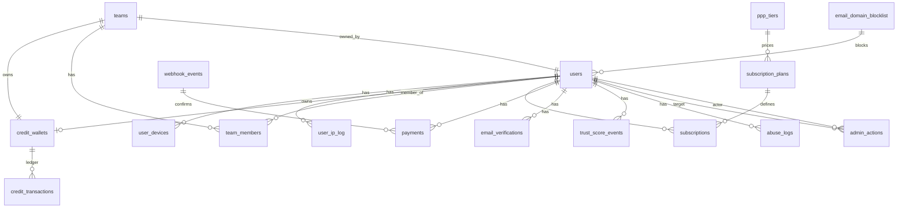
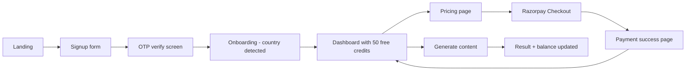

# Design: Monetization & User System

> **Authoring map:** software-cto owns the merge. Sections are authored by the noted specialists: database-architect (Database Architecture), devops-infra-expert (Deployment & Infrastructure), observability-engineer (Observability), test-expert (Testing Strategy), security-reviewer + security-architect (Security Architecture), ui-design-expert (UI/UX Design). All other sections authored by software-cto with input from architect and planner.

---

## Overview

This design realizes the 28 requirements of the Monetization & User System on top of the existing Next.js 14 (App Router) + Supabase + Anthropic stack, adding **Razorpay** for payments/subscriptions, **Upstash Redis** for rate-limit and IP-cache state, **Resend** for transactional email, and **FingerprintJS OSS** for device identity.

The system is composed of seven cooperating subdomains:

1. **Identity & Sessions** — Supabase Auth (magic link + password) with Next.js middleware enforcing JWT on every protected route, plus a `user_devices` / `user_ip_log` ledger for multi-device + anti-abuse signals.
2. **Wallet & Credits** — A single canonical `credit_wallets` table (per user OR per team) with all mutations performed via a Supabase Postgres function (`fn_deduct_credits`) so deduction is atomic with the action that consumes it.
3. **Billing (Razorpay)** — Server-side order/subscription creation, webhook ingestion at `/api/webhooks/razorpay` with HMAC-SHA256 verification and idempotent processing keyed by `payment_id` / event id stored in `webhook_events`.
4. **PPP Pricing Engine** — Country detection (CF-IPCountry → MaxMind fallback) at signup, stored on the user; tier mapping resolved server-side at order creation. The client never supplies an amount.
5. **Anti-Abuse** — Layered checks (email validation, MX, disposable-domain blocklist, IP rate, device fingerprint, behavioral signals) feeding a single `trust_score` integer in `users`. Trust score gates capabilities.
6. **Teams** — `teams` + `team_members` + a team-owned `credit_wallets` row. RLS scopes member access; deductions debit the team wallet but log the `user_id` actor.
7. **Admin & Analytics** — Role-claim gated admin routes; `admin_actions` audit; analytics aggregates rolled up nightly into `daily_credit_aggregates`.

Cross-cutting: every credit mutation, every webhook, every admin action, and every trust-score change writes to a structured audit log. Webhooks are idempotent; credit deduction is atomic; PPP amounts are server-trusted.

---

## Architecture

```mermaid
graph TD
    subgraph Client
        Browser[Browser - Next.js App Router UI]
        FP[FingerprintJS OSS]
    end

    subgraph EdgeAndAPI[Vercel Edge + Next.js API Routes]
        MW[Edge Middleware - JWT + Rate Limit + Geo]
        AuthAPI[/api/auth/*]
        CreditAPI[/api/credits/*]
        SubAPI[/api/subscriptions/*]
        PayAPI[/api/payments/*]
        TeamAPI[/api/teams/*]
        AdminAPI[/api/admin/*]
        ContentAPI[/api/content/generate]
        WebhookAPI[/api/webhooks/razorpay]
        EmailAPI[/api/email/verify]
    end

    subgraph Supabase
        SBAuth[Supabase Auth - JWT issuer]
        PG[(Postgres + RLS)]
        RPC[Postgres Functions - fn_deduct_credits, fn_grant_free_credits]
    end

    subgraph External
        Razorpay[Razorpay Orders + Subscriptions + Webhooks]
        Resend[Resend SMTP]
        Anthropic[Anthropic Claude API]
        MaxMind[MaxMind GeoIP]
        IPRep[IP Reputation API - VPN/Proxy]
        Upstash[(Upstash Redis - rate limits, IP cache)]
    end

    Browser -->|fingerprint hash| FP
    Browser -->|HTTPS| MW
    MW --> AuthAPI
    MW --> CreditAPI
    MW --> SubAPI
    MW --> PayAPI
    MW --> TeamAPI
    MW --> AdminAPI
    MW --> ContentAPI
    MW --> EmailAPI
    Razorpay -->|webhook| WebhookAPI

    AuthAPI --> SBAuth
    AuthAPI --> Resend
    EmailAPI --> Resend
    AuthAPI --> Upstash
    MW --> Upstash

    SubAPI --> Razorpay
    PayAPI --> Razorpay
    WebhookAPI --> RPC
    CreditAPI --> RPC
    ContentAPI --> RPC
    ContentAPI --> Anthropic

    AuthAPI --> MaxMind
    AuthAPI --> IPRep
    AuthAPI --> PG
    RPC --> PG
    AdminAPI --> PG
    TeamAPI --> PG
```

**Key flow invariants:**
- Every protected request transits the Edge Middleware which (a) validates JWT, (b) applies the appropriate rate-limit window via Upstash, (c) attaches `country_code` / `ip` to the request context.
- All credit-mutating writes are funneled through Postgres functions (`fn_deduct_credits`, `fn_grant_free_credits`, `fn_credit_topup`) — never direct table updates from API handlers.
- Razorpay webhooks are the source of truth for any wallet credit; client-side payment success callbacks are advisory only.

---

## Components and Interfaces

| Component | Responsibility | Key Interfaces |
|---|---|---|
| `lib/auth/session.ts` | JWT validation, refresh, multi-device session store | `getSession(req)`, `revokeSession(sessionId)`, `revokeAllSessions(userId)` |
| `lib/credits/wallet.ts` | Wallet read; thin wrapper around RPC | `getBalance(walletId)`, `deduct(walletId, cost, action, requestId)`, `grantFree(userId)` |
| `lib/billing/razorpay.ts` | Server SDK wrapper for orders + subscriptions | `createOrder(userId, packId)`, `createSubscription(userId, planId)`, `verifyWebhookSignature(headers, raw)` |
| `lib/pricing/ppp.ts` | Country → tier resolution + amount calc | `resolveTier(countryCode)`, `priceFor(tier, currency, productId)` |
| `lib/abuse/signals.ts` | Disposable-domain check, MX lookup, typo suggestion, VPN check, fingerprint match | `evaluateSignup(email, ip, fingerprint)` returns `{accept, trustDelta, reasons[]}` |
| `lib/abuse/trust.ts` | Trust-score read + atomic update with event log | `applyEvent(userId, event)` |
| `lib/abuse/ratelimit.ts` | Sliding-window limiter on Upstash | `check(scope, key, limit, windowSec)` |
| `lib/email/sender.ts` | Resend wrapper, retry-with-backoff, `email_log` write | `send(template, to, vars)` |
| `lib/teams/membership.ts` | Team RBAC checks, invite issue/accept | `assertMember(userId, teamId, role?)`, `invite(...)`, `accept(token)` |
| `lib/admin/audit.ts` | Append `admin_actions` rows | `recordAction(adminId, target, action, meta)` |
| `lib/observability/log.ts` | Structured logger; tags every credit mutation, webhook, admin action | `logCreditMutation(...)`, `logWebhook(...)` |
| `middleware.ts` | Edge middleware: JWT, rate limit, geo header injection | n/a |
| Postgres function `fn_deduct_credits` | Atomic balance-check + decrement + transaction-row insert | `(wallet_id, cost, action_type, request_id, actor) → new_balance` |
| Postgres function `fn_credit_topup` | Atomic balance increment from a webhook | `(wallet_id, amount, payment_id) → new_balance` |
| Postgres function `fn_grant_free_credits` | Idempotent free-grant with all anti-abuse checks | `(user_id, ip, fp_hash) → granted_amount` |

---

## Data Models

High-level TypeScript-shape view (full SQL types are in **Database Architecture**):

```ts
type User = {
  id: UUID;
  email: string;            // unique, citext
  email_verified: boolean;
  account_type: 'individual' | 'team_owner' | 'team_member' | 'admin';
  account_status: 'active' | 'restricted' | 'blocked';
  country_code: string;     // ISO-3166-1 alpha-2; "XX" if unknown
  trust_score: number;      // 0..100
  created_at: Date;
  last_active_at: Date;
};

type CreditWallet = {
  id: UUID;
  owner_kind: 'user' | 'team';
  owner_id: UUID;           // user_id or team_id
  balance: number;          // non-negative integer (credits)
  expires_at: Date | null;
};

type Subscription = {
  id: UUID;
  user_id: UUID;
  plan_id: UUID;
  razorpay_subscription_id: string;
  status: 'pending' | 'active' | 'past_due' | 'cancelled' | 'expired';
  current_period_end: Date;
};
```

---

## API Design

All endpoints are Next.js API routes (`app/api/.../route.ts`), TypeScript, JSON in/out. All require JWT unless tagged **public**.

### Auth

| Method | Path | Auth | Body | Success | Errors |
|---|---|---|---|---|---|
| POST | `/api/auth/signup` | public | `{email, password?, country?, fingerprint_hash}` | `201 {user_id}` | `409 EmailExists`, `422 InvalidEmail`, `403 DisposableEmail`, `429 RateLimited` |
| POST | `/api/auth/magic-link` | public | `{email}` | `202 Accepted` | `429 TooManyRequests` |
| GET | `/api/auth/magic-link/callback?token=...` | public | – | `302 → /dashboard` + cookie | `400 InvalidOrExpired` |
| POST | `/api/auth/login` | public | `{email, password}` | `200 {user_id}` + cookie | `401 BadCredentials`, `429` |
| POST | `/api/auth/refresh` | refresh-token | – | `200` (rotated cookies) | `401` |
| POST | `/api/auth/logout` | required | – | `204` | `401` |
| POST | `/api/auth/logout-all` | required | – | `204` | `401` |
| GET | `/api/auth/sessions` | required | – | `200 {sessions: [...]}` | `401` |
| DELETE | `/api/auth/sessions/:id` | required | – | `204` | `401`, `404` |
| POST | `/api/auth/verify-email` | required | `{otp}` | `200 {verified: true}` | `400 InvalidOtp`, `429 OtpLocked` |
| POST | `/api/auth/verify-email/resend` | required | – | `202` | `429 CooldownActive` |

### Credits

| Method | Path | Auth | Body | Success | Errors |
|---|---|---|---|---|---|
| GET | `/api/credits/balance` | required | – | `200 {balance, wallet_kind}` | `401` |
| GET | `/api/credits/history?cursor=&limit=` | required | – | `200 {items[], next_cursor}` | `401` |
| POST | `/api/credits/topup` | required | `{pack_id}` | `201 {razorpay_order_id, amount, currency}` | `401`, `404 PackNotFound`, `403 BlockedAccount` |

### Subscriptions

| Method | Path | Auth | Body | Success | Errors |
|---|---|---|---|---|---|
| GET | `/api/subscriptions/plans` | optional | – | `200 {plans[]}` (priced for caller's country) | – |
| POST | `/api/subscriptions` | required | `{plan_id}` | `201 {razorpay_subscription_id, hosted_url}` | `401`, `409 AlreadySubscribed` |
| GET | `/api/subscriptions/me` | required | – | `200 {subscription, plan}` | `401`, `404` |
| POST | `/api/subscriptions/upgrade` | required | `{new_plan_id}` | `200 {prorated_amount, new_period_end}` | `401`, `409` |
| POST | `/api/subscriptions/downgrade` | required | `{new_plan_id}` | `200 {effective_at}` | `401` |
| POST | `/api/subscriptions/cancel` | required | – | `200 {effective_at}` | `401` |

### Payments / Webhooks

| Method | Path | Auth | Body | Success | Errors |
|---|---|---|---|---|---|
| GET | `/api/payments/history` | required | – | `200 {items[]}` | `401` |
| POST | `/api/webhooks/razorpay` | **HMAC sig** | raw | `200 {ok:true}` | `400 BadSignature`, `409 AlreadyProcessed` (still 200 by spec — see R7.3) |

### PPP Pricing

| Method | Path | Auth | Body | Success | Errors |
|---|---|---|---|---|---|
| GET | `/api/pricing` | optional | – | `200 {tier, currency, packs[], plans[]}` | – |

The price returned here is **advisory** for display. The authoritative amount is computed again on the server during `POST /api/credits/topup` and `POST /api/subscriptions`.

### Teams

| Method | Path | Auth | Body | Success | Errors |
|---|---|---|---|---|---|
| POST | `/api/teams` | required | `{name}` | `201 {team_id}` | `401`, `409 AlreadyOwnsTeam` |
| GET | `/api/teams/:id` | required (member) | – | `200 {team, members[]}` | `401`, `403`, `404` |
| POST | `/api/teams/:id/invite` | owner | `{email}` | `202` | `401`, `403`, `409 AlreadyMember` |
| POST | `/api/teams/invites/accept` | required | `{token}` | `200` | `400 ExpiredToken`, `401` |
| DELETE | `/api/teams/:id/members/:userId` | owner | – | `204` | `401`, `403` |
| POST | `/api/teams/:id/transfer` | owner | `{new_owner_user_id}` | `200` | `401`, `403`, `404` |
| GET | `/api/teams/:id/usage` | member | – | `200 {per_member[]}` | `401`, `403` |

### Admin

| Method | Path | Auth | Body | Success | Errors |
|---|---|---|---|---|---|
| GET | `/api/admin/users?cursor=&q=` | admin | – | `200 {items[], next_cursor}` | `401`, `403` |
| POST | `/api/admin/users/:id/credits` | admin | `{delta, reason (≥10ch)}` | `200 {new_balance}` | `400`, `401`, `403` |
| POST | `/api/admin/users/:id/block` | admin | `{reason}` | `204` | `401`, `403` |
| POST | `/api/admin/users/:id/unblock` | admin | `{reason}` | `204` | `401`, `403` |
| POST | `/api/admin/users/:id/trust` | admin | `{score, reason}` | `200` | `401`, `403` |
| GET | `/api/admin/abuse-log?...` | admin | – | `200 {items[]}` | `401`, `403` |
| GET | `/api/admin/metrics/revenue` | admin | – | `200 {mrr, churn, by_country[]}` | `401`, `403` |
| GET | `/api/admin/metrics/abuse` | admin | – | `200 {by_rule[]}` | `401`, `403` |
| POST | `/api/admin/blocklist/domains` | admin | `{domain, reason}` | `201` | `401`, `403`, `409` |
| DELETE | `/api/admin/blocklist/domains/:domain` | admin | – | `204` | `401`, `403` |

### Content Engine Integration

| Method | Path | Auth | Body | Success | Errors |
|---|---|---|---|---|---|
| POST | `/api/content/generate` | required | `{action_type, params}` | `200 {result, credits_remaining}` or `202 {job_id}` | `401`, `402 InsufficientCredits`, `429`, `403 BlockedOrLowTrust` |
| GET | `/api/jobs/:id` | required | – | `200 {status, result?}` | `401`, `404` |

### Email Validation

| Method | Path | Auth | Body | Success | Errors |
|---|---|---|---|---|---|
| POST | `/api/email/validate` | public | `{email}` | `200 {valid, mx, disposable, suggestion?}` | `429` |

---

## Error Handling Strategy

- **Single error shape:** `{ error: { code: string, message: string, details?: object, request_id: string } }`. `code` is a stable enum (`EMAIL_EXISTS`, `INSUFFICIENT_CREDITS`, `WEBHOOK_BAD_SIGNATURE`, …).
- **HTTP mapping:** `400` validation/signature, `401` auth, `402` credits, `403` blocked / forbidden, `404` not found, `409` conflict / already-processed, `422` semantically invalid, `429` rate-limited (always with `Retry-After`), `5xx` server.
- **Client validation** with Zod schemas at every API boundary; the same schema is used in the React form.
- **Webhook errors:** every non-2xx from `/api/webhooks/razorpay` triggers a Razorpay retry; we make handlers idempotent so retries are safe.
- **Credit-deduction failures:** any error after deduction but before/during AI generation triggers `fn_refund_credits(request_id)` keyed on the `request_id` used for the deduction (idempotent).
- **Email send failures:** retry 3× with exponential backoff (1s, 4s, 16s). After third failure, write `email_log.status='failed'` and emit `email.delivery_failed` alert.
- **Logging:** every error logs `request_id`, `user_id` (if known), `code`, stack at `error` level. PII is minimized (email is hashed in error logs unless flagged for support).

---

## Database Architecture

> *Authored by database-architect.*

### Technology Choice

**ADR-001: Supabase Postgres for primary data store.**

- **Decision:** Use the project's existing Supabase Postgres as the canonical store for all entities described here. No separate OLTP DB.
- **Rationale:**
  - Single source of truth for auth (Supabase Auth) and business data avoids dual-write bugs.
  - Postgres advisory locks + serializable transactions deliver the atomicity the credit-deduction invariant requires (R6.1, R6.2, R26.1).
  - RLS gives row-scoped enforcement of team and admin boundaries without code-side filters.
  - Existing project deployment, staffing, and tooling already cover Postgres.
- **Constraints / consequences:**
  - All credit mutations must be wrapped in a Postgres function so RLS does not interfere with service-role logic.
  - Heavy analytical reads must hit a read replica (Supabase paid tier) or the `daily_credit_aggregates` rollup; no ad-hoc heavy scans on `credit_transactions`.
  - The `trust_score_events` and `abuse_logs` tables will grow large; partitioned monthly (see below).

**Rejected alternatives:** A separate OLTP DB (operational cost, no Auth integration); DynamoDB (transactions across multiple wallets get awkward, and no RLS).

### Schema / ERD



#### DDL summary (PK/FK/types)

```sql
-- enums
CREATE TYPE account_type_t  AS ENUM ('individual','team_owner','team_member','admin');
CREATE TYPE account_status_t AS ENUM ('active','restricted','blocked');
CREATE TYPE wallet_owner_t  AS ENUM ('user','team');
CREATE TYPE sub_status_t    AS ENUM ('pending','active','past_due','cancelled','expired');
CREATE TYPE pay_status_t    AS ENUM ('pending','captured','failed','refunded');
CREATE TYPE team_role_t     AS ENUM ('owner','member');

-- users
CREATE TABLE users (
  id UUID PRIMARY KEY DEFAULT gen_random_uuid(),
  email CITEXT UNIQUE NOT NULL,
  email_verified BOOLEAN NOT NULL DEFAULT FALSE,
  account_type account_type_t NOT NULL DEFAULT 'individual',
  account_status account_status_t NOT NULL DEFAULT 'active',
  country_code CHAR(2) NOT NULL DEFAULT 'XX',
  trust_score SMALLINT NOT NULL DEFAULT 50 CHECK (trust_score BETWEEN 0 AND 100),
  domain_reputation_score SMALLINT,
  created_at TIMESTAMPTZ NOT NULL DEFAULT now(),
  last_active_at TIMESTAMPTZ NOT NULL DEFAULT now()
);

CREATE TABLE user_devices (
  id UUID PRIMARY KEY DEFAULT gen_random_uuid(),
  user_id UUID NOT NULL REFERENCES users(id) ON DELETE CASCADE,
  fingerprint_hash BYTEA NOT NULL,           -- SHA-256, 32 bytes
  user_agent TEXT,
  first_seen_ip INET,
  last_seen_ip INET,
  first_seen_at TIMESTAMPTZ NOT NULL DEFAULT now(),
  last_seen_at TIMESTAMPTZ NOT NULL DEFAULT now(),
  UNIQUE(user_id, fingerprint_hash)
);
CREATE INDEX idx_user_devices_fp ON user_devices(fingerprint_hash);

CREATE TABLE user_ip_log (
  id BIGSERIAL PRIMARY KEY,
  user_id UUID NOT NULL REFERENCES users(id) ON DELETE CASCADE,
  ip INET NOT NULL,
  country_code CHAR(2),
  is_vpn BOOLEAN NOT NULL DEFAULT FALSE,
  created_at TIMESTAMPTZ NOT NULL DEFAULT now()
) PARTITION BY RANGE (created_at);
CREATE INDEX idx_ip_log_ip_time ON user_ip_log(ip, created_at DESC);

-- credits
CREATE TABLE credit_wallets (
  id UUID PRIMARY KEY DEFAULT gen_random_uuid(),
  owner_kind wallet_owner_t NOT NULL,
  owner_id UUID NOT NULL,
  balance INTEGER NOT NULL DEFAULT 0 CHECK (balance >= 0),
  expires_at TIMESTAMPTZ,
  created_at TIMESTAMPTZ NOT NULL DEFAULT now(),
  UNIQUE(owner_kind, owner_id)
);

CREATE TABLE credit_transactions (
  id BIGSERIAL PRIMARY KEY,
  wallet_id UUID NOT NULL REFERENCES credit_wallets(id) ON DELETE CASCADE,
  acting_user_id UUID REFERENCES users(id),
  amount INTEGER NOT NULL,                   -- + grant, - deduct
  action_type TEXT NOT NULL,
  request_id UUID NOT NULL,                  -- idempotency
  metadata JSONB NOT NULL DEFAULT '{}',
  actor TEXT NOT NULL CHECK (actor IN ('system','user','admin','webhook')),
  created_at TIMESTAMPTZ NOT NULL DEFAULT now(),
  UNIQUE(wallet_id, request_id)              -- idempotent deduction
) PARTITION BY RANGE (created_at);
CREATE INDEX idx_credit_tx_wallet_time ON credit_transactions(wallet_id, created_at DESC);

-- subscriptions
CREATE TABLE subscription_plans (
  id UUID PRIMARY KEY DEFAULT gen_random_uuid(),
  name TEXT NOT NULL UNIQUE,
  monthly_credits INTEGER NOT NULL,
  base_price_usd_cents INTEGER NOT NULL,
  feature_limits JSONB NOT NULL DEFAULT '{}',
  is_active BOOLEAN NOT NULL DEFAULT TRUE,
  created_at TIMESTAMPTZ NOT NULL DEFAULT now()
);

CREATE TABLE subscriptions (
  id UUID PRIMARY KEY DEFAULT gen_random_uuid(),
  user_id UUID NOT NULL REFERENCES users(id) ON DELETE CASCADE,
  plan_id UUID NOT NULL REFERENCES subscription_plans(id),
  razorpay_subscription_id TEXT UNIQUE NOT NULL,
  status sub_status_t NOT NULL DEFAULT 'pending',
  current_period_end TIMESTAMPTZ,
  scheduled_plan_id UUID REFERENCES subscription_plans(id),
  scheduled_change_at TIMESTAMPTZ,
  created_at TIMESTAMPTZ NOT NULL DEFAULT now(),
  updated_at TIMESTAMPTZ NOT NULL DEFAULT now()
);
CREATE UNIQUE INDEX uniq_active_sub_per_user
  ON subscriptions(user_id) WHERE status IN ('pending','active','past_due');

-- payments
CREATE TABLE payments (
  id UUID PRIMARY KEY DEFAULT gen_random_uuid(),
  user_id UUID NOT NULL REFERENCES users(id) ON DELETE RESTRICT,
  razorpay_payment_id TEXT UNIQUE NOT NULL,
  razorpay_order_id TEXT,
  amount_minor INTEGER NOT NULL,             -- in smallest unit (paise/cents)
  currency CHAR(3) NOT NULL,
  status pay_status_t NOT NULL,
  purpose TEXT NOT NULL,                     -- 'topup' | 'subscription' | 'subscription_renewal'
  metadata JSONB NOT NULL DEFAULT '{}',
  created_at TIMESTAMPTZ NOT NULL DEFAULT now()
);

-- ppp pricing
CREATE TABLE ppp_tiers (
  id SMALLINT PRIMARY KEY,                   -- 1..4
  tier_name TEXT NOT NULL,
  countries JSONB NOT NULL,                  -- ["US","UK",...]
  multiplier NUMERIC(4,3) NOT NULL,          -- 1.000, 0.800, 0.500, 0.300
  default_currency CHAR(3) NOT NULL
);

-- teams
CREATE TABLE teams (
  id UUID PRIMARY KEY DEFAULT gen_random_uuid(),
  owner_user_id UUID NOT NULL REFERENCES users(id),
  name TEXT NOT NULL,
  created_at TIMESTAMPTZ NOT NULL DEFAULT now()
);

CREATE TABLE team_members (
  id UUID PRIMARY KEY DEFAULT gen_random_uuid(),
  team_id UUID NOT NULL REFERENCES teams(id) ON DELETE CASCADE,
  user_id UUID NOT NULL REFERENCES users(id) ON DELETE CASCADE,
  role team_role_t NOT NULL DEFAULT 'member',
  joined_at TIMESTAMPTZ NOT NULL DEFAULT now(),
  UNIQUE(team_id, user_id)
);

CREATE TABLE team_invites (
  id UUID PRIMARY KEY DEFAULT gen_random_uuid(),
  team_id UUID NOT NULL REFERENCES teams(id) ON DELETE CASCADE,
  email CITEXT NOT NULL,
  token_hash BYTEA NOT NULL,
  expires_at TIMESTAMPTZ NOT NULL,
  accepted_at TIMESTAMPTZ
);

-- email
CREATE TABLE email_verifications (
  id UUID PRIMARY KEY DEFAULT gen_random_uuid(),
  user_id UUID NOT NULL REFERENCES users(id) ON DELETE CASCADE,
  email CITEXT NOT NULL,
  otp_hash BYTEA NOT NULL,
  magic_token_hash BYTEA,
  attempts INTEGER NOT NULL DEFAULT 0,
  expires_at TIMESTAMPTZ NOT NULL,
  verified_at TIMESTAMPTZ,
  last_sent_at TIMESTAMPTZ NOT NULL DEFAULT now()
);

CREATE TABLE email_domain_blocklist (
  domain TEXT PRIMARY KEY,
  reason TEXT NOT NULL,
  added_by UUID REFERENCES users(id),
  added_at TIMESTAMPTZ NOT NULL DEFAULT now()
);

CREATE TABLE email_log (
  id BIGSERIAL PRIMARY KEY,
  user_id UUID REFERENCES users(id),
  template_id TEXT NOT NULL,
  to_email CITEXT NOT NULL,
  status TEXT NOT NULL,                      -- 'sent' | 'failed'
  attempts SMALLINT NOT NULL DEFAULT 1,
  error TEXT,
  sent_at TIMESTAMPTZ NOT NULL DEFAULT now()
) PARTITION BY RANGE (sent_at);

-- trust + abuse
CREATE TABLE trust_score_events (
  id BIGSERIAL PRIMARY KEY,
  user_id UUID NOT NULL REFERENCES users(id) ON DELETE CASCADE,
  previous_score SMALLINT NOT NULL,
  new_score SMALLINT NOT NULL,
  delta SMALLINT NOT NULL,
  reason TEXT NOT NULL,
  created_at TIMESTAMPTZ NOT NULL DEFAULT now()
) PARTITION BY RANGE (created_at);

CREATE TABLE abuse_logs (
  id BIGSERIAL PRIMARY KEY,
  user_id UUID REFERENCES users(id),
  ip INET,
  fingerprint_hash BYTEA,
  event_type TEXT NOT NULL,
  metadata JSONB NOT NULL DEFAULT '{}',
  action_taken TEXT,
  created_at TIMESTAMPTZ NOT NULL DEFAULT now()
) PARTITION BY RANGE (created_at);
CREATE INDEX idx_abuse_logs_ip ON abuse_logs(ip, created_at DESC);
CREATE INDEX idx_abuse_logs_fp ON abuse_logs(fingerprint_hash, created_at DESC);

-- admin
CREATE TABLE admin_actions (
  id BIGSERIAL PRIMARY KEY,
  admin_user_id UUID NOT NULL REFERENCES users(id),
  target_user_id UUID REFERENCES users(id),
  action TEXT NOT NULL,
  before_state JSONB,
  after_state JSONB,
  reason TEXT NOT NULL,
  metadata JSONB NOT NULL DEFAULT '{}',
  created_at TIMESTAMPTZ NOT NULL DEFAULT now()
);

-- webhooks
CREATE TABLE webhook_events (
  id UUID PRIMARY KEY DEFAULT gen_random_uuid(),
  provider TEXT NOT NULL,
  event_type TEXT NOT NULL,
  idempotency_key TEXT NOT NULL,             -- razorpay event id or payment_id
  payload JSONB NOT NULL,
  signature TEXT NOT NULL,
  received_at TIMESTAMPTZ NOT NULL DEFAULT now(),
  processed_at TIMESTAMPTZ,
  result TEXT,
  UNIQUE(provider, idempotency_key)
);

-- analytics rollup
CREATE TABLE daily_credit_aggregates (
  day DATE NOT NULL,
  user_id UUID NOT NULL,
  action_type TEXT NOT NULL,
  credits_used INTEGER NOT NULL,
  PRIMARY KEY (day, user_id, action_type)
);

-- failed-grant tracking for free-credit protection
CREATE TABLE free_credit_grants (
  id UUID PRIMARY KEY DEFAULT gen_random_uuid(),
  user_id UUID NOT NULL REFERENCES users(id) ON DELETE CASCADE,
  email CITEXT NOT NULL,
  ip INET NOT NULL,
  fingerprint_hash BYTEA NOT NULL,
  amount INTEGER NOT NULL,
  granted_at TIMESTAMPTZ NOT NULL DEFAULT now()
);
CREATE INDEX idx_fcg_ip_day ON free_credit_grants(ip, granted_at);
CREATE UNIQUE INDEX uniq_fcg_fp ON free_credit_grants(fingerprint_hash);
```

### Migration Strategy

- Migrations live in `supabase/migrations/` numbered `YYYYMMDDHHMM__name.sql`.
- All schema changes are backward-compatible per release: add columns nullable, deploy code, backfill, then make non-null in next release.
- Enum changes use `ALTER TYPE … ADD VALUE` (additive); never drop values.
- RLS policies are migrated alongside the table they protect.
- A seed migration loads `ppp_tiers`, `subscription_plans`, and the bootstrap `email_domain_blocklist` (~120k entries via `\copy`).

### Indexing & Query Patterns

- `users(email)` unique citext index covers login lookups.
- `credit_transactions(wallet_id, created_at DESC)` covers the dashboard usage history page.
- `payments(user_id, created_at DESC)` covers billing history.
- `webhook_events(provider, idempotency_key)` unique guarantees one-shot processing.
- `user_ip_log(ip, created_at DESC)` covers the "accounts per IP per 24h" anti-abuse query (also bounded by the partition window).
- Hot fingerprint matches use `user_devices(fingerprint_hash)` btree.
- Free-credit IP cap uses a partial count over `free_credit_grants(ip, granted_at >= now()-'1d')`.

### Partitioning / Sharding

- `credit_transactions`, `user_ip_log`, `trust_score_events`, `abuse_logs`, `email_log` are **range-partitioned by month** to keep indexes hot and ease retention pruning (drop old partitions per the GDPR retention policy).
- No application-level sharding planned for v1; Supabase scale-up plus the rollup table comfortably handle expected volumes.

### Specialised Patterns

- **Atomic credit deduction (CQRS-flavored write path):**
  - Single Postgres function `fn_deduct_credits(wallet_id, cost, action_type, request_id, actor)` runs `SELECT … FOR UPDATE` on the wallet row, validates `balance >= cost`, performs `UPDATE balance = balance - cost`, inserts a `credit_transactions` row, and returns the new balance — all in one transaction. The `UNIQUE(wallet_id, request_id)` constraint makes retries safe.
  - The content-generation handler executes this function **as the first DB call**, then runs the AI call. On AI failure it calls `fn_refund_credits(request_id)` which inserts a compensating `+cost` row tagged with the same `request_id` (different unique key to allow exactly one refund per request).
- **Webhook idempotency:** every event is first INSERTed into `webhook_events` with the provider event id as the idempotency key. If the insert violates the unique constraint, the handler returns `200 {ok:true, replayed:true}` immediately and processes nothing further (R7.3, R9.4).

#### Sequence: credit deduction during content generation

```mermaid
sequenceDiagram
    autonumber
    participant Client
    participant API as /api/content/generate
    participant PG as Postgres (fn_deduct_credits)
    participant Claude as Anthropic API

    Client->>API: POST {action_type, params} + JWT
    API->>API: validate JWT, resolve wallet, generate request_id
    API->>PG: BEGIN; fn_deduct_credits(wallet_id, cost, action, request_id, 'user')
    alt balance insufficient
        PG-->>API: error: INSUFFICIENT_CREDITS
        API-->>Client: 402 Payment Required
    else deduction OK
        PG-->>API: COMMIT, new_balance
        API->>Claude: generate(params)
        alt AI success
            Claude-->>API: result
            API->>PG: log generation row
            API-->>Client: 200 {result, credits_remaining=new_balance}
        else AI failure
            Claude-->>API: error
            API->>PG: fn_refund_credits(request_id)
            API-->>Client: 502/503 with original balance
        end
    end
```

---

## Deployment & Infrastructure

> *Authored by devops-infra-expert.*

### Cloud Services

- **Vercel** — hosts Next.js 14 (Edge runtime for `middleware.ts`, Node runtime for billing/webhook routes that need the Razorpay SDK).
- **Supabase** — Postgres, Auth, Storage (for invoice PDFs if Razorpay does not host them).
- **Upstash Redis (Vercel Marketplace integration)** — sliding-window rate limits, IP-reputation cache, OTP cooldown counters.
- **Resend** — transactional email.
- **MaxMind GeoIP2 web service** — fallback country lookup.
- **IP reputation API** (e.g., IPQualityScore or AbuseIPDB) — VPN/proxy detection.

### Infrastructure as Code

- Vercel project + env vars managed via `vercel.json` plus `vercel env pull` per environment.
- Supabase project schema managed via `supabase/migrations/` and `supabase db push`.
- Upstash, Resend, IP-reputation provisioned via Terraform (`infra/terraform/*.tf`) keyed off the existing Vercel/Supabase modules. State in Terraform Cloud.

### Container & Orchestration

Vercel serverless — no containers. Edge Middleware runs on the Vercel Edge runtime (V8 isolates); webhook + billing routes run on Node 20 functions because the Razorpay SDK is not Edge-compatible.

### CI/CD Pipeline

GitHub Actions:
1. **PR pipeline:** typecheck, lint, unit tests, contract tests against ephemeral Supabase branch.
2. **Preview deploy:** Vercel preview + Supabase branch DB; runs migrations and integration tests.
3. **Production deploy:** Vercel promotion; migrations applied against prod Supabase via `supabase db push` gated on a manual approval; smoke tests post-deploy.

### Environment Config

Environment variables (names only):

```
NEXT_PUBLIC_SUPABASE_URL
NEXT_PUBLIC_SUPABASE_ANON_KEY
SUPABASE_SERVICE_ROLE_KEY
SUPABASE_JWT_SECRET
RAZORPAY_KEY_ID
RAZORPAY_KEY_SECRET
RAZORPAY_WEBHOOK_SECRET
ANTHROPIC_API_KEY
RESEND_API_KEY
RESEND_FROM_ADDRESS
UPSTASH_REDIS_REST_URL
UPSTASH_REDIS_REST_TOKEN
MAXMIND_ACCOUNT_ID
MAXMIND_LICENSE_KEY
IPQS_API_KEY
APP_BASE_URL
ADMIN_NOTIFICATION_EMAIL
ADMIN_ALERT_WEBHOOK_URL
JWT_REFRESH_SECRET
NEXT_PUBLIC_FINGERPRINTJS_PUBLIC_KEY
NODE_ENV
```

Secrets stored in Vercel Encrypted Env + GitHub Actions secrets; never in the repo.

### Rollback Strategy

- **Code:** `vercel rollback <deployment>` reverts in <30s; preview deployments retained for 30 days.
- **Schema:** every migration ships with a paired `down.sql`; backward-compatible additive pattern means rollbacks are usually no-ops at the DB layer.
- **Webhook config:** Razorpay webhook URL points at a versioned route (`/api/webhooks/razorpay/v1`) so we can dual-route during a migration.

### Cost Estimate

Rough monthly at ~10k MAU / ~5k paying:
- Vercel Pro: $20 + bandwidth
- Supabase Pro (8GB): $25 + add-ons
- Upstash Redis Pay-as-you-go: ~$10
- Resend (~50k emails): $20
- IPQS: ~$30
- MaxMind: $0 (lite)
- **Total: ~$110–$150/month** before traffic add-ons.

---

## Observability

> *Authored by observability-engineer.*

### Instrumentation Points

Every one of the following emits a structured log line with `request_id`, `user_id`, `wallet_id` (if relevant), and `latency_ms`:

- Edge middleware: `auth.jwt_validated`, `ratelimit.hit`, `ratelimit.blocked`.
- Auth: `auth.signup`, `auth.signup_blocked` (with rule), `auth.magic_link_sent`, `auth.login`, `auth.logout`, `auth.session_revoked`.
- Email: `email.verification_sent`, `email.verification_succeeded`, `email.verification_failed`, `email.delivery_failed`.
- Credits: `credit.granted`, `credit.deducted`, `credit.refunded`, `credit.balance_low`.
- Billing: `billing.order_created`, `billing.subscription_created`, `billing.upgrade`, `billing.downgrade_scheduled`, `billing.cancel`.
- Webhooks: `webhook.received`, `webhook.signature_failed`, `webhook.replayed`, `webhook.processed`.
- Anti-abuse: `abuse.flag` (with rule), `abuse.block`, `abuse.captcha_required`, `trust.score_changed`.
- Admin: `admin.action` (always).
- Content: `content.generation_started`, `content.generation_succeeded`, `content.generation_failed`.

Logs go to Vercel + a forwarder to a long-term store (Logflare/Datadog). `admin.action`, `webhook.*`, `credit.*`, `trust.score_changed` are mirrored into the dedicated DB tables for queryable audit.

### SLO / SLI Definitions

| SLI | Target | Window |
|---|---|---|
| Auth API success rate (`/api/auth/*` non-5xx) | ≥ 99.9% | 30d |
| Webhook processing latency (received → DB committed) | p95 < 2s | 7d |
| Webhook signature failure ratio | < 0.1% | 7d |
| Credit deduction latency (RPC) | p95 < 150ms | 7d |
| Email magic-link delivery time (send → received) | p95 < 5s | 7d |
| Content generation 5xx rate | < 0.5% | 7d |

### Alerting Rules

- **Webhook signature failures > 5/min** → page on-call (likely attack or misconfig).
- **Webhook processing lag p95 > 10s for 5 min** → page on-call.
- **Failed payment rate spike > 20 in 5 min** (R28.3) → admin email + Slack.
- **New-account spike > 50 from /24 in 1h** (R28.1) → admin alert.
- **Same fingerprint > 10 accounts in 24h** (R28.2) → admin alert + auto-block.
- **Email delivery failure rate > 2%/15min** → admin alert.
- **Trust-score-zero events > 20 in 1h** → investigate.
- **Credit deduction RPC p95 > 500ms for 10 min** → page on-call (DB pressure).

### Dashboards

- **Reliability** — RED metrics per route, error breakdown by code.
- **Money** — MRR, conversion funnel, payment success rate by country, refund rate.
- **Abuse** — rules fired/hour, top IPs, top fingerprints, trust-score histogram.
- **Email** — sent/failed by template, retry distribution.
- **Content** — credits consumed/hour by `action_type`, latency percentiles, model error rates.

### Runbook

Each alert has a paired runbook in `docs/runbooks/`:
- `webhook-signature-failures.md` — verify Razorpay secret, check for clock skew, dump recent payloads, freeze processing if attack confirmed.
- `webhook-lag.md` — check DB connections, partition rotation, Razorpay retry backlog.
- `payment-failure-spike.md` — Razorpay status page, currency support, regional bank issues.
- `abuse-spike.md` — query `abuse_logs`, evaluate IP/CIDR block, escalate to Vercel firewall.
- `email-delivery-failure.md` — Resend status, domain reputation, fall back to secondary key.

---

## Testing Strategy

> *Authored by test-expert.*

### Test Pyramid

```
        ┌──────────────┐
        │   E2E (5%)   │  Playwright — full user journeys
        ├──────────────┤
        │ Contract /   │
        │ Integration  │  Vitest + Supabase test branch + Razorpay sandbox
        │   (25%)      │
        ├──────────────┤
        │              │
        │ Unit (70%)   │  Vitest — pure logic, no I/O
        │              │
        └──────────────┘
```

### Unit Tests

- **Credit math:** balance check, refund equivalence, plan-based grant amount, low-trust 50% reduction (R17.4).
- **PPP tier resolution:** every country in every tier; "XX" defaults to Tier 1; VPN flag forces max(stored, detected) (R10.6).
- **Trust-score engine:** every event delta (R16.2); cap at 100; floor at 0; admin abuse flag forces 0.
- **Email validation:** RFC 5321/5322 corner cases; typo suggester (Levenshtein ≤ 1 vs top providers).
- **Disposable check:** blocklist hit/miss; case-insensitivity; subdomain handling.
- **Rate limit math:** sliding-window math with synthetic clock.
- **Razorpay signature verification:** known-good and tampered payloads.

### Integration Tests

- **Razorpay webhook processing:** push every event type into `/api/webhooks/razorpay`; assert idempotency on duplicate `payment_id` (R7.3); assert credit grant + `payment_history` row.
- **Supabase RLS policies:** as a member of team A, verify cannot read team B; as a non-admin, verify cannot read `admin_actions`; as a service role, verify full access.
- **Atomic deduction under concurrency:** spawn 50 parallel deduct calls against a wallet sized for 30; expect exactly 30 successes, 20 `INSUFFICIENT_CREDITS`, no negative balance.
- **OTP flow:** correct code, wrong code 5×, lock, resend cooldown.
- **Free credit protection:** same email twice, same IP 4×, same fingerprint twice — assert grants stop after the configured cap.

### E2E Tests (Playwright)

Critical user journeys:
1. **Signup → email verify → first generation:** signup, OTP entry, free credit grant, generate content, balance debit visible.
2. **Top-up purchase:** select pack, Razorpay sandbox checkout, return to dashboard, balance updated after webhook.
3. **Subscribe → renew → cancel:** subscribe, simulate renewal webhook, simulate cancel webhook, dashboard reflects each state.
4. **Team flow:** owner creates team, invites two members, members accept, both consume from shared wallet, owner views per-member usage, removes a member.
5. **Admin:** admin lists users, adjusts credits with reason, blocks a user; blocked user's session is invalidated within 5s.
6. **Anti-abuse:** create 4 accounts from same IP — 4th is blocked; same fingerprint twice — second has zero free credits.

### Performance Tests

- k6 against `/api/content/generate` with 200 RPS / 1k concurrent users; p95 < 800ms (excluding AI latency).
- k6 against `/api/webhooks/razorpay` with bursts of 100 events; assert no duplicate processing.

### Security Tests

- **Webhook signature validation:** replay-modified payload → `400`.
- **JWT enforcement:** request to `/api/credits/balance` without token → `401`; with another user's token → cannot read this user's wallet (RLS).
- **RLS coverage:** automated suite asserts SELECT/INSERT/UPDATE/DELETE on every table from each role (anon, authenticated, service).
- **CSRF:** POST `/api/credits/topup` from external origin → blocked by SameSite=Strict.
- **Rate-limit bypass attempts:** rotated headers, x-forwarded-for spoofing.
- **Static analysis:** Semgrep ruleset for: client-side credit mutation calls, missing JWT check, missing webhook signature verify.

---

## Security Architecture

> *Authored by security-reviewer + security-architect.*

### Threat Model

| # | Threat | Vector | Likelihood | Impact | Mitigation |
|---|---|---|---|---|---|
| T1 | Free-credit farming | Multiple signups (email/IP/fp) | High | Med | Email verify, IP cap, fingerprint cap, `free_credit_grants` ledger, trust score |
| T2 | Forged webhook | Attacker POSTs fake `payment.captured` | Med | High | HMAC-SHA256 verify; reject on mismatch; `webhook_events` idempotency |
| T3 | Client-side credit mutation | JS calls a hidden RPC to grant credits | Low | Critical | All mutations behind service-role functions; Semgrep CI rule |
| T4 | Tier downgrade abuse | Travel + VPN to a Tier-4 country | Med | Med | Store `country_code` at signup; `max(stored, detected)`; VPN detection |
| T5 | JWT theft | XSS or device compromise | Low | High | HttpOnly + Secure + SameSite=Strict cookies; CSP; refresh-token rotation; "logout-all" |
| T6 | RLS bypass | Application bug exposes service-role to user input | Low | Critical | Service-role only in server runtime; never reachable via client; RLS policy tests |
| T7 | OTP brute force | 6-digit code guessing | Med | Med | 5 attempts then lock; OTP hashed at rest; 10-min expiry |
| T8 | Magic link interception | Email account takeover | Low | High | 15-min expiry, single use, signed token |
| T9 | Subscription replay | Replay old webhook to grant credits | Low | High | Razorpay event id idempotency; `processed_at` set |
| T10 | Refund abuse | User refunds and keeps credits | Med | Med | On `payment.refunded`, deduct equivalent credits (R9.6); chargeback drops trust score (R22.4) |
| T11 | Admin privilege escalation | Forged `role=admin` JWT claim | Low | Critical | `role` claim signed by Supabase; checked server-side; admin set only via DB migration |
| T12 | Stored fingerprint PII | Raw fingerprint identifies users | Med | Med | Only SHA-256 hash stored (R19.5) |

### Auth & Authz

- **Auth:** Supabase Auth (email password + magic link). JWT (HS256) signed by Supabase's secret; we verify in middleware using the same secret.
- **Session:** access JWT 1h, refresh token 30d; both rotate on `/api/auth/refresh`. Refresh tokens are stored hashed in Supabase Auth's `refresh_tokens`.
- **Authz layers:**
  1. Middleware: presence + signature + expiry of JWT.
  2. Route handler: role and ownership check (e.g., team admin endpoint requires `team_members.role = 'owner'`).
  3. Database: RLS on every business table.
- **Cookies:** `__Secure-sb-access`, `__Secure-sb-refresh` — HttpOnly, Secure, SameSite=Strict, Path=/.

#### RLS policy summary

- `users` — user reads/updates only their own row; admin reads all.
- `credit_wallets`, `credit_transactions` — owner (user) or any team member of the wallet's team can read; only service role writes.
- `subscriptions`, `payments` — user-scoped read; service-role write.
- `teams`, `team_members` — members can read; only owner can mutate; service role for invite acceptance.
- `admin_actions`, `abuse_logs`, `webhook_events`, `email_domain_blocklist` — admin read; service-role write.
- `email_verifications`, `trust_score_events`, `free_credit_grants`, `user_devices`, `user_ip_log` — service-role only (never readable by client).

### Secrets Management

- All secrets in Vercel Encrypted Env / GitHub Actions secrets.
- Rotation plan: webhook secret rotated quarterly with overlap window; Supabase service-role rotated semi-annually; Razorpay keys per Razorpay policy.
- No secrets ever logged. Webhook payloads logged at `info`, signatures redacted at `error`.

### Input Validation & Sanitisation

- **Zod** schemas at every API boundary; rejection returns `422` with field-level errors.
- **Email** normalised (trim + lowercase) before lookup.
- **Country code** clamped to ISO-3166-1 alpha-2 set; otherwise `XX`.
- **Amount fields** never accepted from client; resolved server-side.
- **Reason text** for admin actions: 10–500 chars, stripped of control characters.

### Compliance

- **GDPR:** `users.country_code = "XX"` flagged users + EU users get the data-retention policy applied — IP and behavioral logs purged at 90 days; right-to-erasure endpoint (`POST /api/account/delete`) cascades and removes PII while preserving anonymized financial records (legal-hold) per accounting laws.
- **PCI-DSS:** out of scope — Razorpay is PCI-DSS Level 1; we never see card data; only Razorpay tokens stored.
- **CCPA:** "Do not sell my data" — n/a, no data sale; deletion endpoint covers it.

### Container & Supply Chain

- Renovate bot raises PRs for npm dependency updates daily.
- `npm audit` gate in CI; high+ severity blocks merge.
- Lockfile committed; `npm ci` in CI.
- Razorpay SDK pinned by version; Supabase JS pinned; OSS FingerprintJS pinned.
- Edge middleware bundle size monitored (<1MB).

---

## Scalability and Performance

### Credit deduction atomicity under concurrency

The `fn_deduct_credits` Postgres function takes a `SELECT … FOR UPDATE` row lock on the wallet row. Under load this serializes per-wallet writes, which is desired (correctness > throughput on a wallet). Across distinct wallets, throughput scales linearly. The unique `(wallet_id, request_id)` index makes retries safe — duplicate `request_id` returns the original outcome.

### Webhook idempotency

`webhook_events.idempotency_key = razorpay_event_id` UNIQUE. The handler:

1. `INSERT INTO webhook_events (idempotency_key, payload, signature, ...) ON CONFLICT DO NOTHING RETURNING id;`
2. If no row was returned (conflict), return `200 {ok:true, replayed:true}` immediately.
3. Otherwise process the event in a transaction; on success, `UPDATE webhook_events SET processed_at=now(), result='ok'`.
4. On exception, leave `processed_at` null so Razorpay retries; the next retry will conflict on the unique key but will see `processed_at IS NULL` and continue processing — handled by a CTE that distinguishes "first attempt that crashed" from "already-completed".

### Rate-limiting architecture

- **Algorithm:** sliding-window log via Upstash Redis sorted sets (`ZADD` + `ZREMRANGEBYSCORE` + `ZCARD`). Each request adds a timestamp, prunes the window, and counts.
- **Scopes:**
  - `auth:ip:<ip>` — 10/min
  - `gen:user:<userId>` — 30/min
  - `webhook:ip:<ip>` — 100/min, alert at 1000/min
  - `otp:user:<userId>` — 5 attempts / 10 min, then lock
  - `magic:email:<email>` — 5 / 10 min
  - `signup:ip:<ip>` — 3 / 24h (the hard cap, also enforced by `users` IP-day query for durability)
- **Retry-After** header always populated from the window-reset time.
- **Headers honored:** `CF-Connecting-IP` first, then `X-Forwarded-For` first hop, with Vercel + Cloudflare both trusted.

### PPP pricing cache strategy

- `ppp_tiers` is small (4 rows) — held in process memory with a 5-minute TTL; refreshed on each cold start.
- Subscription plans and credit packs cached the same way.
- `MaxMind` country lookups cached in Upstash with 1h TTL keyed by `/24` of IPv4 (`/64` for IPv6) per R18.5.
- IP reputation (VPN/proxy) cached 1h per exact IP.

---

## Dependencies and Risks

| Dependency | Risk | Mitigation |
|---|---|---|
| Razorpay international card support | Requires RBI approval; non-INR may be rejected | Confirm approval before launch; have a fallback "contact sales" CTA for unsupported regions |
| Supabase RLS policy correctness | One missing policy = data leak | Automated RLS test suite; deny-by-default; per-table policy review checklist |
| FingerprintJS OSS accuracy (~60%) | Higher false-negative rate than Pro (~99.5%) | Treat fingerprint as one of three signals (email/IP/fp), not the only one; upgrade to Pro if `abuse_logs` show 60% accuracy is insufficient |
| SMTP provider (Resend) | Outage breaks signup, magic link, payment confirmations | Retry with backoff; secondary provider (SendGrid) wired as warm spare; status banner |
| MaxMind / IPQS outages | Country mis-detection, VPN miss | Cache + sane defaults (Tier 1 if unknown for pricing — protects revenue) |
| Upstash Redis outage | Rate limits fail open or closed | Fail closed for auth/webhook (return `503`), fail open for low-risk reads |
| GDPR / data residency | EU users' IP + fingerprint logs trigger obligations | 90-day retention partitioning, erasure endpoint, DPA with vendors |

---

## UI/UX Design

> *Authored by ui-design-expert.*

### User Flows



### Screen / Component Inventory

- **Marketing:** Landing, Pricing (PPP-aware), FAQ.
- **Auth:** Sign up, Log in, Magic-link sent, OTP verify, Email-verify success/expired, Reset password.
- **Onboarding:** Welcome, Country confirm, Optional team setup.
- **Dashboard:** Balance card, Subscription status card, Recent usage, Quick generate, Buy credits CTA.
- **Billing:** Pricing → Checkout return → Payment success / Payment failed; Billing history; Manage subscription (upgrade/downgrade/cancel).
- **Teams:** Create team, Invite members, Member list, Per-member usage, Transfer ownership.
- **Account:** Profile, Sessions list (revoke), Email change, Delete account.
- **Admin:** Users list, User detail (adjust credits / block / trust), Abuse log, Revenue metrics, Domain blocklist editor, Alerts feed.
- **Status banners:** `email-not-verified`, `subscription-past-due`, `low-credits`, `account-restricted`, `captcha-required`.

### Wireframes (ASCII)

**Signup**
```
┌────────────────────────────────────────┐
│ Logo                                   │
│                                        │
│  Create your account                   │
│  ────────────────                      │
│  [ email@example.com           ]       │
│  [ password (optional)         ]       │
│                                        │
│  We detected you're in: India 🇮🇳      │
│  [Change]                              │
│                                        │
│  [    Create account    ]              │
│                                        │
│  Already have an account? Log in       │
└────────────────────────────────────────┘
```

**OTP verify**
```
┌────────────────────────────────────────┐
│  Verify your email                     │
│                                        │
│  We sent a 6-digit code to             │
│  s••••@gmail.com                       │
│                                        │
│  [ _ ][ _ ][ _ ][ _ ][ _ ][ _ ]        │
│                                        │
│  Resend in 0:53                        │
│  Wrong email? Change it                │
└────────────────────────────────────────┘
```

**Pricing (PPP-aware)**
```
┌─────────────────────────────────────────────────────────────┐
│  Pricing for India 🇮🇳 (Tier 3 — 50% of base)                │
│                                                             │
│  ┌─ Starter ──┐  ┌─ Pro ─────┐  ┌─ Team ────┐               │
│  │ 500 cred/m │  │ 2 000/m   │  │ 10 000/m  │               │
│  │ ₹ 490 /mo  │  │ ₹ 1 490/mo│  │ ₹ 4 990/mo│               │
│  │ [Subscribe]│  │ [Subscribe]│  │ [Contact] │               │
│  └────────────┘  └───────────┘  └───────────┘               │
│                                                             │
│  Or buy a one-time credit pack:                             │
│   100 → ₹ 99   500 → ₹ 449   2000 → ₹ 1 690                 │
└─────────────────────────────────────────────────────────────┘
```

**Dashboard**
```
┌──────────────────────────────────────────────────────────────┐
│ Hi Aakash 👋                                  [Generate ▸]   │
├─────────────────┬─────────────────┬──────────────────────────┤
│ Balance         │ Subscription    │ This month               │
│ 1 480 credits   │ Pro · ₹ 1 490   │ 520 credits used         │
│ [Top up]        │ Renews 12 May   │ across 14 generations    │
├─────────────────┴─────────────────┴──────────────────────────┤
│ Recent activity                                              │
│ ─ Blog post · –20 cr · 2h ago                                │
│ ─ Image gen · –40 cr · yesterday                             │
│ ─ Top-up · +500 cr · 12 Apr                                  │
└──────────────────────────────────────────────────────────────┘
```

**Admin user detail**
```
┌─ User: aakash@example.com (UUID: f3a7…) ─────────────────────┐
│ Country IN · Trust 78 · Status active · Wallet 1 480         │
│                                                              │
│ [Adjust credits] [Set trust score] [Block] [Force logout]    │
│                                                              │
│ Sessions (3)   Devices (2)   IPs (5)   Abuse log (0)         │
│                                                              │
│ Recent admin actions on this user                            │
│ ─ +200 cr by op@…  reason: "support refund — ticket 4421"    │
└──────────────────────────────────────────────────────────────┘
```

### Design Tokens

Reuse the project's existing Tailwind config. New tokens added:

```ts
// tailwind.config.ts (additions only)
theme: {
  extend: {
    colors: {
      credit: { DEFAULT: '#2563eb', dim: '#dbeafe' },
      trust: { high: '#16a34a', med: '#ca8a04', low: '#dc2626' },
      banner: { warn: '#fef3c7', danger: '#fee2e2', info: '#dbeafe' },
    },
    fontSize: {
      'display-xs': ['1.5rem', { lineHeight: '2rem', fontWeight: '600' }],
    },
  },
},
```

### Responsive Behaviour

- Breakpoints: `sm 640`, `md 768`, `lg 1024`, `xl 1280`.
- Dashboard collapses three cards → vertical stack at `< md`.
- Pricing cards: 3-up at `lg`, 1-up below.
- Admin tables: horizontal scroll at `< lg`; sticky first column.

### Accessibility (WCAG 2.2 AA)

- Color contrast ≥ 4.5:1 for text, 3:1 for UI; verified for both `credit` and `trust` token sets.
- All form fields labelled; OTP input announces "1 of 6" via `aria-label`.
- Error states use both color and an icon + text.
- Razorpay Checkout iframe carries an explanatory heading; users with screen readers offered a "redirect" alternative.
- Focus ring visible on all interactive elements; keyboard reachable Modal/Dialog with focus trap.
- Reduced-motion media query disables the credit-balance animation on the dashboard.

### Interaction & Motion

- Balance change: count-up animation 400ms, eased; respects `prefers-reduced-motion`.
- Toasts for: credit deduction (subtle), payment success (celebratory), errors (assertive).
- Skeleton loaders on dashboard cards while balance/subscription fetch.

### Empty & Error States

| State | Surface | Message |
|---|---|---|
| Email unverified | Persistent top banner | "Verify your email to unlock your free credits. [Resend code]" |
| Insufficient credits | Modal on generate | "You need 20 credits, you have 4. [Top up]" |
| Subscription past_due | Top banner | "Your payment failed. Update your payment method." |
| Account restricted (trust < 20) | Full-page block | "Your account is under review. Contact support." |
| Account blocked | Full-page block | "Your account has been suspended. [Contact support]" |
| CAPTCHA required | Inline before action | reCAPTCHA v3 challenge |
| OTP locked | OTP screen | "Too many wrong codes. Try again in 10 min." |
| Empty usage history | Dashboard list | "No generations yet — try the prompt box above." |
| Empty team members | Team page | "Invite your first teammate to share credits." |

#### 14 transactional email templates (template_id → trigger)

1. `magic_link` → R2.1
2. `signup_verify_otp` → R15.1
3. `signup_verify_resend` → R15.5
4. `welcome` → after first verify
5. `payment_captured` → R25.2
6. `payment_failed` → R7.4
7. `subscription_activated` → R8.2
8. `subscription_renewed` → R25.3
9. `subscription_past_due` → R8.5
10. `subscription_cancelled` → R8.4
11. `low_credits_alert` → R25.4
12. `team_invite` → R25.5
13. `team_member_removed` → R11.6
14. `account_blocked` → R13.7 / R23.4

Each template has empty/dark-mode/RTL variants and is preview-tested in Litmus before launch.

---

Design document created at `.spec/monetization-and-user-system/design.md`. Please review and reply 'approved' to continue to the task plan.

