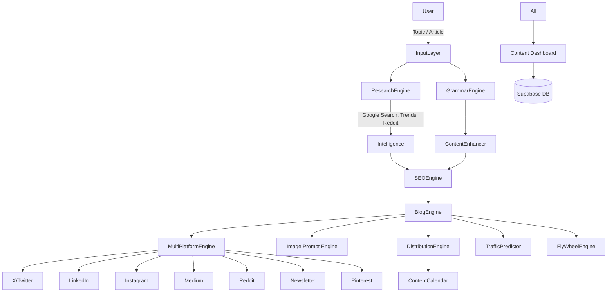

# AI Content Engine — Project Plan

## Goal
A Content Operating System that turns one topic or uploaded article into 20–30 research-backed, SEO-optimized assets across 8+ platforms, with distribution guidance, traffic prediction, and a growth flywheel.

## Tech Stack

| Layer | Choice | Reason |
|---|---|---|
| Framework | Next.js 14 (App Router) | Full-stack, SSR for SEO, API routes |
| Language | TypeScript | Type safety across frontend + backend |
| Styling | Tailwind CSS + shadcn/ui | Fast dashboard UI |
| AI | Claude API (claude-sonnet-4-6) | Content generation, SEO, rewrites |
| Database | Supabase (PostgreSQL) | Auth + content history storage |
| Auth | Supabase Auth | User accounts, session management |
| Hosting | Vercel | Zero-config Next.js deployment |
| Package Manager | npm | Standard, stable |
| Image Gen | fal.ai API | Image prompt generation + rendering |
| Social API | X (Twitter) API v2 | Post scheduling integration |

## Architecture



## File & Folder Structure

```
content-engine/
├── app/
│   ├── (auth)/
│   │   ├── login/page.tsx
│   │   └── signup/page.tsx
│   ├── dashboard/
│   │   ├── page.tsx                  # Main dashboard
│   │   ├── research/page.tsx
│   │   ├── seo/page.tsx
│   │   ├── blog/page.tsx
│   │   ├── social/
│   │   │   ├── x/page.tsx
│   │   │   ├── linkedin/page.tsx
│   │   │   ├── instagram/page.tsx
│   │   │   ├── medium/page.tsx
│   │   │   ├── reddit/page.tsx
│   │   │   ├── newsletter/page.tsx
│   │   │   └── pinterest/page.tsx
│   │   ├── images/page.tsx
│   │   ├── calendar/page.tsx
│   │   └── analytics/page.tsx
│   ├── api/
│   │   ├── research/route.ts
│   │   ├── seo/route.ts
│   │   ├── blog/route.ts
│   │   ├── improve/route.ts
│   │   ├── social/route.ts
│   │   ├── images/route.ts
│   │   ├── distribute/route.ts
│   │   ├── traffic/route.ts
│   │   └── flywheel/route.ts
│   ├── layout.tsx
│   └── globals.css
├── components/
│   ├── ui/                           # shadcn components
│   ├── dashboard/
│   │   ├── Sidebar.tsx
│   │   ├── ContentCard.tsx
│   │   └── ActionBar.tsx             # Copy / Edit / Regenerate
│   ├── input/
│   │   ├── TopicForm.tsx
│   │   └── ArticleUpload.tsx
│   └── sections/
│       ├── ResearchPanel.tsx
│       ├── SEOPanel.tsx
│       ├── BlogPanel.tsx
│       └── SocialPanel.tsx
├── lib/
│   ├── claude.ts                     # Anthropic SDK client
│   ├── supabase.ts                   # Supabase client
│   ├── google-search.ts
│   ├── twitter.ts
│   └── prompts/                      # All Claude prompt templates
│       ├── research.ts
│       ├── seo.ts
│       ├── blog.ts
│       ├── social.ts
│       └── improve.ts
├── types/
│   └── index.ts
├── .claude/
├── .spec/
├── .env.example
├── .gitignore
├── package.json
└── next.config.ts
```

## Key Design Decisions

1. **All AI via Claude API** — single provider, streaming responses for UX
2. **API routes as thin orchestrators** — each engine has its own `/api/` route; no fat server actions
3. **Supabase for persistence** — save generated content per user; enable history/re-generation
4. **Prompt templates in `/lib/prompts/`** — isolated, testable, easily iterable
5. **No direct social posting in MVP** — distribution is copy-paste with instructions; API posting is Phase 2
