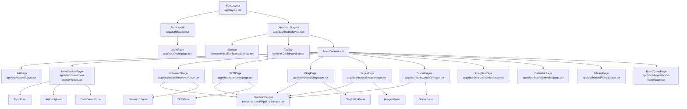
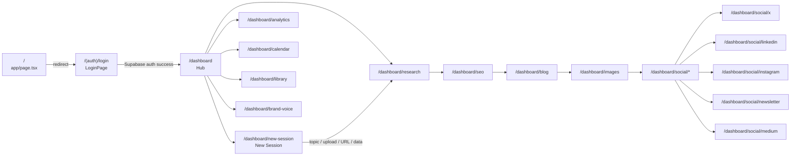

# Design: UI Alignment — Content Studio

## Table of Contents
1. [Architecture Overview](#1-architecture-overview)
2. [Component Hierarchy](#2-component-hierarchy)
3. [Design Tokens](#3-design-tokens)
4. [Screen Flow](#4-screen-flow)
5. [UI/UX Design — Screen by Screen](#5-uiux-design--screen-by-screen)
6. [Database](#6-database)
7. [Deployment](#7-deployment)
8. [Testing Strategy](#8-testing-strategy)
9. [Security](#9-security)

---

## 1. Architecture Overview

This is a **brownfield UI-alignment task**. The Next.js 14 App Router codebase, all API routes, Supabase auth, session logic, and TypeScript types remain completely unchanged. Only visual/presentation layers are modified.

### What Changes

| Layer | Current State | Target State |
|---|---|---|
| `app/globals.css` | Dark navy sidebar tokens; blue primary; Geist font | Teal light-theme tokens; Inter font; full Lumina AI token set |
| `app/layout.tsx` | Geist font imports | Inter font import via `next/font/google` |
| `app/dashboard/layout.tsx` | Generic dark header; `bg-background` (white) | Light teal page bg; 56 px header; correct padding |
| `components/dashboard/Sidebar.tsx` | Dark navy bg; flat nav list; no collapse | Light #f8faf8 bg; grouped sections; collapse toggle; brand card with logo |
| `app/page.tsx` | Generic landing page | Redirect to `/login` or styled auth entry |
| `app/(auth)/login/page.tsx` | Does not exist | New file: centered auth card |
| `app/dashboard/page.tsx` | Tab form + history list | Hub screen: stat bento + quick actions + sessions list + AI Insight Bar |
| `app/dashboard/new-session/page.tsx` | Does not exist | New file: tabbed new-session screen wrapping existing `TopicForm`, `ArticleUpload`, `DataDrivenForm` |
| Screen-level page components | Generic Tailwind classes | Redesigned with design-system classes |
| `components/ui/button.tsx` | Blue primary | Teal primary + updated variants |
| `components/ui/card.tsx` | `rounded-lg shadow-sm` | `rounded-xl shadow-md` per token |
| `components/ui/badge.tsx` | Generic | Status-colour variants |

### What Does NOT Change

- All API route handlers under `app/api/`
- `lib/context/SessionContext.tsx` — zero functional edits
- `components/input/TopicForm.tsx`, `ArticleUpload.tsx`, `DataDrivenForm.tsx`
- Supabase client helpers (`lib/supabase.ts`)
- TypeScript type definitions (`types/`)
- Database schema / migrations
- All existing section panel components (ResearchPanel, SEOPanel, BlogEditor, etc.) — only classes are updated, no logic removed

---

## 2. Component Hierarchy



### New / Modified Components

| Component | File | Action |
|---|---|---|
| `PipelineStepper` | `components/ui/PipelineStepper.tsx` | **New** — extracted from prototype |
| `StatCard` | `components/ui/StatCard.tsx` | **New** — bento grid card |
| `StatusBadge` | `components/ui/StatusBadge.tsx` | **New** — replaces generic `Badge` for content statuses |
| `AIInsightBar` | `components/ui/AIInsightBar.tsx` | **New** — teal gradient CTA bar |
| `Sidebar` | `components/dashboard/Sidebar.tsx` | **Modified** — full redesign |
| `Button` | `components/ui/button.tsx` | **Modified** — teal primary variant |
| `Card` | `components/ui/card.tsx` | **Modified** — updated radius/shadow |
| `Badge` | `components/ui/badge.tsx` | **Modified** — add status variants |

---

## 3. Design Tokens

All tokens are defined in `app/globals.css` via CSS custom properties and consumed through the Tailwind `@theme inline` block. Implementors MUST NOT use arbitrary Tailwind hex values — use token class names only.

### 3.1 Colour Tokens

```css
/* app/globals.css — :root block (replaces current content) */
:root {
  /* Backgrounds */
  --background:        160 33% 96%;   /* #f5fbf5 — page bg (teal-tinted off-white) */
  --sidebar:           120 10% 97%;   /* #f8faf8 — sidebar surface */
  --card:              0 0% 100%;     /* #ffffff — card / surface */
  --surface-low:       120 15% 95%;   /* #eff5ef — surface-container-low */
  --surface-mid:       120 10% 93%;   /* #eaefea — surface-container */
  --hover:             120 8% 90%;    /* #e4eae4 — hover bg */

  /* Foreground */
  --foreground:        150 10% 11%;   /* #171d1a — on-surface (warm dark) */
  --foreground-2:      145 11% 25%;   /* #3d4943 — on-surface-variant */
  --foreground-3:      148 6% 45%;    /* #6d7a73 — outline / muted */
  --foreground-4:      150 14% 74%;   /* #bccac1 — outline-variant / borders */

  /* Primary — Deep Teal */
  --primary:           160 100% 21%;  /* #00694c */
  --primary-container: 160 100% 26%;  /* #008560 */
  --primary-hover:     160 100% 16%;  /* #00513a */
  --primary-muted:     160 100% 21% / 0.08;  /* rgba(0,105,76,0.08) */
  --primary-foreground: 0 0% 100%;   /* #ffffff */

  /* Secondary — Confidence Blue */
  --secondary:         210 100% 33%;  /* #0060a8 */
  --secondary-muted:   210 100% 33% / 0.08; /* rgba(0,96,168,0.08) */
  --secondary-foreground: 0 0% 100%; /* #ffffff */

  /* Semantic */
  --success:           160 100% 21%;  /* same as primary */
  --success-muted:     160 100% 21% / 0.10;
  --warning:           38 100% 30%;   /* #996300 */
  --warning-muted:     38 100% 30% / 0.10;
  --destructive:       0 74% 42%;     /* #ba1a1a */
  --destructive-muted: 0 74% 42% / 0.08;

  /* Border / Input */
  --border:            150 14% 74%;   /* #bccac1 */
  --input:             150 14% 74%;
  --ring:              210 100% 33%;  /* blue focus ring */

  /* Sidebar specific */
  --sidebar-border:    160 12% 88%;   /* #e2e8e4 */
}
```

### 3.2 Tailwind @theme Inline Mappings

```css
@theme inline {
  /* Colours */
  --color-background:          hsl(var(--background));
  --color-sidebar:             hsl(var(--sidebar));
  --color-card:                hsl(var(--card));
  --color-surface-low:         hsl(var(--surface-low));
  --color-surface-mid:         hsl(var(--surface-mid));
  --color-hover:               hsl(var(--hover));
  --color-foreground:          hsl(var(--foreground));
  --color-foreground-2:        hsl(var(--foreground-2));
  --color-foreground-3:        hsl(var(--foreground-3));
  --color-foreground-4:        hsl(var(--foreground-4));
  --color-primary:             hsl(var(--primary));
  --color-primary-foreground:  hsl(var(--primary-foreground));
  --color-primary-muted:       hsl(var(--primary-muted));
  --color-secondary:           hsl(var(--secondary));
  --color-secondary-foreground:hsl(var(--secondary-foreground));
  --color-success:             hsl(var(--success));
  --color-success-muted:       hsl(var(--success-muted));
  --color-warning:             hsl(var(--warning));
  --color-warning-muted:       hsl(var(--warning-muted));
  --color-destructive:         hsl(var(--destructive));
  --color-border:              hsl(var(--border));
  --color-input:               hsl(var(--input));
  --color-ring:                hsl(var(--ring));
  --color-sidebar-border:      hsl(var(--sidebar-border));

  /* Typography */
  --font-sans: 'Inter', -apple-system, system-ui, sans-serif;
  --font-mono: 'JetBrains Mono', 'SF Mono', monospace;

  /* Radius — tiered system */
  --radius-sm:  8px;   /* buttons, inputs */
  --radius-md:  12px;  /* small cards, tabs */
  --radius-lg:  16px;  /* content cards */
  --radius-xl:  24px;  /* modals, AI prompt bar */
  --radius-full: 9999px;

  /* Shadows — teal-tinted */
  --shadow-sm: 0 1px 3px rgba(0,60,40,0.06);
  --shadow-md: 0 4px 12px rgba(0,60,40,0.08);
  --shadow-lg: 0 8px 24px rgba(0,60,40,0.12);

  /* Transitions */
  --transition-fast: 120ms ease;
  --transition-med:  200ms ease;
}
```

### 3.3 Tailwind Class Mapping Reference

| Tailwind Class | Resolves To |
|---|---|
| `bg-background` | `#f5fbf5` |
| `bg-sidebar` | `#f8faf8` |
| `bg-card` | `#ffffff` |
| `bg-surface-low` | `#eff5ef` |
| `bg-surface-mid` | `#eaefea` |
| `bg-hover` | `#e4eae4` |
| `text-foreground` | `#171d1a` |
| `text-foreground-2` | `#3d4943` |
| `text-foreground-3` | `#6d7a73` |
| `text-foreground-4` | `#bccac1` |
| `text-primary` | `#00694c` |
| `bg-primary` | `#00694c` |
| `bg-primary-muted` | `rgba(0,105,76,0.08)` |
| `text-secondary` | `#0060a8` |
| `border-sidebar-border` | `#e2e8e4` |
| `rounded-sm` | `8px` |
| `rounded-md` | `12px` |
| `rounded-lg` | `16px` |
| `rounded-xl` | `24px` |
| `shadow-sm` | `0 1px 3px rgba(0,60,40,0.06)` |
| `shadow-md` | `0 4px 12px rgba(0,60,40,0.08)` |
| `shadow-lg` | `0 8px 24px rgba(0,60,40,0.12)` |

### 3.4 Typography

`app/layout.tsx` switches from `Geist` to `Inter`:

```tsx
import { Inter, JetBrains_Mono } from "next/font/google";
const inter = Inter({ subsets: ["latin"], variable: "--font-sans" });
const mono  = JetBrains_Mono({ subsets: ["latin"], variable: "--font-mono" });
// className={`${inter.variable} ${mono.variable} h-full antialiased`}
```

Typography scale:

| Role | Size | Weight | Line-height | Letter-spacing |
|---|---|---|---|---|
| Page heading | 32px | 700 | 1.2 | -0.02em |
| Section heading | 24px | 600 | 1.3 | 0 |
| Header bar title | 14px | 600 | 1 | 0 |
| Body / label | 14px | 400–500 | 1.5 | 0 |
| Section label (caps) | 11px | 600 | 1 | 0.08em |
| Caption / meta | 12px | 400 | 1.4 | 0 |
| Blog editor body | 15px (Georgia, serif) | 400 | 1.75 | 0 |

---

## 4. Screen Flow



The sidebar's "New Project" button always navigates to `/dashboard/new-session`. The pipeline flows linearly via `PipelineStepper` but any step can be directly navigated via the stepper.

---

## 5. UI/UX Design — Screen by Screen

### 5.1 Root Layout (`app/layout.tsx`)

**Changes:**
- Replace `Geist`/`Geist_Mono` font imports with `Inter`/`JetBrains_Mono` from `next/font/google`.
- Update `<html>` className variables.
- Update `<title>` metadata to `"Content Studio"`.
- Body: `font-family: var(--font-sans)`.

### 5.2 Auth Screen (`app/(auth)/login/page.tsx`) — NEW FILE

The root `app/page.tsx` will be updated to `redirect("/login")`. A new auth group layout `app/(auth)/layout.tsx` provides the full-screen teal-gradient background.

**Visual spec:**

```
┌────────────────────────────────────────────────────┐
│  bg-background (radial teal + blue gradient noise) │
│                                                    │
│         ┌─────────────────────────────────┐        │
│         │  [logo 72×72 rounded-lg]        │        │
│         │  Content Studio  (26px bold)    │        │
│         │  Sign in to your workspace      │        │
│         ├─────────────────────────────────┤        │
│         │  [ G  Continue with Google ]   │        │
│         │  ─────── or continue ──────    │        │
│         │  Email address                  │        │
│         │  [input]                        │        │
│         │  Password         Forgot?       │        │
│         │  [input]                        │        │
│         │  [  Sign In to Workspace  ]    │        │
│         │  Don't have an account? Create  │        │
│         └─────────────────────────────────┘        │
└────────────────────────────────────────────────────┘
```

**Key measurements:**

| Property | Value |
|---|---|
| Card max-width | 420px |
| Card border-radius | `rounded-xl` (24px) |
| Card box-shadow | `shadow-lg` |
| Card padding | 32px 36px |
| Logo size | 72×72px, `rounded-lg` (16px), `object-cover` |
| Logo src | `/logo.png` (public asset) |
| Heading | 26px, weight 700, `text-foreground`, letter-spacing -0.02em |
| Subtitle | 14px, `text-foreground-3` |
| Google button | h-12, `bg-card`, `border border-border`, `rounded-sm` (8px) |
| Input focus | `border-secondary` + `ring-2 ring-secondary/10` |
| Sign In button | h-[52px], `bg-primary`, `rounded-md` (12px), 15px bold |

**No functional change.** The form submits to the existing Supabase auth handler.

### 5.3 Dashboard Layout (`app/dashboard/layout.tsx`)

**Changes:**

| Element | Before | After |
|---|---|---|
| Page root | `bg-background` (white) | `bg-background` (teal-tinted #f5fbf5 via token update) |
| Sidebar | Dark navy `bg-sidebar-bg` | Light `bg-sidebar` via new token |
| Header height | `h-14` (56px — unchanged) | `h-14` (56px) |
| Header background | `bg-card` | `bg-card` (white) |
| Header border | `border-border` | `border-sidebar-border` |
| Header title text | "AI Content Engine" | Current page title (dynamic — passed via a `PageTitle` context or `usePathname` lookup) |
| Header title style | `text-sm font-semibold` | `text-[14px] font-semibold text-foreground` |
| Main padding desktop | `p-8` (32px all sides) | `px-10 py-8` (40px horizontal, 32px vertical) |
| Main padding mobile | `p-6` (24px) | `p-6` (24px) |

### 5.4 Sidebar (`components/dashboard/Sidebar.tsx`)

Full redesign. Retains all existing route hrefs. Groups are mapped as follows:

**Section mapping (existing routes → prototype groups):**

```
MAIN (no section title)
  Hub          → /dashboard
  Research     → /dashboard/research
  SEO          → /dashboard/seo
  Blog         → /dashboard/blog
  Images       → /dashboard/images

DISTRIBUTE
  X / Twitter  → /dashboard/social/x
  LinkedIn     → /dashboard/social/linkedin
  Instagram    → /dashboard/social/instagram
  Newsletter   → /dashboard/social/newsletter
  Medium       → /dashboard/social/medium
  [kept hidden in collapsed, shown in expanded]
  Reddit       → /dashboard/social/reddit      (kept, maps to Distribute)
  Pinterest    → /dashboard/social/pinterest   (kept, maps to Distribute)

MANAGE
  Calendar     → /dashboard/calendar
  Analytics    → /dashboard/analytics
  Library      → /dashboard/library
  Brand Voice  → /dashboard/brand-voice
  [kept, maps to Manage]
  Schedule     → /dashboard/schedule
  Clusters     → /dashboard/clusters
  Workspace    → /dashboard/workspace

DATA PIPELINE (kept as its own Manage sub-section)
  Data Pipeline → /dashboard/data-driven
  [sub-routes kept]
  
FOOTER
  Help         (no route, shows support link)
  Logout       (calls supabase.auth.signOut())
```

**Visual spec:**

```
┌──────────────────────────────────┐  width: 248px
│  ┌────────────────────────────┐  │  brand card: bg-card rounded-md shadow-sm
│  │ [logo 36×36] Content Studio│  │  logo: /logo.png, rounded-sm (8px), object-cover
│  │             Pro Plan       │  │  name: 14px bold; subtitle: 11px text-foreground-3
│  └────────────────────────────┘  │
│  [ + New Project            ]    │  full-width bg-primary rounded-sm h-10
│                                  │
│  ○ Hub                           │  active: bg-primary-muted text-primary
│  ○ Research                      │         font-semibold border-l-[3px] border-primary
│  ○ SEO                           │  hover:  bg-hover transition-[120ms]
│  ○ Blog                          │
│  ○ Images                        │
│                                  │
│  DISTRIBUTE  ←─ 11px uppercase   │
│  ○ X / Twitter                   │
│  ○ LinkedIn                      │
│  ○ Instagram                     │
│  ○ Newsletter                    │
│  ○ Medium                        │
│  ○ Reddit                        │
│  ○ Pinterest                     │
│                                  │
│  MANAGE                          │
│  ○ Calendar                      │
│  ○ Analytics                     │
│  ○ Library                       │
│  ○ Brand Voice                   │
│  ○ Schedule                      │
│  ○ Clusters                      │
│  ○ Workspace                     │
│  ○ Data Pipeline                 │
│  ─ [Data Pipeline sub-routes] ─  │
│                                  │
├──────────────────────────────────┤  border-t border-sidebar-border
│  ○ Help                          │
│  ○ Logout                        │
└──────────────────────────────────┘
```

**Collapsed state (60px):**
- Brand card replaced by logo icon only (36×36, centred).
- Section title text replaced by `<hr>` divider (`h-px bg-sidebar-border mx-3 my-2`).
- "New Project" button becomes a 36×36 teal icon-only square.
- Nav items show icon only. `title={label}` for tooltip.
- Collapse state persisted to `localStorage` key `sidebar-collapsed`.

**Mobile (< 768px):**
- Sidebar hidden; hamburger `Menu` icon fixed top-left.
- Click opens slide-over overlay (same markup as current) but styled with new light theme.

**Component interface (unchanged from caller perspective):**
```tsx
// Sidebar.tsx — no props change; uses usePathname() internally
export function Sidebar(): JSX.Element
```

**New state variables added:**
```tsx
const [collapsed, setCollapsed] = useState<boolean>(
  () => localStorage.getItem("sidebar-collapsed") === "true"
);
// persist on toggle
```

### 5.5 Hub Screen (`app/dashboard/page.tsx`)

The existing `DashboardPage` component is redesigned in-place. The functional session history fetch and restore logic (`handleRestoreSession`, `loadHistory`) remain unchanged. Only the JSX/className layer changes.

**Layout:**

```
Content Studio Hub                    ← h1 32px/700/-0.02em
Real-time status of your pipeline.    ← 16px text-foreground-2

┌────────┐ ┌────────┐ ┌────────┐ ┌────────┐
│ 23     │ │ 14.2k  │ │  87    │ │  842   │
│Articles│ │Traffic │ │SEO Avg │ │Credits │
└────────┘ └────────┘ └────────┘ └────────┘
  4-col desktop / 2-col tablet / 1-col mobile

[ New from Topic ] [ Upload Article ] [ Repurpose URL ] [ Data Pipeline ]
  pill secondary buttons, flex gap-2

Recent Sessions                        View all →
┌──────────────────────────────────────────────────────┐
│ AI in Healthcare…    Blog LinkedIn X  published  94  │
│ Complete Guide…      Blog Newsletter  review     87  │
└──────────────────────────────────────────────────────┘
  bg-card rounded-lg shadow-md; row hover: bg-surface-low

┌─────────────────────────────────────────────────────┐
│ 🟢  AI Insight Engine                               │
│     Your "RAG Architecture" guide is trending…      │
│                    [Apply Strategy] [Dismiss]       │
└─────────────────────────────────────────────────────┘
  gradient bg: linear-gradient(to right, rgba(29,158,117,0.05), rgba(55,138,221,0.05))
  rounded-xl (24px), border rgba(29,158,117,0.2)
```

**Stat Card spec (`components/ui/StatCard.tsx`):**
- `bg-card rounded-lg shadow-md p-5`
- Label: 11px, uppercase, `text-foreground-3`, letter-spacing 0.06em
- Value: 32px, bold, `text-foreground`
- Change badge: 12px, `text-primary`, flex items-center gap-1 with `TrendingUp` icon
- Icon: 18px, colour alternates `text-primary` / `text-secondary` per index

**Status Badge variants (`components/ui/StatusBadge.tsx`):**

| Status | Background | Text |
|---|---|---|
| `published` | `rgba(0,105,76,0.1)` | `#00694c` |
| `review` | `rgba(153,99,0,0.1)` | `#996300` |
| `draft` | `rgba(109,122,115,0.12)` | `#6d7a73` |
| `scheduled` | `rgba(0,96,168,0.08)` | `#0060a8` |

Pill shape: `rounded-full px-2.5 py-0.5 text-[11px] font-semibold`.

**Session row hover:** `hover:bg-surface-low transition-colors duration-[120ms]`

**Quick action buttons:** `variant="outline"` with `rounded-full px-4 py-2.5 text-[13px]`; hover changes border to `border-foreground-3`.

### 5.6 New Session Screen (`app/dashboard/new-session/page.tsx`) — NEW FILE

New page that wraps the existing `TopicForm`, `ArticleUpload`, and `DataDrivenForm` components with the prototype's tab switcher UI. A fourth "Repurpose URL" tab maps to a simple URL input field (new, minimal, no API changes needed for the design task).

**Tab switcher:**
- Container: `bg-surface-mid rounded-md p-1 flex gap-1`
- Active tab: `bg-card rounded-sm shadow-sm font-semibold text-foreground`
- Inactive tab: `text-foreground-3 font-normal`

**Upload zone:**
- `border-2 border-dashed border-foreground-4 rounded-lg p-12 text-center`
- Hover: `border-primary` (120ms transition)

**Create Session button:**
- `bg-primary text-primary-foreground w-full h-[52px] rounded-sm text-[15px] font-semibold mt-7`

The existing `TopicForm` renders inside the "Start from Topic" tab panel without modification. Its own submit logic remains intact.

### 5.7 Pipeline Screens — PipelineStepper Component

New shared component `components/ui/PipelineStepper.tsx`:

```
Research ─── SEO ─── Write ─── Images ─── Distribute
  ✓         [active]  ○           ○           ○
```

- Container: `bg-card rounded-md shadow-sm border border-foreground-4/20 flex items-center px-2 py-1.5 mb-7`
- Connector line: `w-7 h-0.5` — done: `bg-primary`; pending: `bg-foreground-4/60`
- Active button: `bg-primary-muted text-primary font-semibold rounded-sm px-3.5 py-2`
- Done button: shows `Check` icon in `text-primary`; text `text-foreground-2`
- Pending button: `text-foreground-3`

**Props interface:**
```tsx
interface PipelineStepperProps {
  current: "research" | "seo" | "blog" | "images" | "social-x";
  /** Optional: called when user clicks a step — defaults to router.push */
  onNavigate?: (step: string) => void;
}
```

### 5.8 Research Screen (`app/dashboard/research/page.tsx`)

Page heading: `text-2xl font-bold tracking-tight text-foreground` (24px).
Topic subtitle: `text-[14px] text-foreground-2`.

**Sub-tab row:**
- Underline style: borderless buttons with `border-b-2`
- Active: `border-primary text-primary font-semibold`
- Inactive: `border-transparent text-foreground-3`
- Container: `border-b border-foreground-4/60 flex gap-0 mb-6`

Keyword table, competitor cards, outline card — all use `bg-card rounded-lg shadow-md`.

Row hover in tables: `hover:bg-surface-low transition-colors`.

KD colour coding:
- `> 60` → `text-destructive font-semibold`
- `40–60` → `text-warning font-semibold`
- `< 40` → `text-primary font-semibold`

### 5.9 SEO Screen (`app/dashboard/seo/page.tsx`)

Grid: `grid grid-cols-1 md:grid-cols-[280px_1fr] gap-5` (collapses to 1-col on mobile).

**Score dial (SVG):**
- Size: 140×140px
- Track circle: `stroke={foreground-4 at 25%}`, strokeWidth=8
- Progress circle: `stroke=#00694c` if score ≥ 80, else `stroke=#996300`
- `strokeDasharray={score/100 * 377} 377`, `strokeLinecap="round"`, rotated -90°
- Centre: `text-[38px] font-extrabold text-foreground` above `text-[11px] uppercase tracking-wider text-foreground-3`

**Check list rows:**
- Pass: `bg-success-muted` circle with `Check` icon `text-primary`
- Warn: `bg-warning-muted` circle with `!` span `text-warning`
- Fail: `bg-destructive-muted` circle with `X` icon `text-destructive`

### 5.10 Blog Editor (`app/dashboard/blog/page.tsx`)

Toolbar: `flex flex-wrap items-center gap-0.5 px-4 py-2 border-b border-foreground-4/30`
Toolbar buttons: `hover:bg-surface-low hover:text-foreground rounded px-2 py-1 text-[12px] text-foreground-3 transition-colors`

Textarea: `font-serif text-[15px] leading-[1.75] text-foreground p-7 min-h-[440px] w-full border-0 bg-transparent resize-y outline-none`

AI Assist panel: `w-[280px] bg-card rounded-lg shadow-md p-5 flex flex-col gap-2.5`
Grid layout: `grid gap-4` — `grid-cols-1` when panel hidden, `grid-cols-[1fr_280px]` when shown.

### 5.11 Images Screen (`app/dashboard/images/page.tsx`)

Style filter pills: `rounded-full border text-[13px] font-medium px-4 py-2 capitalize transition-colors`
Active: `border-primary bg-primary-muted text-primary`
Inactive: `border-border bg-card text-foreground-2`

Image grid: `grid grid-cols-2 gap-4` (1-col on mobile via `md:grid-cols-2`).
Card: `bg-card rounded-lg shadow-md overflow-hidden`.
Thumbnail placeholder uses aspect-ratio CSS with gradient.

### 5.12 Social Distribution Screens (`app/dashboard/social/*/page.tsx`)

Each channel page (`x`, `linkedin`, `instagram`, `newsletter`, `medium`) uses the same layout shell.

**Channel filter row:**
- `flex flex-wrap gap-1.5 mb-6`
- Pills: `rounded-full border text-[12px] font-medium px-3.5 py-1.5 transition-colors`
- Active: `bg-primary-muted border-primary text-primary`
- Inactive: `bg-card border-border text-foreground-3`

**Post card:**
- `bg-card rounded-lg shadow-md p-[22px]`
- Status badge top-left, scheduled time top-right
- Body: `text-[14px] text-foreground leading-[1.65] mb-3.5`
- Action row: `flex gap-2`
- Edit / Rewrite / Copy: `variant="outline"` sized `h-8 px-3 text-[12px]`
- Rewrite has `Sparkles` icon in `text-primary`

**Header buttons:** Regenerate (`variant="outline"`) + Schedule All (`bg-primary`).

### 5.13 Analytics Screen (`app/dashboard/analytics/page.tsx`)

The existing `AnalyticsDashboard` component is wrapped by the redesigned page layout. The page shell provides the heading; `AnalyticsDashboard` internals are restyled.

Heading: `text-[32px] font-bold tracking-tight text-foreground` + subtitle 16px `text-foreground-2`.

**KPI cards:** `grid grid-cols-1 md:grid-cols-3 gap-4 mb-6`
Value font: 36px, bold, colour per KPI.
Progress bar: `h-1.5 bg-foreground-4/30 rounded-full overflow-hidden` → inner bar uses KPI colour.

**Bar chart:**
Bar fill: `background: linear-gradient(to top, #00694c, #008560)`, `rounded-t`

**Dial gauges:** `grid gap-4` in sidebar column; SVG circles with `stroke={T.primary}` / `stroke={T.secondary}`.

### 5.14 Calendar Screen (`app/dashboard/calendar/page.tsx`)

The existing `CalendarPanel` is restyled.

Calendar grid: `grid grid-cols-7` inside `bg-card rounded-lg shadow-md overflow-hidden`.
Day header row: `text-[11px] font-semibold uppercase text-foreground-3 p-2.5 text-center border-b border-foreground-4/30`.
Cell: `min-h-[80px] p-1.5 border-b border-foreground-4/20 border-r-[last-child-no]`.
Today cell: `bg-primary-muted` day number `font-bold text-primary`.
Out-of-month cells: `opacity-30`.

Event chip: `text-[10px] font-medium text-foreground border-l-2 bg-[color]/10 px-1.5 py-0.5 rounded-[3px] truncate mb-0.5`.

### 5.15 Library Screen (Content Library)

The existing `ContentLibrary` component (`components/sections/ContentLibrary.tsx`) is restyled.

Filter row: pills matching Status Badge spec above.
Active filter pill: `bg-primary-muted border-primary text-primary`
List container: `bg-card rounded-lg shadow-md overflow-hidden`.
Row hover: `hover:bg-surface-low`.
SEO score colour: `>= 85` → `text-primary`, `70-84` → `text-warning`.

### 5.16 Brand Voice Screen (`app/dashboard/brand-voice/page.tsx`)

The existing `BrandVoiceSettings` component is restyled.

Profile cards: `bg-card rounded-lg shadow-md p-6 cursor-pointer transition-all duration-200`
Active: `border border-primary bg-primary-muted`
Inactive: `border border-foreground-4/25`

Trait badges: `bg-surface-mid text-foreground-2 rounded-full px-2.5 py-1 text-[12px] font-medium`

"+ New Profile" button: `bg-primary text-primary-foreground rounded-sm`.

---

## 6. Database

No database changes are required for this task. The UI alignment is purely a presentation layer change. All existing tables, row-level security policies, and migrations remain in place.

---

## 7. Deployment

No deployment configuration changes are required. The app remains a Next.js 14 project deployed on the same infrastructure. The only build-time change is the addition of `Inter` and `JetBrains_Mono` from `next/font/google`, which are fetched at build time by Next.js and served as self-hosted font assets — no external font CDN calls at runtime.

The public `/logo.png` asset must be placed in `public/logo.png` before deploy. The source file is at `design_idea/isolated_content_studio_brand_logo_mark_only._remove_all_text._the_logo.png` — it should be copied/renamed to `public/logo.png`.

---

## 8. Testing Strategy

### 8.1 Visual Regression (No Regressions — Requirement 14)

**Tool:** Playwright with `@playwright/test` (already scaffolded if any E2E tests exist; add visual snapshots).

**Approach:** For each screen, a Playwright test navigates to the route, takes a full-page screenshot, and compares against a baseline. Baselines are committed to the repo after implementation is approved.

Key routes to cover:
- `/login`
- `/dashboard` (hub)
- `/dashboard/new-session`
- `/dashboard/research`
- `/dashboard/seo`
- `/dashboard/blog`
- `/dashboard/images`
- `/dashboard/social/x`
- `/dashboard/analytics`
- `/dashboard/calendar`
- `/dashboard/library`
- `/dashboard/brand-voice`

### 8.2 TypeScript Type-checks (Requirement 14 AC4)

```bash
npx tsc --noEmit
```

Run as CI gate. Must pass with zero errors after all component changes.

### 8.3 Unit Tests — Existing Tests Must Not Regress

Existing Jest/Vitest tests:
- `components/sections/DataDrivenStepper.test.tsx`
- `components/sections/PublishButton.test.tsx`
- `components/sections/SocialEditableBlock.test.tsx`

These test functional behaviour of components whose props interfaces are not changed by this task. They must continue to pass without modification.

### 8.4 Token Sanity Tests

Manual smoke-test checklist (can be automated with Playwright `getComputedStyle`):

| Check | Expected |
|---|---|
| `bg-background` on `<body>` | `rgb(245, 251, 245)` — `#f5fbf5` |
| Sidebar background | `rgb(248, 250, 248)` — `#f8faf8` |
| Primary button background | `rgb(0, 105, 76)` — `#00694c` |
| Active nav item border-left colour | `rgb(0, 105, 76)` |
| Focus ring on email input | `rgb(0, 96, 168)` — `#0060a8` |
| Card border-radius | `16px` |
| Font family on body | starts with `Inter` |

### 8.5 Responsive Checks

Playwright viewports to test:
- Desktop: 1440×900
- Tablet: 768×1024 (stat grid should be 2-col)
- Mobile: 375×812 (stat grid 1-col, sidebar hidden, hamburger visible)

### 8.6 No-functional-change Checklist

After implementation, manually verify:
- [ ] Sign in with Google (Supabase OAuth flow completes)
- [ ] Sign in with email/password
- [ ] Session history loads from `/api/sessions`
- [ ] Restore session navigates and populates assets
- [ ] `TopicForm` submit triggers generation pipeline
- [ ] `ArticleUpload` file input accepts files
- [ ] `DataDrivenForm` renders and submits

---

## 9. Security

No security changes are introduced or required by this task. The following existing controls remain fully in place:

- **Authentication:** Supabase Auth (email/password + Google OAuth) — unchanged.
- **Authorization:** All API routes validate the `Authorization: Bearer <token>` header against Supabase session — unchanged.
- **Row-Level Security:** Supabase RLS policies on all tables — unchanged.
- **Content Security Policy:** Any existing CSP headers on the Next.js deployment — unchanged.
- **Font loading:** Inter is loaded via `next/font/google`, which downloads fonts at build time. No third-party font requests at runtime, preserving existing CSP posture.
- **Public assets:** `/logo.png` is a static image with no sensitive data. It is served from the Next.js `public/` directory as a standard static asset.

---

*Design document approved and ready for implementation. Proceed to create a task spec in `.spec/ui-alignment/tasks.md` and begin implementation.*
