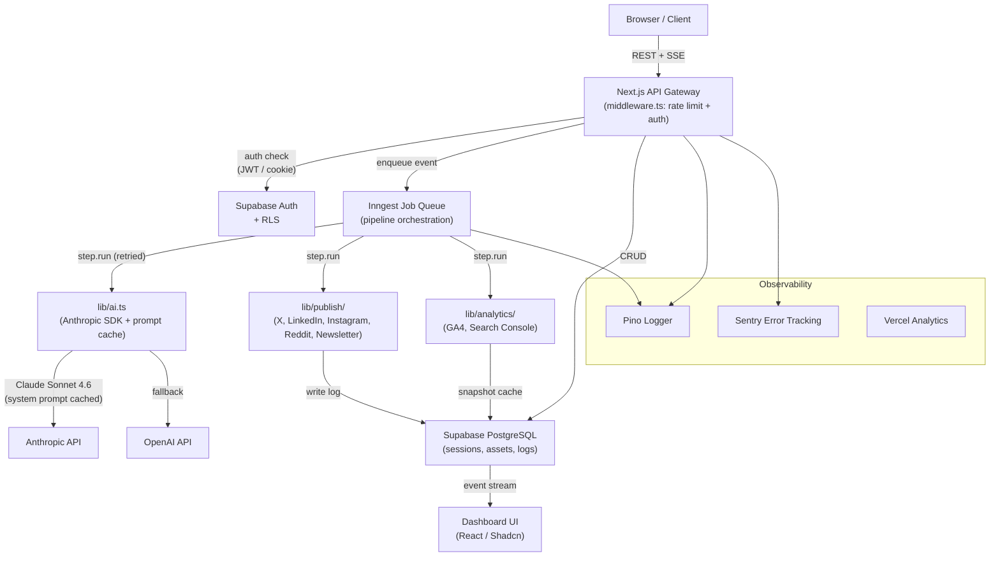

# Architecture: AI Content Engine — Repository Optimization Report

**Author:** Technical Consultant (Architect Role)
**Date:** 2026-04-28
**Codebase:** `d:\content-engine` — Next.js 16 / TypeScript / Supabase / Anthropic SDK

---

## Section A: Current State Summary

The Content Engine is a **production-grade full-stack AI application** built on Next.js 16 App Router, Supabase PostgreSQL, and the Anthropic Claude SDK. It accepts three input types (topic, file upload, data-driven source) and runs them through AI pipelines that produce research, blog articles, SEO metadata, social content (7 platforms), distribution campaigns, and analytics-driven refresh triggers.

### What is working well

| Strength | Evidence |
|---|---|
| Multi-provider AI abstraction | `lib/ai.ts` switches between Anthropic/OpenAI at runtime via `AI_PROVIDER` env var |
| Layered security | Bearer JWT + Supabase cookie auth, RLS on all 6 tables, input sanitization, Upstash rate limiting |
| Modular prompt library | 14 prompt files, each platform/step isolated — easy to tune independently |
| Comprehensive asset model | 22 typed asset constants, versioned `content_assets` table with JSONB content |
| Distribution safety | `checkAlreadyPublished()` prevents duplicate publishes per session+platform |
| Type safety | TypeScript strict mode, type guards (`isDataDrivenInputData`), structured error codes |
| Test infrastructure | Jest + ts-jest, 80% threshold, 21 test files covering utilities, routes, and prompt contracts |
| Operational audit trail | `bug-log.md` with 20 documented root-cause fixes |

### What needs improvement (headline items)

1. **Browser-orchestrated pipeline** — the multi-step data-driven pipeline runs in the browser; a tab close loses all progress
2. **No structured observability** — no logging framework, no error tracking, no performance monitoring
3. **No retry or resilience layer** — transient AI API failures are unhandled
4. **Missing prompt caching** — Anthropic SDK prompt caching not used; repeated system prompts billed at full rate
5. **No API specification** — 34 endpoints with no OpenAPI contract
6. **Frontend test gap** — zero React component tests, zero E2E tests
7. **Secrets stored in env vars** — should be in a managed secrets store for production
8. **No streaming backpressure / abort** — SSE streams cannot be cancelled client-side

---

## Section B: Key Areas for Improvement

### B1. Pipeline Orchestration (Critical Gap)

The data-driven pipeline (`assess → research → article → seo-geo → distribution`) is entirely browser-driven via `DataDrivenStepper.tsx` and client-side state. Closing the tab or losing network mid-run causes silent data loss.

**Impact:** Loss of expensive AI API calls mid-pipeline, no retry, no background execution.

### B2. Observability (Operational Blind Spot)

There is no structured logging, no distributed tracing, and no error aggregation service. The only observability is `console.log` statements and `bug-log.md`. For a production content engine making multi-second AI API calls, this means no visibility into:
- Which API calls fail at what rate
- P95/P99 latency per pipeline step
- Cost per session

### B3. AI API Resilience (Revenue Risk)

`lib/ai.ts` has zero retry logic. Anthropic and OpenAI APIs are both transient-failure-prone. A single 503 from either kills a user's active generation. No fallback, no exponential backoff.

Additionally, **Anthropic prompt caching is not implemented**, despite the codebase using Claude as the primary provider. System prompts in `lib/prompts/` are large (300–800 tokens each) and re-sent on every call. With `cache_control: { type: "ephemeral" }` on the system prompt, these would qualify for the 5-minute TTL cache, cutting costs by ~90% on repeated calls.

### B4. Testing Coverage (Quality Risk)

The 80% threshold applies only to unit tests. There are no:
- React component tests (zero `@testing-library/react` usage)
- Integration tests for the Supabase DB layer
- E2E tests covering the publish flow or pipeline flow
- Contract tests validating prompt output shapes against live Claude responses

### B5. API Surface (Maintainability Risk)

34 API routes with no OpenAPI/Swagger spec means:
- No auto-generated client SDK
- No contract validation between frontend `api-client.ts` and API handlers
- No documentation for future integrations or team onboarding

### B6. Content Performance Loop (Feature Gap)

The engine publishes content but does not close the feedback loop: there is no post-publish tracking of which content performed best (clicks, engagement, ranking), no A/B variation testing on social content, and no model for learning from performance data to improve future generation.

---

## Section C: Specific Technical Recommendations

### C1. Migrate Pipeline to a Server-Side Job Queue

**Priority: P0 (Critical)**

Replace the browser-driven `DataDrivenStepper` orchestration with a server-side durable job queue.

**Recommended tool:** [Inngest](https://inngest.com) — natively integrates with Next.js/Vercel, supports multi-step functions, automatic retries, and real-time event streaming back to the UI.

```typescript
// lib/inngest/data-driven-pipeline.ts
import { inngest } from "./client";

export const dataDrivenPipeline = inngest.createFunction(
  { id: "data-driven-pipeline", retries: 3 },
  { event: "content/pipeline.start" },
  async ({ event, step }) => {
    const { sessionId, userId, mode } = event.data;

    const assessment = await step.run("assess", () =>
      runAssessStep(sessionId, userId)
    );

    const research = await step.run("research", () =>
      runResearchStep(sessionId, userId, assessment)
    );

    await step.run("article", () =>
      runArticleStep(sessionId, userId, research)
    );
    // ... seo-geo, distribution
  }
);
```

**Migration path:**
1. Install Inngest SDK, add `/api/inngest` route handler
2. Wrap each `data-driven/*` API step as an Inngest `step.run()`
3. Subscribe UI to Inngest real-time events (replaces polling `pipeline/state`)
4. Retire browser-state orchestration from `DataDrivenStepper`
5. **Effort:** 3–5 days

### C2. Implement Anthropic Prompt Caching

**Priority: P0 (Cost + Performance)**

The `lib/ai.ts` `createMessage` and `streamMessage` functions do not pass `cache_control` breakpoints. Every call re-sends full system prompts at input token rates. This is a direct cost inefficiency.

```typescript
// lib/ai.ts — add cache_control to system prompts
async function createMessage(opts: MessageOptions) {
  if (provider === "anthropic") {
    return client.messages.create({
      model: opts.model ?? getDefaultModel("anthropic"),
      max_tokens: opts.maxTokens ?? 4096,
      system: [
        {
          type: "text",
          text: opts.system,
          cache_control: { type: "ephemeral" }, // ← ADD THIS
        },
      ],
      messages: opts.messages,
    });
  }
}
```

Also add the beta header to the client instantiation:

```typescript
const client = new Anthropic({
  defaultHeaders: {
    "anthropic-beta": "prompt-caching-2024-07-31",
  },
});
```

**Expected outcome:** ~90% cost reduction on system-prompt tokens for repeated calls within the 5-minute TTL window. For the data-driven pipeline (5 consecutive calls to Claude), this is significant per-session savings.

**Effort:** 2–4 hours.

### C3. Add Structured Logging and Error Tracking

**Priority: P1**

Replace bare `console.log/error` with a structured logger. For a Vercel deployment, [Pino](https://getpino.io) with Vercel's log drain or [Better Stack Logs](https://betterstack.com/logs) is the right choice.

```typescript
// lib/logger.ts
import pino from "pino";

export const logger = pino({
  level: process.env.LOG_LEVEL ?? "info",
  base: { service: "content-engine" },
});

// Usage in API routes:
logger.info({ sessionId, userId, step: "assess" }, "pipeline step started");
logger.error({ err, sessionId }, "AI call failed");
```

Add [Sentry](https://sentry.io) for error aggregation with source maps:

```typescript
// instrumentation.ts (Next.js)
import * as Sentry from "@sentry/nextjs";
Sentry.init({ dsn: process.env.SENTRY_DSN, tracesSampleRate: 0.1 });
```

**Effort:** 1 day.

### C4. Add AI API Retry with Exponential Backoff

**Priority: P1**

Wrap AI calls in `lib/ai.ts` with retry logic. The Anthropic SDK does not retry automatically on 529 (overloaded) or 503.

```typescript
// lib/ai.ts — retry wrapper
import { setTimeout } from "timers/promises";

async function withRetry<T>(
  fn: () => Promise<T>,
  maxAttempts = 3,
  baseDelayMs = 1000
): Promise<T> {
  for (let attempt = 1; attempt <= maxAttempts; attempt++) {
    try {
      return await fn();
    } catch (err) {
      const isRetryable = isAnthropicOverloadError(err) || isNetworkError(err);
      if (!isRetryable || attempt === maxAttempts) throw err;
      await setTimeout(baseDelayMs * 2 ** (attempt - 1));
    }
  }
  throw new Error("unreachable");
}
```

**Effort:** 2–4 hours.

### C5. Generate OpenAPI Specification

**Priority: P1**

Use [Zod](https://zod.dev) schemas (already partially used via validation) plus [`zod-to-openapi`](https://github.com/asteasolutions/zod-to-openapi) or [`next-swagger-doc`](https://github.com/jellydn/next-swagger-doc) to auto-generate an OpenAPI 3.1 spec from the existing route handlers.

This enables:
- Auto-generated TypeScript client for the frontend (replacing hand-written `api-client.ts` calls)
- API documentation for team onboarding
- Contract testing in CI

**Effort:** 1–2 days.

### C6. Add React Component Tests and E2E Tests

**Priority: P2**

Install `@testing-library/react` and `@playwright/test`. Priority test targets:

| Test Type | Target | Why |
|---|---|---|
| Component | `DataDrivenStepper.tsx` | Most complex UI state; pipeline orchestration |
| Component | `PublishButton.tsx` | Prevents accidental double-publish |
| Component | `SocialEditableBlock.tsx` | Editable content is user-data risk |
| E2E | Topic → Blog → Publish flow | Golden path; regressions here are P0 |
| E2E | Data-driven pipeline (mock AI) | 5-step flow; easiest to break |

**Effort:** 3–5 days initial setup + tests.

### C7. Implement Content Performance Feedback Loop

**Priority: P2**

The engine already integrates GA4 and Search Console, and has `refresh_triggers` for ranking drops. The missing piece is closing the loop: tracking which generated content drove the most traffic, and feeding that signal back into prompt selection.

**Proposed schema addition:**

```sql
-- supabase/migrations/performance_attribution.sql
CREATE TABLE content_performance (
  id UUID PRIMARY KEY DEFAULT gen_random_uuid(),
  session_id UUID REFERENCES sessions(id),
  asset_type TEXT NOT NULL,
  platform TEXT,
  clicks INTEGER,
  impressions INTEGER,
  avg_position NUMERIC,
  measured_at TIMESTAMPTZ DEFAULT now()
);
```

**Use case:** After 7 days, pull Search Console data for URLs tied to `distribution_logs`, write `content_performance` rows, expose in the analytics dashboard. Surface "top-performing formats" to guide future generation.

**Effort:** 2–3 days.

### C8. Secrets Management Migration

**Priority: P2**

Platform OAuth tokens (`X_OAUTH_TOKEN`, `LINKEDIN_CLIENT_SECRET`, etc.) are in environment variables loaded via `lib/platform-config.ts` and `lib/publish/secrets.ts`. For production:

- Migrate to **Vercel Encrypted Environment Variables** (immediate win, zero code change)
- For longer term: **Supabase Vault** (per-user encrypted secrets, enables team-level platform accounts)

```typescript
// lib/publish/secrets.ts — future per-user secrets
import { createSupabaseServerClient } from "@/lib/supabase-server";

export async function getUserPlatformSecret(
  userId: string,
  platform: string
): Promise<string> {
  const { data } = await supabase.rpc("vault.decryptSecret", {
    secret_name: `${userId}:${platform}:access_token`,
  });
  return data;
}
```

**Effort:** 1–2 days.

### C9. Add SSE Abort Signal Support

**Priority: P2**

Current SSE streams in `app/api/blog/route.ts`, `app/api/data-driven/article/route.ts`, etc. have no way to be cancelled by the client. If a user navigates away, the server continues burning AI tokens.

```typescript
// In API route handlers — honour request abort
const stream = new ReadableStream({
  async start(controller) {
    request.signal.addEventListener("abort", () => {
      controller.close();
    });
    for await (const chunk of streamMessage(opts)) {
      if (request.signal.aborted) break;
      controller.enqueue(encoder.encode(`data: ${JSON.stringify({ content: chunk })}\n\n`));
    }
  },
});
```

On the client (`lib/sse-parser.ts`), surface an `AbortController` to the UI so users can cancel in-flight generation.

**Effort:** 4–6 hours.

### C10. Platform Expansion: TikTok, YouTube, Substack

**Priority: P3**

The existing publishing architecture is modular — adding a platform requires:
1. A new `lib/publish/{platform}.ts` module
2. A new asset type constant in `lib/asset-types.ts`
3. A new prompt template in `lib/prompts/`
4. A new `/api/publish/{platform}` route
5. A new `platform` option in `distribution_logs`

TikTok script generation (from blog content) and YouTube description/chapter generation are high-value additions for content repurposing.

---

## Section D: Priority Ranking

| # | Recommendation | Priority | Impact | Effort | Risk if Skipped |
|---|---|---|---|---|---|
| C2 | Anthropic prompt caching | **P0** | Cost −60–90% | 4h | Ongoing cost bleed |
| C1 | Server-side job queue (Inngest) | **P0** | Reliability | 4d | Data loss on tab close |
| C4 | AI API retry + backoff | **P1** | Reliability | 4h | Silent user failures |
| C3 | Structured logging + Sentry | **P1** | Ops visibility | 1d | Blind to production errors |
| C5 | OpenAPI spec | **P1** | Maintainability | 2d | API drift / onboarding friction |
| C9 | SSE abort signal | **P2** | Cost + UX | 6h | Wasted AI spend on abandoned streams |
| C6 | Component + E2E tests | **P2** | Quality | 5d | Regressions ship silently |
| C7 | Content performance loop | **P2** | Product value | 3d | No learning from published content |
| C8 | Secrets management | **P2** | Security | 2d | Credential exposure risk |
| C10 | Platform expansion | **P3** | Growth | 2d/platform | Missed distribution surface |

---

## Section E: Proposed Architecture (Target State)



---

## ADR-001: Inngest for Pipeline Orchestration

**Status:** Recommended

**Context:** The 5-step data-driven pipeline runs in browser state. A tab close or network drop loses all progress and wastes completed AI API calls.

**Decision:** Use Inngest for durable, server-side step execution with automatic retries.

**Consequences:**
- Positive: Tab-close safety, automatic retries (configurable per step), real-time UI events, Vercel-native
- Negative: Additional dependency, ~$20/mo for production usage beyond free tier
- Alternatives considered: BullMQ (requires Redis instance), Vercel Queue (beta, limited), raw cron jobs (no retry semantics)

---

## ADR-002: Anthropic Prompt Caching as Default

**Status:** Recommended

**Context:** System prompts average 400–800 tokens and are re-sent on every AI call. The Anthropic SDK supports `cache_control: { type: "ephemeral" }` with a 5-minute TTL. The data-driven pipeline makes 5 consecutive Claude calls within ~2 minutes.

**Decision:** Add `cache_control` to all system prompts in `lib/ai.ts` and the `anthropic-beta: prompt-caching-2024-07-31` header.

**Consequences:**
- Positive: ~90% cost reduction on system-prompt tokens within the cache window; no latency impact
- Negative: Minimal — cached tokens cost 10% of normal input token rate; first call pays full rate
- Alternatives: None preferable — this is a pure cost win with zero functionality trade-off

---

## Migration Plan

**Phase 1 — Week 1 (Quick wins, no downtime):**
- [ ] C2: Add prompt caching to `lib/ai.ts` — 4 hours
- [ ] C4: Add retry wrapper to `lib/ai.ts` — 4 hours
- [ ] C9: Add SSE abort signal to all streaming routes — 6 hours
- [ ] C3: Add Pino logger + Sentry — 1 day

**Phase 2 — Week 2–3 (Architecture change):**
- [ ] C1: Migrate data-driven pipeline to Inngest — 4 days
- [ ] C5: Generate OpenAPI spec from Zod schemas — 2 days

**Phase 3 — Week 4–6 (Quality + Growth):**
- [ ] C6: React component tests (DataDrivenStepper, PublishButton) — 3 days
- [ ] C6: Playwright E2E golden path — 2 days
- [ ] C7: Content performance attribution schema + dashboard — 3 days
- [ ] C8: Migrate secrets to Vercel Encrypted Env / Supabase Vault — 2 days

**Phase 4 — Ongoing:**
- [ ] C10: Platform expansion (TikTok, YouTube, Substack) — 2 days each

---

## Risk Summary

| Risk | Likelihood | Impact | Mitigation |
|---|---|---|---|
| Pipeline data loss (browser crash) | High | High | C1: Inngest migration |
| AI cost overrun (no prompt caching) | Certain | Medium | C2: Cache control headers |
| Silent production failures (no logging) | Medium | High | C3: Pino + Sentry |
| API contract drift (no OpenAPI) | Medium | Medium | C5: zod-to-openapi |
| Duplicate publish (race condition) | Low | High | Already mitigated by `checkAlreadyPublished()` |
| Auth token leakage (env vars) | Low | Critical | C8: Vercel Encrypted Env |
